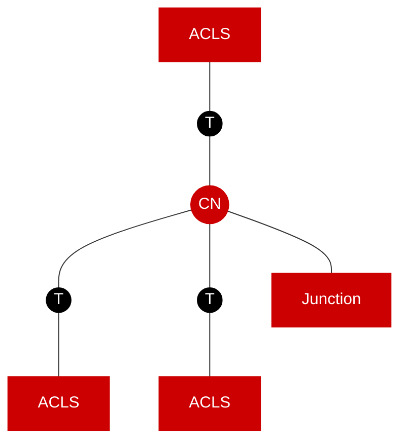
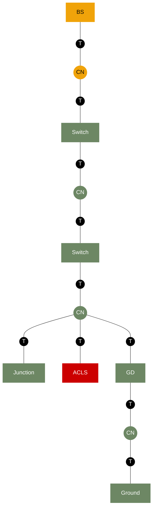

# Create CIM Topology Mermaid

## When to Use

- Creating a new CIM topology diagram showing circuit connectivity (Terminals, ConnectivityNodes, ConductingEquipment)
- Creating a container hierarchy diagram showing container ownership relationships
- Illustrating how equipment is grouped into containers (Substation, VoltageLevel, Bay, Line, FeederLine)
- Documenting a new modelling case or option for the CIM container model

## Conventions

### File Location

All CIM topology Mermaid diagrams are stored in:

```
cim-knowledge-base/cim-container-model/mmd/
```

SVG renders are generated in:

```
cim-knowledge-base/cim-container-model/svg/
```

### File Naming

- Use **snake_case** with `cim_container_` prefix: `cim_container_lv_line_circuit.mmd`
- Use `.mmd` extension
- Suffix conventions:
  - `_circuit` — circuit topology diagram (shows Terminals, CNs, equipment)
  - `_container` — container hierarchy diagram (shows ownership only)
  - No suffix — standalone element or simple diagram

### Diagram Type

Always use `graph TD` (top-down) direction.

### Two Diagram Types

#### 1. Circuit Topology Diagram

Shows the electrical connectivity: **ConductingEquipment** connected via **Terminals** to **ConnectivityNodes**. Equipment is color-coded by its owning container.

#### 2. Container Hierarchy Diagram

Shows the container ownership: which containers own which other containers and equipment. Uses simple box connections without Terminals/CNs.

**Layout rule:** The top-level Substation must be at the top of the diagram. VoltageLevels connect **down** from the Substation (i.e., `Sub --- VL_HV`, not `VL_HV --- Sub`). In `graph TD`, the first node in a link renders above the second.

Example:
```mermaid
    Sub --- VL_HV
    VL_HV --- Bay_HV
    Sub --- VL_230
    VL_230 --- Bay_230_1
```

## Color Scheme

Every element is colored by the **container it belongs to**:

| Container | Color | Hex | Text |
|-----------|-------|-----|------|
| Substation | Blue | `#0050EF` | White |
| VoltageLevel | Amber/Yellow | `#F0A30A` | White (or black for CN/BS) |
| Bay | Olive Green | `#6D8764` | White |
| Line | Red | `#CC0000` | White |
| FeederLine | Purple | `#7B68A2` | White |
| Terminal | Black | `#000000` | White |

### classDef Naming Convention

```
classDef <ClassName>           — for container legend boxes
classDef <ClassName>_<Container> — for equipment colored by container
classDef CN_<Container>        — for ConnectivityNodes colored by container
```

### Standard classDef Definitions

```mermaid
%% Containers (for legend)
classDef Substation fill:#0050EF,color:#FFFFFF,stroke:#0050EF
classDef VoltageLevel fill:#F0A30A,color:#FFFFFF,stroke:#F0A30A
classDef Bay fill:#6D8764,color:#FFFFFF,stroke:#6D8764
classDef Line fill:#CC0000,color:#FFFFFF,stroke:#CC0000
classDef FeederLine fill:#7B68A2,color:#FFFFFF,stroke:#7B68A2

%% Terminals (always black)
classDef Terminal fill:#000000,color:#FFFFFF,stroke:#000000

%% ConnectivityNodes (colored by owning container)
classDef CN_VoltageLevel fill:#F0A30A,color:#000,stroke:#F0A30A
classDef CN_Bay fill:#6D8764,color:#FFFFFF,stroke:#6D8764
classDef CN_Line fill:#CC0000,color:#FFFFFF,stroke:#CC0000
classDef CN_FeederLine fill:#7B68A2,color:#FFFFFF,stroke:#7B68A2

%% ConductingEquipment (colored by owning container)
classDef PowerTransformer fill:#0050EF,color:#FFFFFF,stroke:#0050EF
classDef Switch fill:#6D8764,color:#FFFFFF,stroke:#6D8764
classDef Jumper fill:#6D8764,color:#FFFFFF,stroke:#6D8764
classDef BusbarSection fill:#F0A30A,color:#000,stroke:#F0A30A
classDef ACLS_Line fill:#CC0000,color:#FFFFFF,stroke:#CC0000
classDef ACLS_FeederLine fill:#7B68A2,color:#FFFFFF,stroke:#7B68A2
classDef ConformLoad fill:#7B68A2,color:#FFFFFF,stroke:#7B68A2
classDef Junction fill:#6D8764,color:#FFFFFF,stroke:#6D8764
classDef GroundDisconnector fill:#6D8764,color:#FFFFFF,stroke:#6D8764
classDef Ground fill:#6D8764,color:#FFFFFF,stroke:#6D8764
```

## Node Shapes

| Element | Shape | Example |
|---------|-------|---------|
| ConductingEquipment | Rectangle `[label]` | `SW1[Switch]:::Switch` |
| Terminal | Circle `((label))` | `T1((T)):::Terminal` |
| ConnectivityNode | Circle `((label))` | `CN1((CN)):::CN_Bay` |
| Container (legend) | Rectangle `[label]` | `VL[VL]:::VoltageLevel` |

## Connection Syntax

| Connection Type | Syntax | Use |
|-----------------|--------|-----|
| Solid line (normal) | `---` | Standard electrical connection |
| Dashed line (optional) | `-.-` | Optional element (e.g. optional Junction) |
| Arrow (containment) | `-->` | Only in container hierarchy legend (parent → child) |

## Container Legend

Every diagram should include a **container legend** section at the top showing which colors represent which containers. Legend items must be **standalone nodes with no links between them**.

```mermaid
    %% Container legend (standalone)
    Sub[Sub]:::Substation
    VL[VL]:::VoltageLevel
    Bay1[Bay]:::Bay
    L[Line]:::Line
    FL[FL]:::FeederLine
```

**IMPORTANT:** Never use arrows (`-->`) or links (`---`) between legend items. They are purely a color key.

## Circuit Topology Rules

1. **Every ConductingEquipment has exactly 2 Terminals** (one on each side)
   - Exception: PowerTransformer may have 2+ Terminals (one per winding)
   - Exception: Junction has 1 Terminal
   - Exception: BusbarSection has 1 Terminal
   - Exception: ConformLoad has 1 Terminal
   - Exception: Ground has 1 Terminal

2. **Terminals connect to ConnectivityNodes** — never directly to other equipment

3. **Two ConductingEquipment must NEVER share a Terminal** — there must always be a ConnectivityNode between them:
   - WRONG: `Switch --- T --- ACLS`
   - CORRECT: `Switch --- T --- CN --- T --- ACLS`
   - The CN between them is colored by the container that owns it (typically Bay=green or FeederLine=purple)

4. **ConnectivityNodes are shared** — a CN can have multiple Terminals connected to it (this is how branching works)

5. **Color follows container** — equipment and CNs are colored by the container they belong to, not by their class type

6. **Terminal IDs must be unique** — use sequential numbering: `T1`, `T2`, `T3`...

7. **CN IDs must be unique** — use descriptive or sequential: `CN1`, `CN_C`, `CN_PT1`...

## Equipment Abbreviations

| Abbreviation | Full Name |
|--------------|-----------|
| BS | BusbarSection |
| PT | PowerTransformer |
| SW / Switch | Switch (Disconnector, Breaker, etc.) |
| ACLS | ACLineSegment |
| CL | ConformLoad |
| CN | ConnectivityNode |
| T | Terminal |
| GD | GroundDisconnector |
| FL | FeederLine |
| VL | VoltageLevel |
| Sub | Substation |
| J | Jumper |

## Example: Simple T-Junction (Single Line)



## Example: MV Feeder Bay ("avgang")



## SVG Generation

After creating or updating `.mmd` files, generate SVGs using the Mermaid CLI:

```powershell
$mmd_files = Get-ChildItem -Path "cim-knowledge-base/cim-container-model/mmd/*.mmd"
foreach ($file in $mmd_files) {
    $outfile = Join-Path "cim-knowledge-base/cim-container-model/svg" ($file.BaseName + ".svg")
    mmdc -i $file.FullName -o $outfile
}
```

## References

- [cim-container-model.md](../../../cim-knowledge-base/cim-container-model/cim-container-model.md) — Full documentation of container model cases
- [Mermaid Flowchart Docs](https://mermaid.js.org/syntax/flowchart.html) — Mermaid syntax reference
