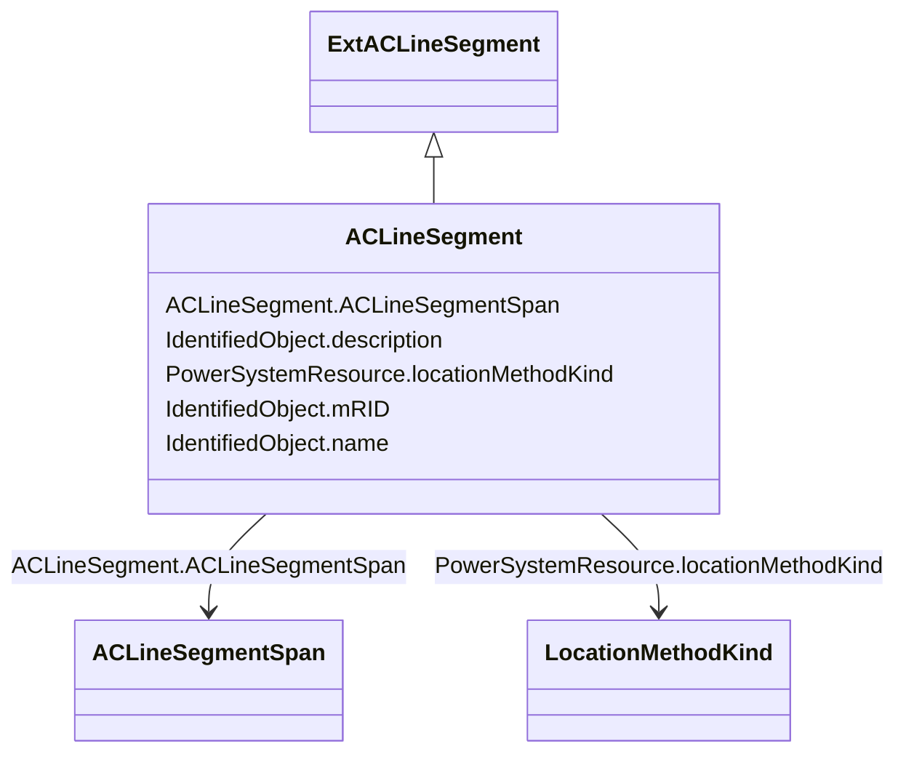

# ACLineSegment

_A wire or combination of wires, with consistent electrical characteristics, building a single electrical system, used to carry alternating current between points in the power system.For symmetrical, transposed three phase lines, it is sufficient to use attributes of the line segment, which describe impedances and admittances for the entire length of the segment.  Additionally impedances can be computed by using length and associated per length impedances.The BaseVoltage at the two ends of ACLineSegments in a Line shall have the same BaseVoltage.nominalVoltage. However, boundary lines may have slightly different BaseVoltage.nominalVoltages and variation is allowed. Larger voltage difference in general requires use of an equivalent branch._

**URI**: [cim:ACLineSegment](http://iec.ch/TC57/CIM100#ACLineSegment) 
**Type**: Class

## Inheritance
* [IdentifiedObject](IdentifiedObject.md)
    * [ExtPowerSystemResource](ExtPowerSystemResource.md)
        * [PowerSystemResource](PowerSystemResource.md)
            * [Equipment](Equipment.md)
                * [ConductingEquipment](ConductingEquipment.md)
                    * [Conductor](Conductor.md)
                        * [ExtACLineSegment](ExtACLineSegment.md)
                            * **ACLineSegment**

## Attributes

| Name | URI | Cardinality and Range | Description | Inheritance |
| ---  | --- | --- | --- | --- |
| ACLineSegmentSpan | [nc-no:ACLineSegment.ACLineSegmentSpan](https://ap-no.cim4.eu/AviationObstacle/1.0#ACLineSegment.ACLineSegmentSpan) | 0..n    [ACLineSegmentSpan](ACLineSegmentSpan.md)  | The associated AC Line Segment | [ExtACLineSegment](ExtACLineSegment.md) |
| locationMethodKind | [nc-no:PowerSystemResource.locationMethodKind](https://ap-no.cim4.eu/AviationObstacle/1.0#PowerSystemResource.locationMethodKind) | 0..1    [LocationMethodKind](LocationMethodKind.md)  | Possible methods to derive geographical location | [ExtPowerSystemResource](ExtPowerSystemResource.md) |
| mRID | [cim:IdentifiedObject.mRID](http://iec.ch/TC57/CIM100#IdentifiedObject.mRID) | 0..1    string  | Master resource identifier issued by a model authority | [IdentifiedObject](IdentifiedObject.md) |
| description | [cim:IdentifiedObject.description](http://iec.ch/TC57/CIM100#IdentifiedObject.description) | 0..1    string  | The description is a free human readable text describing or naming the object | [IdentifiedObject](IdentifiedObject.md) |
| name | [cim:IdentifiedObject.name](http://iec.ch/TC57/CIM100#IdentifiedObject.name) | 0..1    string  | The name is any free human readable and possibly non unique text naming the o... | [IdentifiedObject](IdentifiedObject.md) |

## Usages

| used by | used in | type | used |
| ---  | --- | --- | --- |
| [ACLineSegmentSpan](ACLineSegmentSpan.md) | ACLineSegment | range | [ACLineSegment](ACLineSegment.md) |

## Comments

* - Each ACLineSegment is required to have an association to a BaseVoltage. The association to Line is not required.- Using the EquipmentContainer association, an ACLineSegment can only be contained by a Line, but the association to Line is not required.

## Identifier and Mapping Information

### Schema Source

* from schema: https://ap-no.cim4.eu/AviationObstacle/1.0#

## Mappings

| Mapping Type | Mapped Value |
| ---  | ---  |
| self | cim:ACLineSegment |
| native | this:ACLineSegment |

