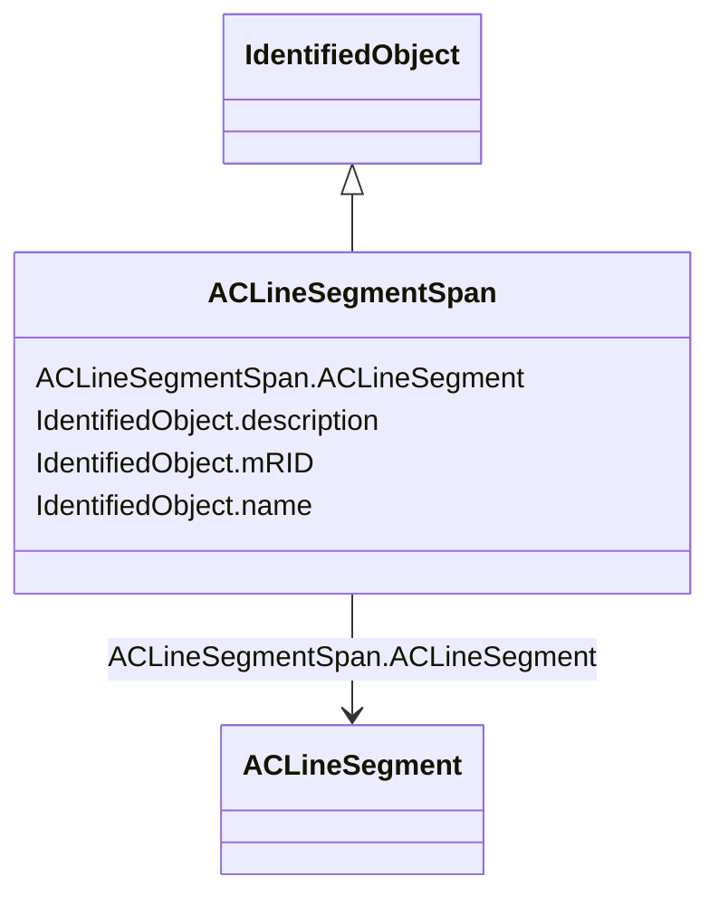

# ACLineSegmentSpan

**URI**: [nc-no:ACLineSegmentSpan](https://ap-no.cim4.eu/AviationObstacle/1.0#ACLineSegmentSpan) 
**Type**: Class

## Inheritance
* [IdentifiedObject](IdentifiedObject.md)
    * **ACLineSegmentSpan**

## Attributes

| Name | URI | Cardinality and Range | Description | Inheritance |
| ---  | --- | --- | --- | --- |
| ACLineSegment | [nc-no:ACLineSegmentSpan.ACLineSegment](https://ap-no.cim4.eu/AviationObstacle/1.0#ACLineSegmentSpan.ACLineSegment) | 0..*    [ACLineSegment](ACLineSegment.md)  | The associated AC Line Segment | direct |
| mRID | [cim:IdentifiedObject.mRID](http://iec.ch/TC57/CIM100#IdentifiedObject.mRID) | 0..1    string  | Master resource identifier issued by a model authority | [IdentifiedObject](IdentifiedObject.md) |
| description | [cim:IdentifiedObject.description](http://iec.ch/TC57/CIM100#IdentifiedObject.description) | 0..1    string  | The description is a free human readable text describing or naming the object | [IdentifiedObject](IdentifiedObject.md) |
| name | [cim:IdentifiedObject.name](http://iec.ch/TC57/CIM100#IdentifiedObject.name) | 0..1    string  | The name is any free human readable and possibly non unique text naming the o... | [IdentifiedObject](IdentifiedObject.md) |

## Usages

| used by | used in | type | used |
| ---  | --- | --- | --- |
| [ACLineSegment](ACLineSegment.md) | ACLineSegmentSpan | range | [ACLineSegmentSpan](ACLineSegmentSpan.md) |
| [Container](Container.md) | ACLineSegmentSpan | range | [ACLineSegmentSpan](ACLineSegmentSpan.md) |

## Identifier and Mapping Information

### Schema Source

* from schema: https://ap-no.cim4.eu/AviationObstacle/1.0

## Mappings

| Mapping Type | Mapped Value |
| ---  | ---  |
| self | nc-no:ACLineSegmentSpan |
| native | this:ACLineSegmentSpan |

