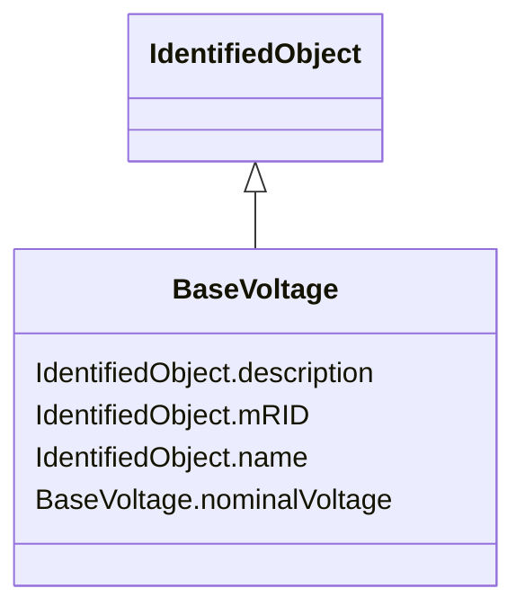

# BaseVoltage

_Defines a system base voltage which is referenced._

**URI**: [cim:BaseVoltage](http://iec.ch/TC57/CIM100#BaseVoltage) 
**Type**: Class

## Inheritance
* [IdentifiedObject](IdentifiedObject.md)
    * **BaseVoltage**

## Attributes

| Name | URI | Cardinality and Range | Description | Inheritance |
| ---  | --- | --- | --- | --- |
| nominalVoltage | [cim:BaseVoltage.nominalVoltage](http://iec.ch/TC57/CIM100#BaseVoltage.nominalVoltage) | 0..1    [Voltage](Voltage.md)  | The power system resource's base voltage | direct |
| mRID | [cim:IdentifiedObject.mRID](http://iec.ch/TC57/CIM100#IdentifiedObject.mRID) | 0..1    string  | Master resource identifier issued by a model authority | [IdentifiedObject](IdentifiedObject.md) |
| description | [cim:IdentifiedObject.description](http://iec.ch/TC57/CIM100#IdentifiedObject.description) | 0..1    string  | The description is a free human readable text describing or naming the object | [IdentifiedObject](IdentifiedObject.md) |
| name | [cim:IdentifiedObject.name](http://iec.ch/TC57/CIM100#IdentifiedObject.name) | 0..1    string  | The name is any free human readable and possibly non unique text naming the o... | [IdentifiedObject](IdentifiedObject.md) |

## Usages

| used by | used in | type | used |
| ---  | --- | --- | --- |
| [AssetDeployment](AssetDeployment.md) | BaseVoltage | range | [BaseVoltage](BaseVoltage.md) |
| [ACLineSegmentSpanDeployment](ACLineSegmentSpanDeployment.md) | BaseVoltage | range | [BaseVoltage](BaseVoltage.md) |
| [StructureDeployment](StructureDeployment.md) | BaseVoltage | range | [BaseVoltage](BaseVoltage.md) |

## Identifier and Mapping Information

### Schema Source

* from schema: https://ap-no.cim4.eu/AviationObstacle/1.0

## Mappings

| Mapping Type | Mapped Value |
| ---  | ---  |
| self | cim:BaseVoltage |
| native | this:BaseVoltage |

