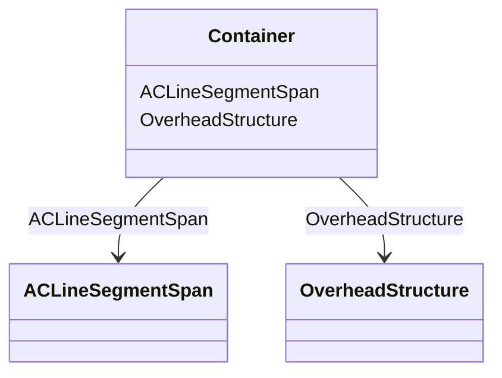

# Container

**URI**: [this:Container](https://ap-no.cim4.eu/AviationObstacle/1.0#Container) 
**Type**: Class

<!-- no inheritance hierarchy -->

## Attributes

| Name | URI | Cardinality and Range | Description | Inheritance |
| ---  | --- | --- | --- | --- |
| OverheadStructure | [this:OverheadStructure](https://ap-no.cim4.eu/AviationObstacle/1.0#OverheadStructure) | 0..*    [OverheadStructure](OverheadStructure.md)  |  | direct |
| ACLineSegmentSpan | [this:ACLineSegmentSpan](https://ap-no.cim4.eu/AviationObstacle/1.0#ACLineSegmentSpan) | 0..*    [ACLineSegmentSpan](ACLineSegmentSpan.md)  |  | direct |

## Identifier and Mapping Information

### Schema Source

* from schema: https://ap-no.cim4.eu/AviationObstacle/1.0

## Mappings

| Mapping Type | Mapped Value |
| ---  | ---  |
| self | this:Container |
| native | this:Container |

