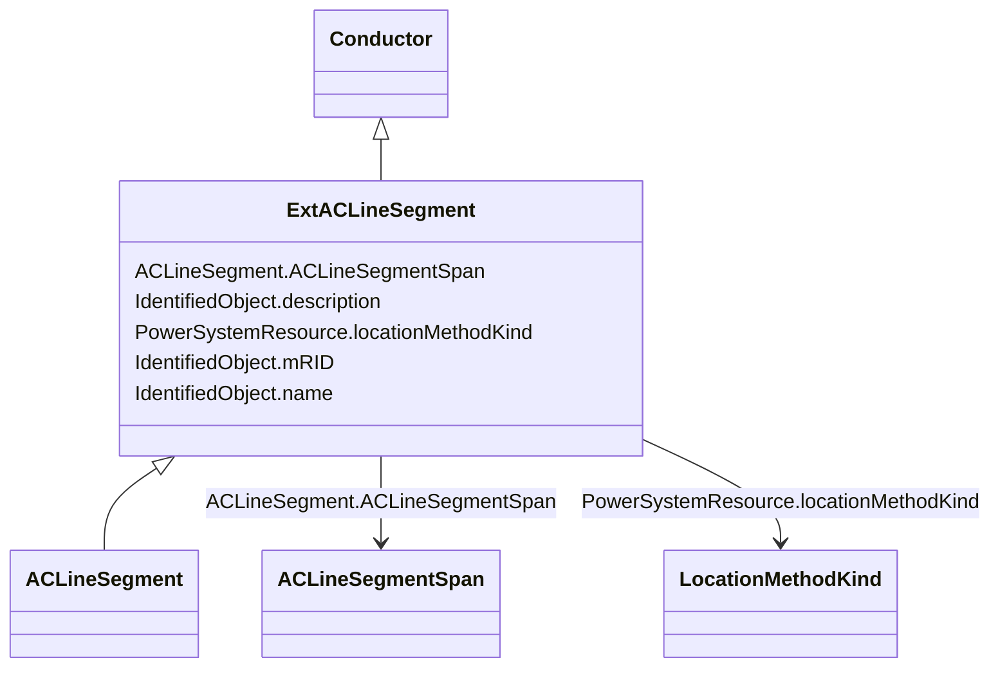

# ExtACLineSegment

_Extension of cim AC Line Segment_

**URI**: [nc-no:ACLineSegment](https://ap-no.cim4.eu/AviationObstacle/1.0#ACLineSegment) 
**Type**: Class

## Inheritance
* [IdentifiedObject](IdentifiedObject.md)
    * [ExtPowerSystemResource](ExtPowerSystemResource.md)
        * [PowerSystemResource](PowerSystemResource.md)
            * [Equipment](Equipment.md)
                * [ConductingEquipment](ConductingEquipment.md)
                    * [Conductor](Conductor.md)
                        * **ExtACLineSegment**
                            * [ACLineSegment](ACLineSegment.md)

## Attributes

| Name | URI | Cardinality and Range | Description | Inheritance |
| ---  | --- | --- | --- | --- |
| ACLineSegmentSpan | [nc-no:ACLineSegment.ACLineSegmentSpan](https://ap-no.cim4.eu/AviationObstacle/1.0#ACLineSegment.ACLineSegmentSpan) | 0..n    [ACLineSegmentSpan](ACLineSegmentSpan.md)  | The associated AC Line Segment | direct |
| locationMethodKind | [nc-no:PowerSystemResource.locationMethodKind](https://ap-no.cim4.eu/AviationObstacle/1.0#PowerSystemResource.locationMethodKind) | 0..1    [LocationMethodKind](LocationMethodKind.md)  | Possible methods to derive geographical location | [ExtPowerSystemResource](ExtPowerSystemResource.md) |
| mRID | [cim:IdentifiedObject.mRID](http://iec.ch/TC57/CIM100#IdentifiedObject.mRID) | 0..1    string  | Master resource identifier issued by a model authority | [IdentifiedObject](IdentifiedObject.md) |
| description | [cim:IdentifiedObject.description](http://iec.ch/TC57/CIM100#IdentifiedObject.description) | 0..1    string  | The description is a free human readable text describing or naming the object | [IdentifiedObject](IdentifiedObject.md) |
| name | [cim:IdentifiedObject.name](http://iec.ch/TC57/CIM100#IdentifiedObject.name) | 0..1    string  | The name is any free human readable and possibly non unique text naming the o... | [IdentifiedObject](IdentifiedObject.md) |

## Identifier and Mapping Information

### Schema Source

* from schema: https://ap-no.cim4.eu/AviationObstacle/1.0#

## Mappings

| Mapping Type | Mapped Value |
| ---  | ---  |
| self | nc-no:ACLineSegment |
| native | this:ExtACLineSegment |

