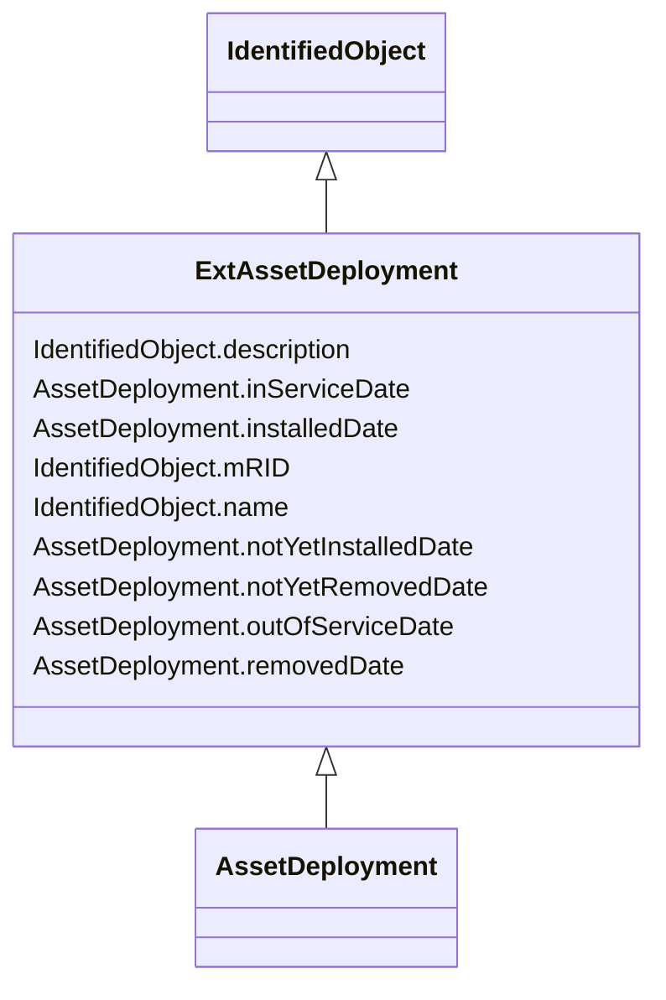

# ExtAssetDeployment

_Deployment of asset deployment in a power system resource role._

**URI**: [nc-no:AssetDeployment](https://ap-no.cim4.eu/AviationObstacle/1.0#AssetDeployment) 
**Type**: Class

## Inheritance
* [IdentifiedObject](IdentifiedObject.md)
    * **ExtAssetDeployment**
        * [AssetDeployment](AssetDeployment.md)

## Attributes

| Name | URI | Cardinality and Range | Description | Inheritance |
| ---  | --- | --- | --- | --- |
| inServiceDate | [nc-no:AssetDeployment.inServiceDate](https://ap-no.cim4.eu/AviationObstacle/1.0#AssetDeployment.inServiceDate) | 0..1    datetime  | Date and time asset was most recently put in service | direct |
| installedDate | [nc-no:AssetDeployment.installedDate](https://ap-no.cim4.eu/AviationObstacle/1.0#AssetDeployment.installedDate) | 0..1    datetime  | Date and time asset was most recently installed | direct |
| notYetInstalledDate | [nc-no:AssetDeployment.notYetInstalledDate](https://ap-no.cim4.eu/AviationObstacle/1.0#AssetDeployment.notYetInstalledDate) | 0..1    datetime  | Date and time of asset deployment transition to not yet installed | direct |
| notYetRemovedDate | [nc-no:AssetDeployment.notYetRemovedDate](https://ap-no.cim4.eu/AviationObstacle/1.0#AssetDeployment.notYetRemovedDate) | 0..1    datetime  | Date and time of asset deployment transition to not yet removed | direct |
| outOfServiceDate | [nc-no:AssetDeployment.outOfServiceDate](https://ap-no.cim4.eu/AviationObstacle/1.0#AssetDeployment.outOfServiceDate) | 0..1    datetime  | Date and time asset was most recently taken out of service | direct |
| removedDate | [nc-no:AssetDeployment.removedDate](https://ap-no.cim4.eu/AviationObstacle/1.0#AssetDeployment.removedDate) | 0..1    datetime  | Date and time asset was most recently removed | direct |
| mRID | [cim:IdentifiedObject.mRID](http://iec.ch/TC57/CIM100#IdentifiedObject.mRID) | 0..1    string  | Master resource identifier issued by a model authority | [IdentifiedObject](IdentifiedObject.md) |
| description | [cim:IdentifiedObject.description](http://iec.ch/TC57/CIM100#IdentifiedObject.description) | 0..1    string  | The description is a free human readable text describing or naming the object | [IdentifiedObject](IdentifiedObject.md) |
| name | [cim:IdentifiedObject.name](http://iec.ch/TC57/CIM100#IdentifiedObject.name) | 0..1    string  | The name is any free human readable and possibly non unique text naming the o... | [IdentifiedObject](IdentifiedObject.md) |

## Identifier and Mapping Information

### Schema Source

* from schema: https://ap-no.cim4.eu/AviationObstacle/1.0#

## Mappings

| Mapping Type | Mapped Value |
| ---  | ---  |
| self | nc-no:AssetDeployment |
| native | this:ExtAssetDeployment |

