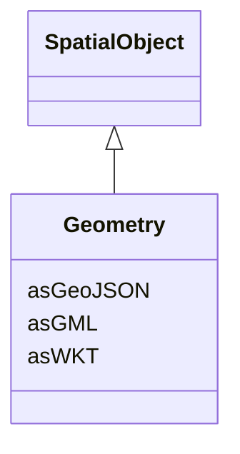

# Geometry

_Geometric representation details._

**URI**: [geo:Geometry](http://www.opengis.net/ont/geosparql#Geometry) 
**Type**: Class

## Inheritance
* [SpatialObject](SpatialObject.md)
    * **Geometry**

## Attributes

| Name | URI | Cardinality and Range | Description | Inheritance |
| ---  | --- | --- | --- | --- |
| asWKT | [geo:asWKT](http://www.opengis.net/ont/geosparql#asWKT) | 0..1    string  | Geometric representation of the spatial object in WKT format | direct |
| asGeoJSON | [geo:asGeoJSON](http://www.opengis.net/ont/geosparql#asGeoJSON) | 0..1    string  | Geometric representation of the spatial object in GeoJSON format | direct |
| asGML | [geo:asGML](http://www.opengis.net/ont/geosparql#asGML) | 0..1    string  | Geometric representation of the spatial object in GML format | direct |

## Usages

| used by | used in | type | used |
| ---  | --- | --- | --- |
| [Feature](Feature.md) | hasGeometry | range | [Geometry](Geometry.md) |
| [PowerSystemResource](PowerSystemResource.md) | hasGeometry | range | [Geometry](Geometry.md) |
| [Equipment](Equipment.md) | hasGeometry | range | [Geometry](Geometry.md) |
| [ConductingEquipment](ConductingEquipment.md) | hasGeometry | range | [Geometry](Geometry.md) |
| [Conductor](Conductor.md) | hasGeometry | range | [Geometry](Geometry.md) |
| [OverheadStructure](OverheadStructure.md) | hasGeometry | range | [Geometry](Geometry.md) |
| [ACLineSegment](ACLineSegment.md) | hasGeometry | range | [Geometry](Geometry.md) |

## Identifier and Mapping Information

### Schema Source

* from schema: https://ap-no.cim4.eu/AviationObstacle/1.0

## Mappings

| Mapping Type | Mapped Value |
| ---  | ---  |
| self | geo:Geometry |
| native | this:Geometry |

