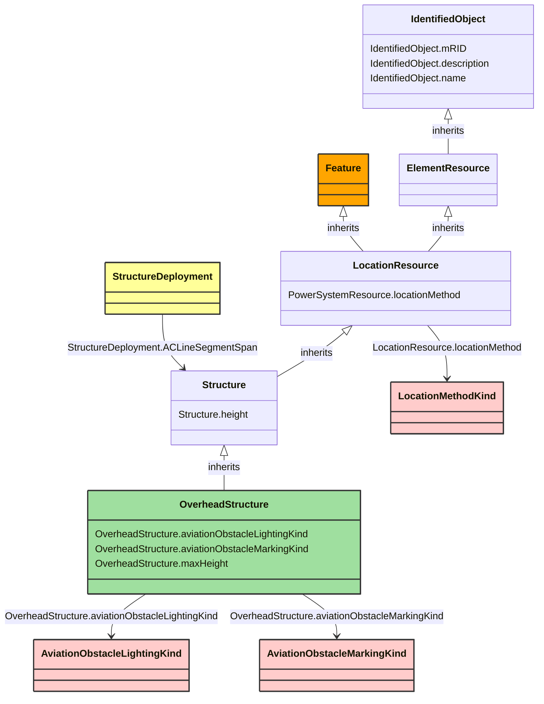

# OverheadStructure

_An overhead structure is an element of an electric transmission or distribution system that supports the overhead conductors and associated equipment used for the transmission of electricity._

**URI**: [nc-no:OverheadStructure](http://cim4.eu/ns/nc-no#OverheadStructure) 
**Type**: Class

## Inheritance
* [IdentifiedObject](IdentifiedObject.md)
    * [ElementResource](ElementResource.md)
        * [LocationResource](LocationResource.md)
            * [Structure](Structure.md)
                * **OverheadStructure**

## Attributes
| Name | URI | Cardinality and Range | Description | Inheritance |
| ---  | --- | --- | --- | --- |
| aviationObstacleLightingKind | [nc-no:OverheadStructure.aviationObstacleLightingKind](http://cim4.eu/ns/nc-no#OverheadStructure.aviationObstacleLightingKind) | 0..1 AviationObstacleLightingKind | Kind of lighting on the structure. | direct |
| aviationObstacleMarkingKind | [nc-no:OverheadStructure.aviationObstacleMarkingKind](http://cim4.eu/ns/nc-no#OverheadStructure.aviationObstacleMarkingKind) | 0..1 AviationObstacleMarkingKind | Kind of marking on the structure. | direct |
| maxHeight | [nc-no:OverheadStructure.maxHeight](http://cim4.eu/ns/nc-no#OverheadStructure.maxHeight) | 0..1 Length | The length of the longest distance from the ground to the highest point on the structure. If f.ex. the structure is located in a steep slope, the distance from the top of the structure to the ground may vary. | direct |
| height | [nc-no:Structure.height](http://cim4.eu/ns/nc-no#Structure.height) | 0..1 Length | Visible height of structure above ground level for overhead construction (e.g., Pole or Tower) or below ground level for an underground vault, manhole, etc. | Structure |
| locationMethod | [nc-no:PowerSystemResource.locationMethod](http://cim4.eu/ns/nc-no#PowerSystemResource.locationMethod) | 0..1 LocationMethodKind | Method used to derive geographical location for this entity. | LocationResource |
| mRID | [cim:IdentifiedObject.mRID](https://cim.ucaiug.io/ns#IdentifiedObject.mRID) | 0..1 string | Master resource identifier issued by a model authority. The mRID is unique within an exchange context. Global uniqueness is easily achieved by using a UUID, as specified in RFC 4122, for the mRID. The use of UUID is strongly recommended.For CIMXML data files in RDF syntax conforming to IEC 61970-552, the mRID is mapped to rdf:ID or rdf:about attributes that identify CIM object elements. | IdentifiedObject |
| description | [cim:IdentifiedObject.description](https://cim.ucaiug.io/ns#IdentifiedObject.description) | 0..1 string | The description is a free human readable text describing or naming the object. It may be non unique and may not correlate to a naming hierarchy. | IdentifiedObject |
| name | [cim:IdentifiedObject.name](https://cim.ucaiug.io/ns#IdentifiedObject.name) | 0..1 string | The name is any free human readable and possibly non unique text naming the object. | IdentifiedObject |

### Schema Source
* from schema: [https://ap-no.cim4.eu/AviationObstacle/1.0](https://ap-no.cim4.eu/AviationObstacle/1.0)
