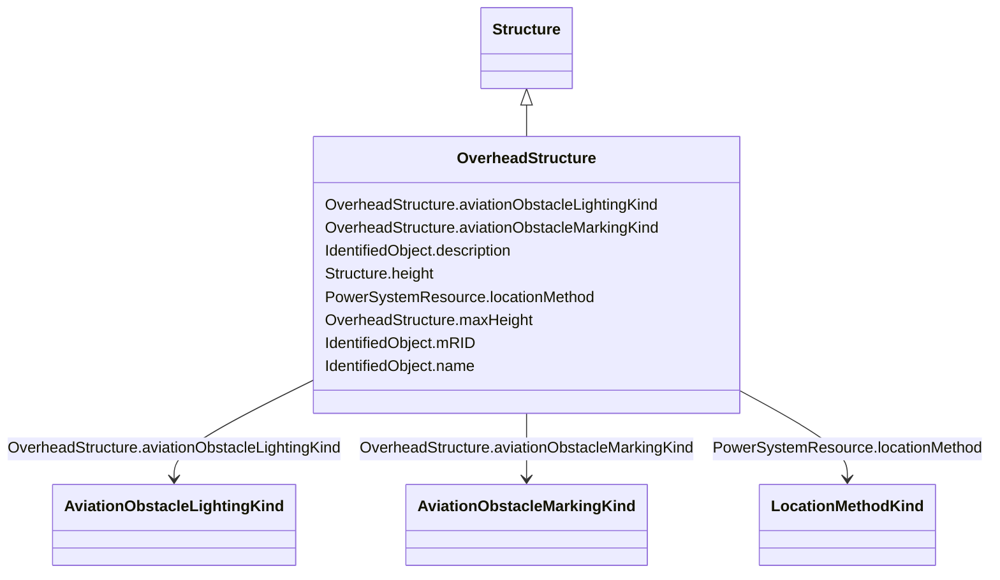

# OverheadStructure

_An overhead structure is an element of an electric transmission or distribution system that supports the overhead conductors and associated equipment used for the transmission of electricity._

* __NOTE__: this is an abstract class and should not be instantiated directly

**URI**: [nc-no:OverheadStructure](https://ap-no.cim4.eu/AviationObstacle/1.0#OverheadStructure) 
**Type**: Class

## Inheritance
* [IdentifiedObject](IdentifiedObject.md)
    * [ElementResource](ElementResource.md)
        * [LocationResource](LocationResource.md)
            * [Structure](Structure.md)
                * **OverheadStructure**

## Attributes

| Name | URI | Cardinality and Range | Description | Inheritance |
| ---  | --- | --- | --- | --- |
| aviationObstacleLightingKind | [nc-no:OverheadStructure.aviationObstacleLightingKind](https://ap-no.cim4.eu/AviationObstacle/1.0#OverheadStructure.aviationObstacleLightingKind) | 0..1    [AviationObstacleLightingKind](AviationObstacleLightingKind.md)  | Kind of lighting on the structure | direct |
| aviationObstacleMarkingKind | [nc-no:OverheadStructure.aviationObstacleMarkingKind](https://ap-no.cim4.eu/AviationObstacle/1.0#OverheadStructure.aviationObstacleMarkingKind) | 0..1    [AviationObstacleMarkingKind](AviationObstacleMarkingKind.md)  | Kind of marking on the structure | direct |
| maxHeight | [nc-no:OverheadStructure.maxHeight](https://ap-no.cim4.eu/AviationObstacle/1.0#OverheadStructure.maxHeight) | 0..1    [Length](Length.md)  | The length of the longest distance from the ground to the highest point on th... | direct |
| height | [nc-no:Structure.height](https://ap-no.cim4.eu/AviationObstacle/1.0#Structure.height) | 0..1    [Length](Length.md)  | Visible height of structure above ground level for overhead construction (e | [Structure](Structure.md) |
| locationMethod | [nc-no:PowerSystemResource.locationMethod](https://ap-no.cim4.eu/AviationObstacle/1.0#PowerSystemResource.locationMethod) | 0..1    [LocationMethodKind](LocationMethodKind.md)  | Method used to derive geographical location for this entity | [LocationResource](LocationResource.md) |
| mRID | [cim:IdentifiedObject.mRID](http://iec.ch/TC57/CIM100#IdentifiedObject.mRID) | 0..1    string  | Master resource identifier issued by a model authority | [IdentifiedObject](IdentifiedObject.md) |
| description | [cim:IdentifiedObject.description](http://iec.ch/TC57/CIM100#IdentifiedObject.description) | 0..1    string  | The description is a free human readable text describing or naming the object | [IdentifiedObject](IdentifiedObject.md) |
| name | [cim:IdentifiedObject.name](http://iec.ch/TC57/CIM100#IdentifiedObject.name) | 0..1    string  | The name is any free human readable and possibly non unique text naming the o... | [IdentifiedObject](IdentifiedObject.md) |

## Identifier and Mapping Information

### Schema Source

* from schema: https://ap-no.cim4.eu/AviationObstacle/1.0#

## Mappings

| Mapping Type | Mapped Value |
| ---  | ---  |
| self | nc-no:OverheadStructure |
| native | this:OverheadStructure |

