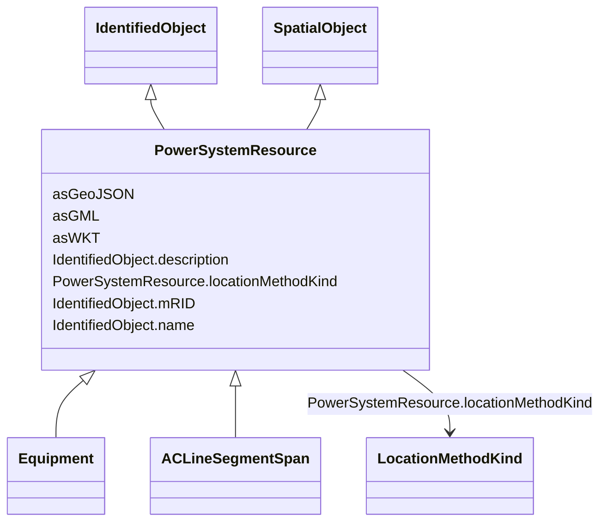

# PowerSystemResource

_A power system resource (PSR) can be an item of equipment such as a switch, an equipment container containing many individual items of equipment such as a substation, or an organisational entity such as sub-control area. Power system resources can have measurements associated._

* __NOTE__: this is an abstract class and should not be instantiated directly

**URI**: [cim:PowerSystemResource](http://iec.ch/TC57/CIM100#PowerSystemResource) 
**Type**: Class

## Inheritance
* **PowerSystemResource** [ [IdentifiedObject](IdentifiedObject.md) [SpatialObject](SpatialObject.md)]
    * [Equipment](Equipment.md)
    * [ACLineSegmentSpan](ACLineSegmentSpan.md)

## Attributes

| Name | URI | Cardinality and Range | Description | Inheritance |
| ---  | --- | --- | --- | --- |
| locationMethodKind | [nc-no:PowerSystemResource.locationMethodKind](https://ap-no.cim4.eu/AviationObstacle/1.0#PowerSystemResource.locationMethodKind) | 0..1    [LocationMethodKind](LocationMethodKind.md)  | Possible methods to derive geographical location | direct |
| mRID | [cim:IdentifiedObject.mRID](http://iec.ch/TC57/CIM100#IdentifiedObject.mRID) | 0..1    string  | Master resource identifier issued by a model authority | [IdentifiedObject](IdentifiedObject.md) |
| description | [cim:IdentifiedObject.description](http://iec.ch/TC57/CIM100#IdentifiedObject.description) | 0..1    string  | The description is a free human readable text describing or naming the object | [IdentifiedObject](IdentifiedObject.md) |
| name | [cim:IdentifiedObject.name](http://iec.ch/TC57/CIM100#IdentifiedObject.name) | 0..1    string  | The name is any free human readable and possibly non unique text naming the o... | [IdentifiedObject](IdentifiedObject.md) |
| asWKT | [geo:asWKT](http://www.opengis.net/ont/geosparql#asWKT) | 0..1    string  | Geometric representation of the spatial object in WKT format | [SpatialObject](SpatialObject.md) |
| asGeoJSON | [geo:asGeoJSON](http://www.opengis.net/ont/geosparql#asGeoJSON) | 0..1    string  | Geometric representation of the spatial object in GeoJSON format | [SpatialObject](SpatialObject.md) |
| asGML | [geo:asGML](http://www.opengis.net/ont/geosparql#asGML) | 0..1    string  | Geometric representation of the spatial object in GML format | [SpatialObject](SpatialObject.md) |

## Identifier and Mapping Information

### Schema Source

* from schema: https://ap-no.cim4.eu/AviationObstacle/1.0#

## Mappings

| Mapping Type | Mapped Value |
| ---  | ---  |
| self | cim:PowerSystemResource |
| native | this:PowerSystemResource |

