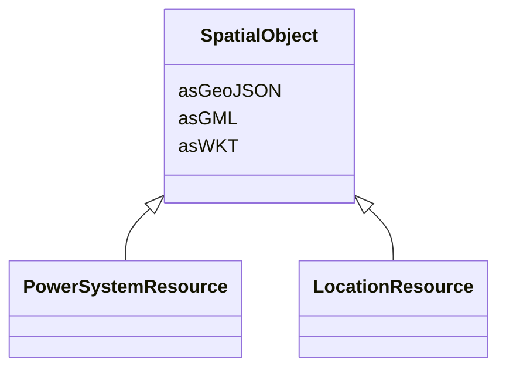

# SpatialObject

_Defines a system base voltage which is referenced._

**URI**: [geo:SpatialObject](http://www.opengis.net/ont/geosparql#SpatialObject) 
**Type**: Class

<!-- no inheritance hierarchy -->

## Attributes

| Name | URI | Cardinality and Range | Description | Inheritance |
| ---  | --- | --- | --- | --- |
| asWKT | [geo:asWKT](http://www.opengis.net/ont/geosparql#asWKT) | 0..1    string  | Geometric representation of the spatial object in WKT format | direct |
| asGeoJSON | [geo:asGeoJSON](http://www.opengis.net/ont/geosparql#asGeoJSON) | 0..1    string  | Geometric representation of the spatial object in GeoJSON format | direct |
| asGML | [geo:asGML](http://www.opengis.net/ont/geosparql#asGML) | 0..1    string  | Geometric representation of the spatial object in GML format | direct |

## Identifier and Mapping Information

### Schema Source

* from schema: https://ap-no.cim4.eu/AviationObstacle/1.0#

## Mappings

| Mapping Type | Mapped Value |
| ---  | ---  |
| self | geo:SpatialObject |
| native | this:SpatialObject |

