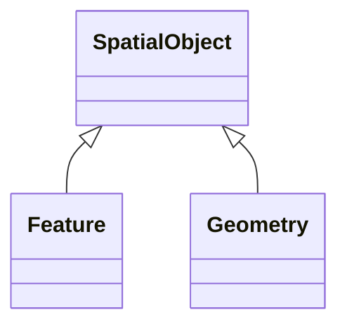

# SpatialObject

_A spatial object is a physical object that has a location in space. It may have a geometric representation to describe its shape and position._

**URI**: [geo:SpatialObject](http://www.opengis.net/ont/geosparql#SpatialObject) 
**Type**: Class

## Inheritance
* **SpatialObject**
    * [Feature](Feature.md)
    * [Geometry](Geometry.md)

## Attributes

| Name | URI | Cardinality and Range | Description | Inheritance |
| ---  | --- | --- | --- | --- |

## Identifier and Mapping Information

### Schema Source

* from schema: https://ap-no.cim4.eu/AviationObstacle/1.0

## Mappings

| Mapping Type | Mapped Value |
| ---  | ---  |
| self | geo:SpatialObject |
| native | this:SpatialObject |

