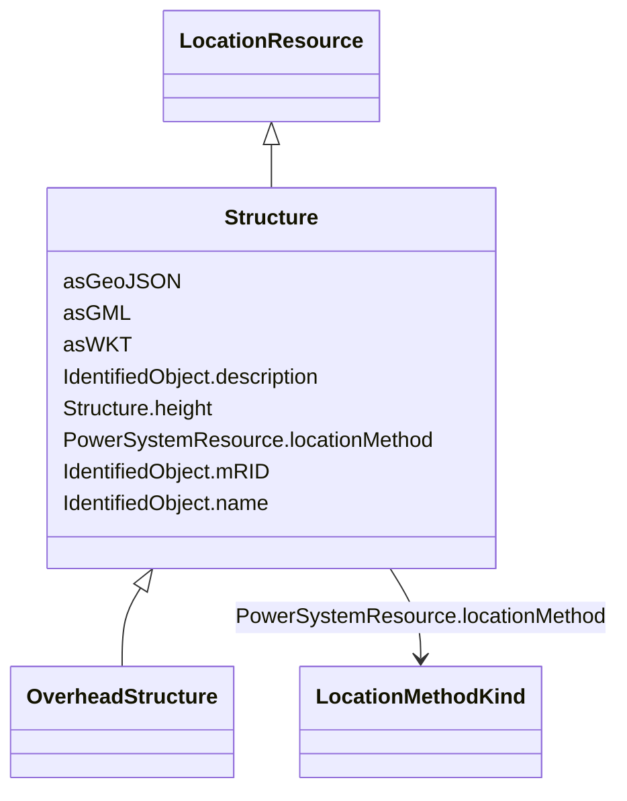

# Structure

_Construction holding assets such as conductors, transformers, switchgear, etc._

* __NOTE__: this is an abstract class and should not be instantiated directly

**URI**: [nc-no:Structure](https://ap-no.cim4.eu/AviationObstacle/1.0#Structure) 
**Type**: Class

## Inheritance
* [LocationResource](LocationResource.md) [ [ElementResource](ElementResource.md) [SpatialObject](SpatialObject.md)]
    * **Structure**
        * [OverheadStructure](OverheadStructure.md)

## Attributes

| Name | URI | Cardinality and Range | Description | Inheritance |
| ---  | --- | --- | --- | --- |
| height | [nc-no:Structure.height](https://ap-no.cim4.eu/AviationObstacle/1.0#Structure.height) | 0..1    [Length](Length.md)  | Visible height of structure above ground level for overhead construction (e | direct |
| locationMethod | [nc-no:PowerSystemResource.locationMethod](https://ap-no.cim4.eu/AviationObstacle/1.0#PowerSystemResource.locationMethod) | 0..1    [LocationMethodKind](LocationMethodKind.md)  | Method used to derive geographical location for this entity | [LocationResource](LocationResource.md) |
| asWKT | [geo:asWKT](http://www.opengis.net/ont/geosparql#asWKT) | 0..1    string  | Geometric representation of the spatial object in WKT format | [SpatialObject](SpatialObject.md) |
| asGeoJSON | [geo:asGeoJSON](http://www.opengis.net/ont/geosparql#asGeoJSON) | 0..1    string  | Geometric representation of the spatial object in GeoJSON format | [SpatialObject](SpatialObject.md) |
| asGML | [geo:asGML](http://www.opengis.net/ont/geosparql#asGML) | 0..1    string  | Geometric representation of the spatial object in GML format | [SpatialObject](SpatialObject.md) |
| mRID | [cim:IdentifiedObject.mRID](http://iec.ch/TC57/CIM100#IdentifiedObject.mRID) | 0..1    string  | Master resource identifier issued by a model authority | [IdentifiedObject](IdentifiedObject.md) |
| description | [cim:IdentifiedObject.description](http://iec.ch/TC57/CIM100#IdentifiedObject.description) | 0..1    string  | The description is a free human readable text describing or naming the object | [IdentifiedObject](IdentifiedObject.md) |
| name | [cim:IdentifiedObject.name](http://iec.ch/TC57/CIM100#IdentifiedObject.name) | 0..1    string  | The name is any free human readable and possibly non unique text naming the o... | [IdentifiedObject](IdentifiedObject.md) |

## Usages

| used by | used in | type | used |
| ---  | --- | --- | --- |
| [StructureDeployment](StructureDeployment.md) | ACLineSegmentSpan | range | [Structure](Structure.md) |

## Identifier and Mapping Information

### Schema Source

* from schema: https://ap-no.cim4.eu/AviationObstacle/1.0#

## Mappings

| Mapping Type | Mapped Value |
| ---  | ---  |
| self | nc-no:Structure |
| native | this:Structure |

