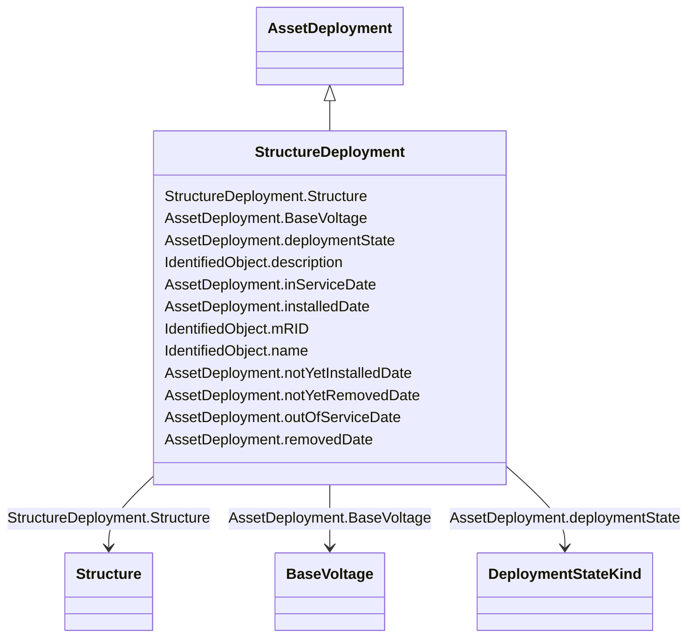

# StructureDeployment

_Deployment of a structure._

**URI**: [nc-no:StructureDeployment](http://cim4.eu/ns/nc-no#StructureDeployment) 
**Type**: Class

## Inheritance
* [IdentifiedObject](IdentifiedObject.md)
    * [AssetDeployment](AssetDeployment.md)
        * **StructureDeployment**

## Attributes

| Name | URI | Cardinality and Range | Description | Inheritance |
| ---  | --- | --- | --- | --- |
| ACLineSegmentSpan | [nc-no:StructureDeployment.Structure](http://cim4.eu/ns/nc-no#StructureDeployment.Structure) | 0..1    [Structure](Structure.md)  | The associated Structure | direct |
| deploymentState | [cim:AssetDeployment.deploymentState](https://cim.ucaiug.io/ns#AssetDeployment.deploymentState) | 0..1    [DeploymentStateKind](DeploymentStateKind.md)  | Current deployment state of asset | [AssetDeployment](AssetDeployment.md) |
| BaseVoltage | [cim:AssetDeployment.BaseVoltage](https://cim.ucaiug.io/ns#AssetDeployment.BaseVoltage) | 0..1    [BaseVoltage](BaseVoltage.md)  | The associated Base Voltage | [AssetDeployment](AssetDeployment.md) |
| inServiceDate | [nc-no:AssetDeployment.inServiceDate](http://cim4.eu/ns/nc-no#AssetDeployment.inServiceDate) | 0..1    datetime  | Date and time asset was most recently put in service | [AssetDeployment](AssetDeployment.md) |
| installedDate | [nc-no:AssetDeployment.installedDate](http://cim4.eu/ns/nc-no#AssetDeployment.installedDate) | 0..1    datetime  | Date and time asset was most recently installed | [AssetDeployment](AssetDeployment.md) |
| notYetInstalledDate | [nc-no:AssetDeployment.notYetInstalledDate](http://cim4.eu/ns/nc-no#AssetDeployment.notYetInstalledDate) | 0..1    datetime  | Date and time of asset deployment transition to not yet installed | [AssetDeployment](AssetDeployment.md) |
| notYetRemovedDate | [nc-no:AssetDeployment.notYetRemovedDate](http://cim4.eu/ns/nc-no#AssetDeployment.notYetRemovedDate) | 0..1    datetime  | Date and time of asset deployment transition to not yet removed | [AssetDeployment](AssetDeployment.md) |
| outOfServiceDate | [nc-no:AssetDeployment.outOfServiceDate](http://cim4.eu/ns/nc-no#AssetDeployment.outOfServiceDate) | 0..1    datetime  | Date and time asset was most recently taken out of service | [AssetDeployment](AssetDeployment.md) |
| removedDate | [nc-no:AssetDeployment.removedDate](http://cim4.eu/ns/nc-no#AssetDeployment.removedDate) | 0..1    datetime  | Date and time asset was most recently removed | [AssetDeployment](AssetDeployment.md) |
| mRID | [cim:IdentifiedObject.mRID](https://cim.ucaiug.io/ns#IdentifiedObject.mRID) | 0..1    string  | Master resource identifier issued by a model authority | [IdentifiedObject](IdentifiedObject.md) |
| description | [cim:IdentifiedObject.description](https://cim.ucaiug.io/ns#IdentifiedObject.description) | 0..1    string  | The description is a free human readable text describing or naming the object | [IdentifiedObject](IdentifiedObject.md) |
| name | [cim:IdentifiedObject.name](https://cim.ucaiug.io/ns#IdentifiedObject.name) | 0..1    string  | The name is any free human readable and possibly non unique text naming the o... | [IdentifiedObject](IdentifiedObject.md) |

## Identifier and Mapping Information

### Schema Source

* from schema: https://ap-no.cim4.eu/AviationObstacle/1.0

## Mappings

| Mapping Type | Mapped Value |
| ---  | ---  |
| self | nc-no:StructureDeployment |
| native | this:StructureDeployment |

