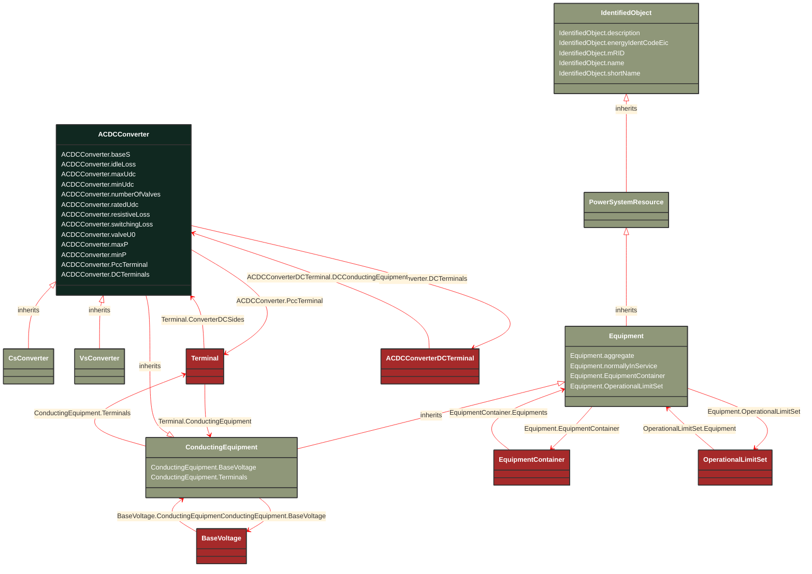

# ACDCConverter

_A unit with valves for three phases, together with unit control equipment, essential protective and switching devices, DC storage capacitors, phase reactors and auxiliaries, if any, used for conversion._

*__NOTE__: this is an abstract class and should not be instantiated directly

**URI**: [cim:ACDCConverter](http://iec.ch/TC57/CIM100#ACDCConverter) 
**Type**: Class

## Inheritance
* [IdentifiedObject](/Models/Profiles/CoreEquipment/AbstractClasses/IdentifiedObject/)
    * [PowerSystemResource](/Models/Profiles/CoreEquipment/AbstractClasses/PowerSystemResource/)
        * [Equipment](/Models/Profiles/CoreEquipment/AbstractClasses/Equipment/)
            * [ConductingEquipment](/Models/Profiles/CoreEquipment/AbstractClasses/ConductingEquipment/)
                * **ACDCConverter**

## Attributes
| Name | URI | Cardinality and Range | Description | Inheritance |
| ---  | --- | --- | --- | --- |
| baseS | [cim:ACDCConverter.baseS](http://iec.ch/TC57/CIM100#ACDCConverter.baseS) | No cardinality available ApparentPower | Base apparent power of the converter pole. The attribute shall be a positive value. | direct |
| idleLoss | [cim:ACDCConverter.idleLoss](http://iec.ch/TC57/CIM100#ACDCConverter.idleLoss) | No cardinality available ActivePower | Active power loss in pole at no power transfer. It is converter’s configuration data used in power flow. The attribute shall be a positive value. | direct |
| maxUdc | [cim:ACDCConverter.maxUdc](http://iec.ch/TC57/CIM100#ACDCConverter.maxUdc) | No cardinality available Voltage | The maximum voltage on the DC side at which the converter should operate. It is converter’s configuration data used in power flow. The attribute shall be a positive value. | direct |
| minUdc | [cim:ACDCConverter.minUdc](http://iec.ch/TC57/CIM100#ACDCConverter.minUdc) | No cardinality available Voltage | The minimum voltage on the DC side at which the converter should operate. It is converter’s configuration data used in power flow. The attribute shall be a positive value. | direct |
| numberOfValves | [cim:ACDCConverter.numberOfValves](http://iec.ch/TC57/CIM100#ACDCConverter.numberOfValves) | No cardinality available integer | Number of valves in the converter. Used in loss calculations. | direct |
| ratedUdc | [cim:ACDCConverter.ratedUdc](http://iec.ch/TC57/CIM100#ACDCConverter.ratedUdc) | No cardinality available Voltage | Rated converter DC voltage, also called UdN. The attribute shall be a positive value. It is converter’s configuration data used in power flow. For instance a bipolar HVDC link with value  200 kV has a 400kV difference between the dc lines. | direct |
| resistiveLoss | [cim:ACDCConverter.resistiveLoss](http://iec.ch/TC57/CIM100#ACDCConverter.resistiveLoss) | No cardinality available Resistance | It is converter’s configuration data used in power flow. Refer to poleLossP. The attribute shall be a positive value. | direct |
| switchingLoss | [cim:ACDCConverter.switchingLoss](http://iec.ch/TC57/CIM100#ACDCConverter.switchingLoss) | No cardinality available ActivePowerPerCurrentFlow | Switching losses, relative to the base apparent power 'baseS'. Refer to poleLossP. The attribute shall be a positive value. | direct |
| valveU0 | [cim:ACDCConverter.valveU0](http://iec.ch/TC57/CIM100#ACDCConverter.valveU0) | No cardinality available Voltage | Valve threshold voltage, also called Uvalve. Forward voltage drop when the valve is conducting. Used in loss calculations, i.e. the switchLoss depend on numberOfValves * valveU0. | direct |
| maxP | [cim:ACDCConverter.maxP](http://iec.ch/TC57/CIM100#ACDCConverter.maxP) | No cardinality available ActivePower | Maximum active power limit. The value is overwritten by values of VsCapabilityCurve, if present. | direct |
| minP | [cim:ACDCConverter.minP](http://iec.ch/TC57/CIM100#ACDCConverter.minP) | No cardinality available ActivePower | Minimum active power limit. The value is overwritten by values of VsCapabilityCurve, if present. | direct |
| PccTerminal | [cim:ACDCConverter.PccTerminal](http://iec.ch/TC57/CIM100#ACDCConverter.PccTerminal) | No cardinality available Terminal | Point of common coupling terminal for this converter DC side. It is typically the terminal on the power transformer (or switch) closest to the AC network. | direct |
| DCTerminals | [cim:ACDCConverter.DCTerminals](http://iec.ch/TC57/CIM100#ACDCConverter.DCTerminals) | No cardinality available ACDCConverterDCTerminal | A DC converter have DC converter terminals. A converter has two DC converter terminals. | direct |
| BaseVoltage | [cim:ConductingEquipment.BaseVoltage](http://iec.ch/TC57/CIM100#ConductingEquipment.BaseVoltage) | No cardinality available BaseVoltage | Base voltage of this conducting equipment.  Use only when there is no voltage level container used and only one base voltage applies.  For example, not used for transformers. | ConductingEquipment |
| Terminals | [cim:ConductingEquipment.Terminals](http://iec.ch/TC57/CIM100#ConductingEquipment.Terminals) | No cardinality available Terminal | Conducting equipment have terminals that may be connected to other conducting equipment terminals via connectivity nodes or topological nodes. | ConductingEquipment |
| aggregate | [cim:Equipment.aggregate](http://iec.ch/TC57/CIM100#Equipment.aggregate) | No cardinality available boolean | The aggregate flag provides an alternative way of representing an aggregated (equivalent) element. It is applicable in cases when the dedicated classes for equivalent equipment do not have all of the attributes necessary to represent the required level of detail.  In case the flag is set to “true” the single instance of equipment represents multiple pieces of equipment that have been modelled together as an aggregate equivalent obtained by a network reduction procedure. Examples would be power transformers or synchronous machines operating in parallel modelled as a single aggregate power transformer or aggregate synchronous machine.  
The attribute is not used for EquivalentBranch, EquivalentShunt and EquivalentInjection. | Equipment |
| normallyInService | [cim:Equipment.normallyInService](http://iec.ch/TC57/CIM100#Equipment.normallyInService) | No cardinality available boolean | Specifies the availability of the equipment under normal operating conditions. True means the equipment is available for topology processing, which determines if the equipment is energized or not. False means that the equipment is treated by network applications as if it is not in the model. | Equipment |
| EquipmentContainer | [cim:Equipment.EquipmentContainer](http://iec.ch/TC57/CIM100#Equipment.EquipmentContainer) | No cardinality available EquipmentContainer | Container of this equipment. | Equipment |
| OperationalLimitSet | [cim:Equipment.OperationalLimitSet](http://iec.ch/TC57/CIM100#Equipment.OperationalLimitSet) | No cardinality available OperationalLimitSet | The operational limit sets associated with this equipment. | Equipment |
| description | [cim:IdentifiedObject.description](http://iec.ch/TC57/CIM100#IdentifiedObject.description) | No cardinality available string | The description is a free human readable text describing or naming the object. It may be non unique and may not correlate to a naming hierarchy. | IdentifiedObject |
| energyIdentCodeEic | [eu:IdentifiedObject.energyIdentCodeEic](http://iec.ch/TC57/CIM100-European#IdentifiedObject.energyIdentCodeEic) | No cardinality available string | The attribute is used for an exchange of the EIC code (Energy identification Code). The length of the string is 16 characters as defined by the EIC code. For details on EIC scheme please refer to ENTSO-E web site. | IdentifiedObject |
| mRID | [cim:IdentifiedObject.mRID](http://iec.ch/TC57/CIM100#IdentifiedObject.mRID) | No cardinality available string | Master resource identifier issued by a model authority. The mRID is unique within an exchange context. Global uniqueness is easily achieved by using a UUID, as specified in RFC 4122, for the mRID. The use of UUID is strongly recommended.
For CIMXML data files in RDF syntax conforming to IEC 61970-552, the mRID is mapped to rdf:ID or rdf:about attributes that identify CIM object elements. | IdentifiedObject |
| name | [cim:IdentifiedObject.name](http://iec.ch/TC57/CIM100#IdentifiedObject.name) | No cardinality available string | The name is any free human readable and possibly non unique text naming the object. | IdentifiedObject |
| shortName | [eu:IdentifiedObject.shortName](http://iec.ch/TC57/CIM100-European#IdentifiedObject.shortName) | No cardinality available string | The attribute is used for an exchange of a human readable short name with length of the string 12 characters maximum. | IdentifiedObject |

### Schema Source
* from schema: [http://iec.ch/TC57/ns/CIM/CoreEquipment-EUPackage_CoreEquipmentProfile](http://iec.ch/TC57/ns/CIM/CoreEquipment-EUPackage_CoreEquipmentProfile)
