# TransformerEnd

_A conducting connection point of a power transformer. It corresponds to a physical transformer winding terminal.  In earlier CIM versions, the TransformerWinding class served a similar purpose, but this class is more flexible because it associates to terminal but is not a specialization of ConductingEquipment._

*__NOTE__: this is an abstract class and should not be instantiated directly

**URI**: [cim:TransformerEnd](http://iec.ch/TC57/CIM100#TransformerEnd) 
**Type**: Class

```mermaid
%%{init: {'theme':'base','themeVariables': {'lineColor': '#FF0000'}}}%%
classDiagram
    class TransformerEnd
    click TransformerEnd href "/Models/Profiles/CoreEquipment/AbstractClasses/TransformerEnd/"
    style TransformerEnd fill:#102820,stroke:#333,stroke-width:2px,rx:10,ry:10,color:white

        TransformerEnd <|-- PowerTransformerEnd : inherits

        PowerTransformerEnd
            click PowerTransformerEnd href "/Models/Profiles/CoreEquipment/ConcreteClasses/PowerTransformerEnd/"
            style PowerTransformerEnd fill:#8F9779,stroke:#333,stroke-width:2px,rx:10,ry:10,color:white
     
        IdentifiedObject <|-- TransformerEnd : inherits
            click IdentifiedObject href "/Models/Profiles/CoreEquipment/AbstractClasses/IdentifiedObject/"
            style IdentifiedObject fill:#8F9779,stroke:#333,stroke-width:2px,rx:10,ry:10,color:white

        TransformerEnd --> BaseVoltage : TransformerEnd.BaseVoltage

        BaseVoltage
            click BaseVoltage href "/Models/Profiles/CoreEquipment/ConcreteClasses/BaseVoltage/"
            style BaseVoltage fill:#A52A2A,stroke:#333,stroke-width:2px,rx:10,ry:10,color:white
        TransformerEnd --> PhaseTapChanger : TransformerEnd.PhaseTapChanger

        PhaseTapChanger
            click PhaseTapChanger href "/Models/Profiles/CoreEquipment/AbstractClasses/PhaseTapChanger/"
            style PhaseTapChanger fill:#A52A2A,stroke:#333,stroke-width:2px,rx:10,ry:10,color:white
        TransformerEnd --> RatioTapChanger : TransformerEnd.RatioTapChanger

        RatioTapChanger
            click RatioTapChanger href "/Models/Profiles/CoreEquipment/ConcreteClasses/RatioTapChanger/"
            style RatioTapChanger fill:#A52A2A,stroke:#333,stroke-width:2px,rx:10,ry:10,color:white
        TransformerEnd --> Terminal : TransformerEnd.Terminal

        Terminal
            click Terminal href "/Models/Profiles/CoreEquipment/ConcreteClasses/Terminal/"
            style Terminal fill:#A52A2A,stroke:#333,stroke-width:2px,rx:10,ry:10,color:white

        BaseVoltage --> TransformerEnd : BaseVoltage.TransformerEnds

        BaseVoltage
            click BaseVoltage href "/Models/Profiles/CoreEquipment/ConcreteClasses/BaseVoltage/"
            style BaseVoltage fill:#A52A2A,stroke:#333,stroke-width:2px,rx:10,ry:10,color:white

        PhaseTapChanger --> TransformerEnd : PhaseTapChanger.TransformerEnd

        PhaseTapChanger
            click PhaseTapChanger href "/Models/Profiles/CoreEquipment/AbstractClasses/PhaseTapChanger/"
            style PhaseTapChanger fill:#A52A2A,stroke:#333,stroke-width:2px,rx:10,ry:10,color:white

        RatioTapChanger --> TransformerEnd : RatioTapChanger.TransformerEnd

        RatioTapChanger
            click RatioTapChanger href "/Models/Profiles/CoreEquipment/ConcreteClasses/RatioTapChanger/"
            style RatioTapChanger fill:#A52A2A,stroke:#333,stroke-width:2px,rx:10,ry:10,color:white

        Terminal --> TransformerEnd : Terminal.TransformerEnd

        Terminal
            click Terminal href "/Models/Profiles/CoreEquipment/ConcreteClasses/Terminal/"
            style Terminal fill:#A52A2A,stroke:#333,stroke-width:2px,rx:10,ry:10,color:white


        TransformerEnd : TransformerEnd.BaseVoltage
        TransformerEnd : TransformerEnd.PhaseTapChanger
        TransformerEnd : TransformerEnd.RatioTapChanger
        TransformerEnd : TransformerEnd.Terminal
        TransformerEnd : TransformerEnd.endNumber
        IdentifiedObject : IdentifiedObject.description
        IdentifiedObject : IdentifiedObject.energyIdentCodeEic
        IdentifiedObject : IdentifiedObject.mRID
        IdentifiedObject : IdentifiedObject.name
        IdentifiedObject : IdentifiedObject.shortName
```

## Inheritance
* [IdentifiedObject](/Models/Profiles/CoreEquipment/AbstractClasses/IdentifiedObject/)
    * **TransformerEnd**

## Attributes
| Name | URI | Cardinality and Range | Description | Inheritance |
| ---  | --- | --- | --- | --- |
| BaseVoltage | [cim:TransformerEnd.BaseVoltage](http://iec.ch/TC57/CIM100#TransformerEnd.BaseVoltage) | No cardinality available BaseVoltage | Base voltage of the transformer end.  This is essential for PU calculation. | direct |
| PhaseTapChanger | [cim:TransformerEnd.PhaseTapChanger](http://iec.ch/TC57/CIM100#TransformerEnd.PhaseTapChanger) | No cardinality available PhaseTapChanger | Phase tap changer associated with this transformer end. | direct |
| RatioTapChanger | [cim:TransformerEnd.RatioTapChanger](http://iec.ch/TC57/CIM100#TransformerEnd.RatioTapChanger) | No cardinality available RatioTapChanger | Ratio tap changer associated with this transformer end. | direct |
| Terminal | [cim:TransformerEnd.Terminal](http://iec.ch/TC57/CIM100#TransformerEnd.Terminal) | No cardinality available Terminal | Terminal of the power transformer to which this transformer end belongs. | direct |
| endNumber | [cim:TransformerEnd.endNumber](http://iec.ch/TC57/CIM100#TransformerEnd.endNumber) | No cardinality available integer | Number for this transformer end, corresponding to the end's order in the power transformer vector group or phase angle clock number.  Highest voltage winding should be 1.  Each end within a power transformer should have a unique subsequent end number.   Note the transformer end number need not match the terminal sequence number. | direct |
| description | [cim:IdentifiedObject.description](http://iec.ch/TC57/CIM100#IdentifiedObject.description) | No cardinality available string | The description is a free human readable text describing or naming the object. It may be non unique and may not correlate to a naming hierarchy. | IdentifiedObject |
| energyIdentCodeEic | [eu:IdentifiedObject.energyIdentCodeEic](http://iec.ch/TC57/CIM100-European#IdentifiedObject.energyIdentCodeEic) | No cardinality available string | The attribute is used for an exchange of the EIC code (Energy identification Code). The length of the string is 16 characters as defined by the EIC code. For details on EIC scheme please refer to ENTSO-E web site. | IdentifiedObject |
| mRID | [cim:IdentifiedObject.mRID](http://iec.ch/TC57/CIM100#IdentifiedObject.mRID) | No cardinality available string | Master resource identifier issued by a model authority. The mRID is unique within an exchange context. Global uniqueness is easily achieved by using a UUID, as specified in RFC 4122, for the mRID. The use of UUID is strongly recommended.
For CIMXML data files in RDF syntax conforming to IEC 61970-552, the mRID is mapped to rdf:ID or rdf:about attributes that identify CIM object elements. | IdentifiedObject |
| name | [cim:IdentifiedObject.name](http://iec.ch/TC57/CIM100#IdentifiedObject.name) | No cardinality available string | The name is any free human readable and possibly non unique text naming the object. | IdentifiedObject |
| shortName | [eu:IdentifiedObject.shortName](http://iec.ch/TC57/CIM100-European#IdentifiedObject.shortName) | No cardinality available string | The attribute is used for an exchange of a human readable short name with length of the string 12 characters maximum. | IdentifiedObject |

### Schema Source
* from schema: [http://iec.ch/TC57/ns/CIM/CoreEquipment-EUPackage_CoreEquipmentProfile](http://iec.ch/TC57/ns/CIM/CoreEquipment-EUPackage_CoreEquipmentProfile)
