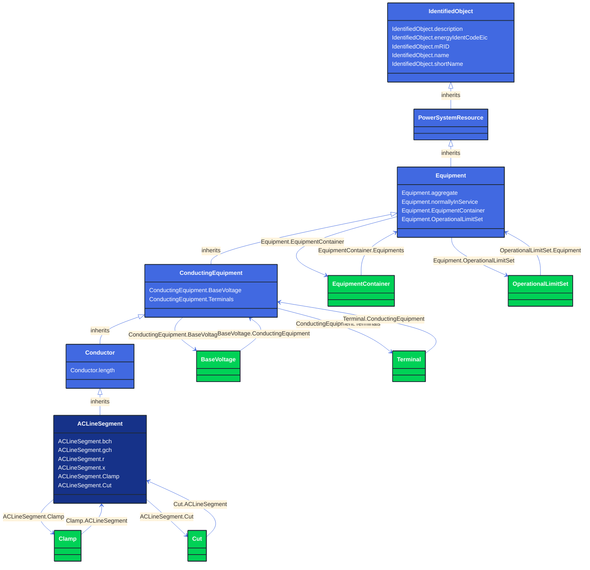

# ACLineSegment

_A wire or combination of wires, with consistent electrical characteristics, building a single electrical system, used to carry alternating current between points in the power system.
For symmetrical, transposed three phase lines, it is sufficient to use attributes of the line segment, which describe impedances and admittances for the entire length of the segment.  Additionally impedances can be computed by using length and associated per length impedances.
The BaseVoltage at the two ends of ACLineSegments in a Line shall have the same BaseVoltage.nominalVoltage. However, boundary lines may have slightly different BaseVoltage.nominalVoltages and variation is allowed. Larger voltage difference in general requires use of an equivalent branch._

**URI**: [cim:ACLineSegment](http://iec.ch/TC57/CIM100#ACLineSegment) 
**Type**: Class

## Inheritance
* [IdentifiedObject](/Models/Profiles/CoreEquipment/AbstractClasses/IdentifiedObject/)
    * [PowerSystemResource](/Models/Profiles/CoreEquipment/AbstractClasses/PowerSystemResource/)
        * [Equipment](/Models/Profiles/CoreEquipment/AbstractClasses/Equipment/)
            * [ConductingEquipment](/Models/Profiles/CoreEquipment/AbstractClasses/ConductingEquipment/)
                * [Conductor](/Models/Profiles/CoreEquipment/AbstractClasses/Conductor/)
                    * **ACLineSegment**

## Attributes
| Name | URI | Cardinality and Range | Description | Inheritance |
| ---  | --- | --- | --- | --- |
| bch | [cim:ACLineSegment.bch](http://iec.ch/TC57/CIM100#ACLineSegment.bch) | No cardinality available Susceptance | Positive sequence shunt (charging) susceptance, uniformly distributed, of the entire line section.  This value represents the full charging over the full length of the line. | direct |
| gch | [cim:ACLineSegment.gch](http://iec.ch/TC57/CIM100#ACLineSegment.gch) | No cardinality available Conductance | Positive sequence shunt (charging) conductance, uniformly distributed, of the entire line section. | direct |
| r | [cim:ACLineSegment.r](http://iec.ch/TC57/CIM100#ACLineSegment.r) | No cardinality available Resistance | Positive sequence series resistance of the entire line section. | direct |
| x | [cim:ACLineSegment.x](http://iec.ch/TC57/CIM100#ACLineSegment.x) | No cardinality available Reactance | Positive sequence series reactance of the entire line section. | direct |
| Clamp | [cim:ACLineSegment.Clamp](http://iec.ch/TC57/CIM100#ACLineSegment.Clamp) | No cardinality available Clamp | The clamps connected to the line segment. | direct |
| Cut | [cim:ACLineSegment.Cut](http://iec.ch/TC57/CIM100#ACLineSegment.Cut) | No cardinality available Cut | Cuts applied to the line segment. | direct |
| length | [cim:Conductor.length](http://iec.ch/TC57/CIM100#Conductor.length) | No cardinality available Length | Segment length for calculating line section capabilities. | Conductor |
| BaseVoltage | [cim:ConductingEquipment.BaseVoltage](http://iec.ch/TC57/CIM100#ConductingEquipment.BaseVoltage) | No cardinality available BaseVoltage | Base voltage of this conducting equipment.  Use only when there is no voltage level container used and only one base voltage applies.  For example, not used for transformers. | ConductingEquipment |
| Terminals | [cim:ConductingEquipment.Terminals](http://iec.ch/TC57/CIM100#ConductingEquipment.Terminals) | No cardinality available Terminal | Conducting equipment have terminals that may be connected to other conducting equipment terminals via connectivity nodes or topological nodes. | ConductingEquipment |
| aggregate | [cim:Equipment.aggregate](http://iec.ch/TC57/CIM100#Equipment.aggregate) | No cardinality available boolean | The aggregate flag provides an alternative way of representing an aggregated (equivalent) element. It is applicable in cases when the dedicated classes for equivalent equipment do not have all of the attributes necessary to represent the required level of detail.  In case the flag is set to “true” the single instance of equipment represents multiple pieces of equipment that have been modelled together as an aggregate equivalent obtained by a network reduction procedure. Examples would be power transformers or synchronous machines operating in parallel modelled as a single aggregate power transformer or aggregate synchronous machine.  
The attribute is not used for EquivalentBranch, EquivalentShunt and EquivalentInjection. | Equipment |
| normallyInService | [cim:Equipment.normallyInService](http://iec.ch/TC57/CIM100#Equipment.normallyInService) | No cardinality available boolean | Specifies the availability of the equipment under normal operating conditions. True means the equipment is available for topology processing, which determines if the equipment is energized or not. False means that the equipment is treated by network applications as if it is not in the model. | Equipment |
| EquipmentContainer | [cim:Equipment.EquipmentContainer](http://iec.ch/TC57/CIM100#Equipment.EquipmentContainer) | No cardinality available EquipmentContainer | Container of this equipment. | Equipment |
| OperationalLimitSet | [cim:Equipment.OperationalLimitSet](http://iec.ch/TC57/CIM100#Equipment.OperationalLimitSet) | No cardinality available OperationalLimitSet | The operational limit sets associated with this equipment. | Equipment |
| description | [cim:IdentifiedObject.description](http://iec.ch/TC57/CIM100#IdentifiedObject.description) | No cardinality available string | The description is a free human readable text describing or naming the object. It may be non unique and may not correlate to a naming hierarchy. | IdentifiedObject |
| energyIdentCodeEic | [eu:IdentifiedObject.energyIdentCodeEic](http://iec.ch/TC57/CIM100-European#IdentifiedObject.energyIdentCodeEic) | No cardinality available string | The attribute is used for an exchange of the EIC code (Energy identification Code). The length of the string is 16 characters as defined by the EIC code. For details on EIC scheme please refer to ENTSO-E web site. | IdentifiedObject |
| mRID | [cim:IdentifiedObject.mRID](http://iec.ch/TC57/CIM100#IdentifiedObject.mRID) | No cardinality available string | Master resource identifier issued by a model authority. The mRID is unique within an exchange context. Global uniqueness is easily achieved by using a UUID, as specified in RFC 4122, for the mRID. The use of UUID is strongly recommended.
For CIMXML data files in RDF syntax conforming to IEC 61970-552, the mRID is mapped to rdf:ID or rdf:about attributes that identify CIM object elements. | IdentifiedObject |
| name | [cim:IdentifiedObject.name](http://iec.ch/TC57/CIM100#IdentifiedObject.name) | No cardinality available string | The name is any free human readable and possibly non unique text naming the object. | IdentifiedObject |
| shortName | [eu:IdentifiedObject.shortName](http://iec.ch/TC57/CIM100-European#IdentifiedObject.shortName) | No cardinality available string | The attribute is used for an exchange of a human readable short name with length of the string 12 characters maximum. | IdentifiedObject |

### Schema Source
* from schema: [http://iec.ch/TC57/ns/CIM/CoreEquipment-EUPackage_CoreEquipmentProfile](http://iec.ch/TC57/ns/CIM/CoreEquipment-EUPackage_CoreEquipmentProfile)
