# AngleDegrees

_Measurement of angle in degrees._

**URI**: [cim:AngleDegrees](http://iec.ch/TC57/CIM100#AngleDegrees) 
**Type**: Class

```mermaid
%%{init: {'theme':'base','themeVariables': {'lineColor': '#FF0000'}}}%%
classDiagram
    class AngleDegrees
    click AngleDegrees href "/Models/Profiles/CoreEquipment/ConcreteClasses/AngleDegrees/"
    style AngleDegrees fill:#102820,stroke:#333,stroke-width:2px,rx:10,ry:10,color:white


        CsConverter --> AngleDegrees : CsConverter.maxAlpha

        CsConverter
            click CsConverter href "/Models/Profiles/CoreEquipment/ConcreteClasses/CsConverter/"
            style CsConverter fill:#A52A2A,stroke:#333,stroke-width:2px,rx:10,ry:10,color:white

        CsConverter --> AngleDegrees : CsConverter.maxGamma

        CsConverter
            click CsConverter href "/Models/Profiles/CoreEquipment/ConcreteClasses/CsConverter/"
            style CsConverter fill:#A52A2A,stroke:#333,stroke-width:2px,rx:10,ry:10,color:white

        CsConverter --> AngleDegrees : CsConverter.minAlpha

        CsConverter
            click CsConverter href "/Models/Profiles/CoreEquipment/ConcreteClasses/CsConverter/"
            style CsConverter fill:#A52A2A,stroke:#333,stroke-width:2px,rx:10,ry:10,color:white

        CsConverter --> AngleDegrees : CsConverter.minGamma

        CsConverter
            click CsConverter href "/Models/Profiles/CoreEquipment/ConcreteClasses/CsConverter/"
            style CsConverter fill:#A52A2A,stroke:#333,stroke-width:2px,rx:10,ry:10,color:white

        PhaseTapChangerAsymmetrical --> AngleDegrees : PhaseTapChangerAsymmetrical.windingConnectionAngle

        PhaseTapChangerAsymmetrical
            click PhaseTapChangerAsymmetrical href "/Models/Profiles/CoreEquipment/ConcreteClasses/PhaseTapChangerAsymmetrical/"
            style PhaseTapChangerAsymmetrical fill:#A52A2A,stroke:#333,stroke-width:2px,rx:10,ry:10,color:white

        PhaseTapChangerLinear --> AngleDegrees : PhaseTapChangerLinear.stepPhaseShiftIncrement

        PhaseTapChangerLinear
            click PhaseTapChangerLinear href "/Models/Profiles/CoreEquipment/ConcreteClasses/PhaseTapChangerLinear/"
            style PhaseTapChangerLinear fill:#A52A2A,stroke:#333,stroke-width:2px,rx:10,ry:10,color:white

        PhaseTapChangerTablePoint --> AngleDegrees : PhaseTapChangerTablePoint.angle

        PhaseTapChangerTablePoint
            click PhaseTapChangerTablePoint href "/Models/Profiles/CoreEquipment/ConcreteClasses/PhaseTapChangerTablePoint/"
            style PhaseTapChangerTablePoint fill:#A52A2A,stroke:#333,stroke-width:2px,rx:10,ry:10,color:white

        AngleDegrees --> UnitSymbol : AngleDegrees.unit

        UnitSymbol
            click UnitSymbol href "/Models/Profiles/CoreEquipment/Enumerations/UnitSymbol/"
            style UnitSymbol fill:#4D2D18,stroke:#333,stroke-width:2px,rx:10,ry:10,color:white
        AngleDegrees --> UnitMultiplier : AngleDegrees.multiplier

        UnitMultiplier
            click UnitMultiplier href "/Models/Profiles/CoreEquipment/Enumerations/UnitMultiplier/"
            style UnitMultiplier fill:#4D2D18,stroke:#333,stroke-width:2px,rx:10,ry:10,color:white

        AngleDegrees : AngleDegrees.value
        AngleDegrees : AngleDegrees.unit
        AngleDegrees : AngleDegrees.multiplier
```

## Inheritance
* **AngleDegrees**

## Attributes
| Name | URI | Cardinality and Range | Description | Inheritance |
| ---  | --- | --- | --- | --- |
| value | [cim:AngleDegrees.value](http://iec.ch/TC57/CIM100#AngleDegrees.value) | No cardinality available float | No description available | direct |
| unit | [cim:AngleDegrees.unit](http://iec.ch/TC57/CIM100#AngleDegrees.unit) | No cardinality available UnitSymbol | No description available | direct |
| multiplier | [cim:AngleDegrees.multiplier](http://iec.ch/TC57/CIM100#AngleDegrees.multiplier) | No cardinality available UnitMultiplier | No description available | direct |

### Schema Source
* from schema: [http://iec.ch/TC57/ns/CIM/CoreEquipment-EUPackage_CoreEquipmentProfile](http://iec.ch/TC57/ns/CIM/CoreEquipment-EUPackage_CoreEquipmentProfile)
