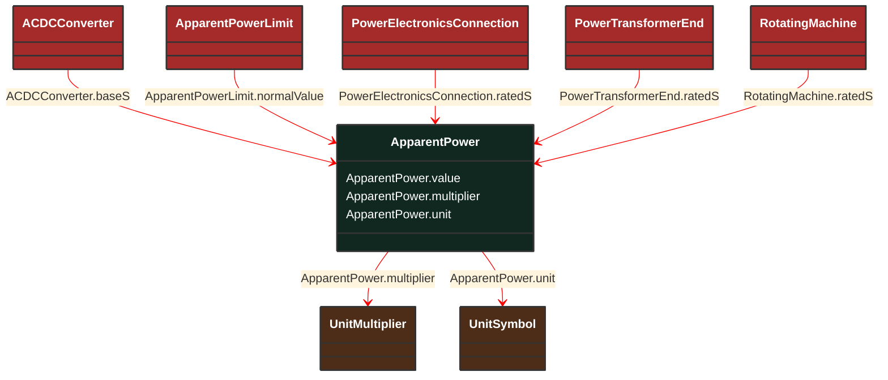

# ApparentPower

_Product of the RMS value of the voltage and the RMS value of the current._

**URI**: [cim:ApparentPower](http://iec.ch/TC57/CIM100#ApparentPower) 
**Type**: Class

## Inheritance
* **ApparentPower**

## Attributes
| Name | URI | Cardinality and Range | Description | Inheritance |
| ---  | --- | --- | --- | --- |
| value | [cim:ApparentPower.value](http://iec.ch/TC57/CIM100#ApparentPower.value) | No cardinality available float | No description available | direct |
| multiplier | [cim:ApparentPower.multiplier](http://iec.ch/TC57/CIM100#ApparentPower.multiplier) | No cardinality available UnitMultiplier | No description available | direct |
| unit | [cim:ApparentPower.unit](http://iec.ch/TC57/CIM100#ApparentPower.unit) | No cardinality available UnitSymbol | No description available | direct |

### Schema Source
* from schema: [http://iec.ch/TC57/ns/CIM/CoreEquipment-EUPackage_CoreEquipmentProfile](http://iec.ch/TC57/ns/CIM/CoreEquipment-EUPackage_CoreEquipmentProfile)
