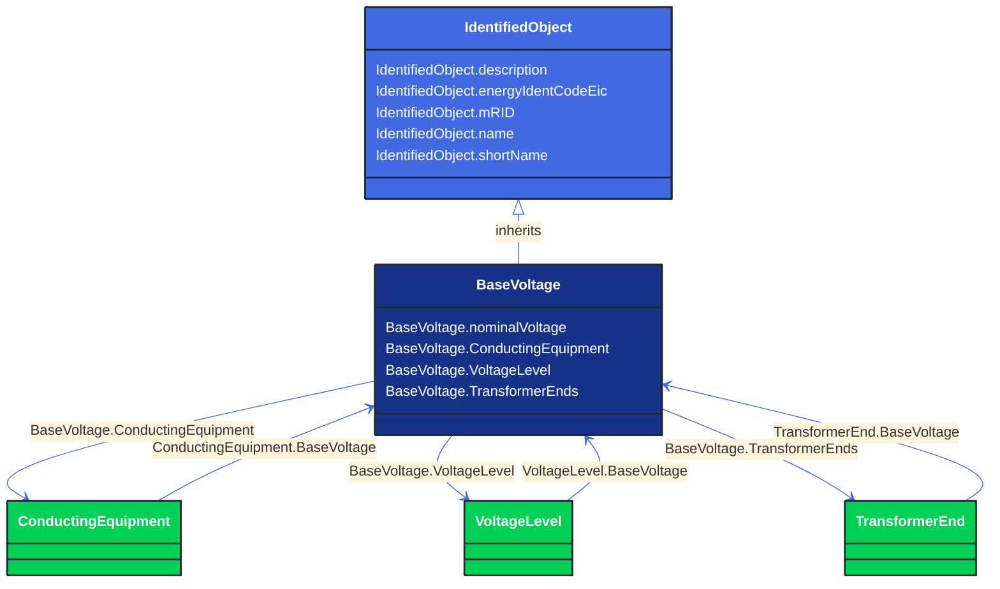

# BaseVoltage

_Defines a system base voltage which is referenced._

**URI**: [cim:BaseVoltage](http://iec.ch/TC57/CIM100#BaseVoltage) 
**Type**: Class

## Inheritance
* [IdentifiedObject](/Models/Profiles/CoreEquipment/AbstractClasses/IdentifiedObject/)
    * **BaseVoltage**

## Attributes
| Name | URI | Cardinality and Range | Description | Inheritance |
| ---  | --- | --- | --- | --- |
| nominalVoltage | [cim:BaseVoltage.nominalVoltage](http://iec.ch/TC57/CIM100#BaseVoltage.nominalVoltage) | No cardinality available Voltage | The power system resource's base voltage.  Shall be a positive value and not zero. | direct |
| ConductingEquipment | [cim:BaseVoltage.ConductingEquipment](http://iec.ch/TC57/CIM100#BaseVoltage.ConductingEquipment) | No cardinality available ConductingEquipment | All conducting equipment with this base voltage.  Use only when there is no voltage level container used and only one base voltage applies.  For example, not used for transformers. | direct |
| VoltageLevel | [cim:BaseVoltage.VoltageLevel](http://iec.ch/TC57/CIM100#BaseVoltage.VoltageLevel) | No cardinality available VoltageLevel | The voltage levels having this base voltage. | direct |
| TransformerEnds | [cim:BaseVoltage.TransformerEnds](http://iec.ch/TC57/CIM100#BaseVoltage.TransformerEnds) | No cardinality available TransformerEnd | Transformer ends at the base voltage.  This is essential for PU calculation. | direct |
| description | [cim:IdentifiedObject.description](http://iec.ch/TC57/CIM100#IdentifiedObject.description) | No cardinality available string | The description is a free human readable text describing or naming the object. It may be non unique and may not correlate to a naming hierarchy. | IdentifiedObject |
| energyIdentCodeEic | [eu:IdentifiedObject.energyIdentCodeEic](http://iec.ch/TC57/CIM100-European#IdentifiedObject.energyIdentCodeEic) | No cardinality available string | The attribute is used for an exchange of the EIC code (Energy identification Code). The length of the string is 16 characters as defined by the EIC code. For details on EIC scheme please refer to ENTSO-E web site. | IdentifiedObject |
| mRID | [cim:IdentifiedObject.mRID](http://iec.ch/TC57/CIM100#IdentifiedObject.mRID) | No cardinality available string | Master resource identifier issued by a model authority. The mRID is unique within an exchange context. Global uniqueness is easily achieved by using a UUID, as specified in RFC 4122, for the mRID. The use of UUID is strongly recommended.
For CIMXML data files in RDF syntax conforming to IEC 61970-552, the mRID is mapped to rdf:ID or rdf:about attributes that identify CIM object elements. | IdentifiedObject |
| name | [cim:IdentifiedObject.name](http://iec.ch/TC57/CIM100#IdentifiedObject.name) | No cardinality available string | The name is any free human readable and possibly non unique text naming the object. | IdentifiedObject |
| shortName | [eu:IdentifiedObject.shortName](http://iec.ch/TC57/CIM100-European#IdentifiedObject.shortName) | No cardinality available string | The attribute is used for an exchange of a human readable short name with length of the string 12 characters maximum. | IdentifiedObject |

### Schema Source
* from schema: [http://iec.ch/TC57/ns/CIM/CoreEquipment-EUPackage_CoreEquipmentProfile](http://iec.ch/TC57/ns/CIM/CoreEquipment-EUPackage_CoreEquipmentProfile)
