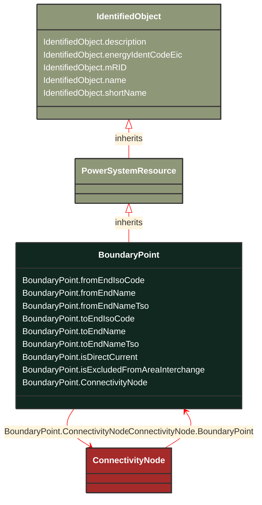

# BoundaryPoint

_Designates a connection point at which one or more model authority sets shall connect to. The location of the connection point as well as other properties are agreed between organisations responsible for the interconnection, hence all attributes of the class represent this agreement.  It is primarily used in a boundary model authority set which can contain one or many BoundaryPoint-s among other Equipment-s and their connections._

**URI**: [eu:BoundaryPoint](http://iec.ch/TC57/CIM100-European#BoundaryPoint) 
**Type**: Class

## Inheritance
* [IdentifiedObject](/Models/Profiles/CoreEquipment/ConcreteClasses/IdentifiedObject/)
    * [PowerSystemResource](/Models/Profiles/CoreEquipment/ConcreteClasses/PowerSystemResource/)
        * **BoundaryPoint**

## Attributes
| Name | URI | Cardinality and Range | Description | Inheritance |
| ---  | --- | --- | --- | --- |
| fromEndIsoCode | [eu:BoundaryPoint.fromEndIsoCode](http://iec.ch/TC57/CIM100-European#BoundaryPoint.fromEndIsoCode) | No cardinality available string | The ISO code of the region which the "From" side of the Boundary point belongs to or it is connected to.
The ISO code is a two-character country code as defined by ISO 3166 (http://www.iso.org/iso/country_codes). The length of the string is 2 characters maximum. | direct |
| fromEndName | [eu:BoundaryPoint.fromEndName](http://iec.ch/TC57/CIM100-European#BoundaryPoint.fromEndName) | No cardinality available string | A human readable name with length of the string 64 characters maximum. It covers the following two cases:
-if the Boundary point is placed on a tie-line, it is the name (IdentifiedObject.name) of the substation at which the "From" side of the tie-line is connected to.
-if the Boundary point is placed in a substation, it is the name (IdentifiedObject.name) of the element (e.g. PowerTransformer, ACLineSegment, Switch, etc.) at which the "From" side of the Boundary point is connected to. | direct |
| fromEndNameTso | [eu:BoundaryPoint.fromEndNameTso](http://iec.ch/TC57/CIM100-European#BoundaryPoint.fromEndNameTso) | No cardinality available string | Identifies the name of the transmission system operator, distribution system operator or other entity at which the "From" side of the interconnection is connected to. The length of the string is 64 characters maximum. | direct |
| toEndIsoCode | [eu:BoundaryPoint.toEndIsoCode](http://iec.ch/TC57/CIM100-European#BoundaryPoint.toEndIsoCode) | No cardinality available string | The ISO code of the region which the "To" side of the Boundary point belongs to or is connected to.
The ISO code is a two-character country code as defined by ISO 3166 (http://www.iso.org/iso/country_codes). The length of the string is 2 characters maximum. | direct |
| toEndName | [eu:BoundaryPoint.toEndName](http://iec.ch/TC57/CIM100-European#BoundaryPoint.toEndName) | No cardinality available string | A human readable name with length of the string 64 characters maximum. It covers the following two cases:
-if the Boundary point is placed on a tie-line, it is the name (IdentifiedObject.name) of the substation at which the "To" side of the tie-line is connected to.
-if the Boundary point is placed in a substation, it is the name (IdentifiedObject.name) of the element (e.g. PowerTransformer, ACLineSegment, Switch, etc.) at which the "To" side of the Boundary point is connected to. | direct |
| toEndNameTso | [eu:BoundaryPoint.toEndNameTso](http://iec.ch/TC57/CIM100-European#BoundaryPoint.toEndNameTso) | No cardinality available string | Identifies the name of the transmission system operator, distribution system operator or other entity at which the "To" side of the interconnection is connected to. The length of the string is 64 characters maximum. | direct |
| isDirectCurrent | [eu:BoundaryPoint.isDirectCurrent](http://iec.ch/TC57/CIM100-European#BoundaryPoint.isDirectCurrent) | No cardinality available boolean | If true, this boundary point is a point of common coupling (PCC) of a direct current (DC) interconnection, otherwise the interconnection is AC (default). | direct |
| isExcludedFromAreaInterchange | [eu:BoundaryPoint.isExcludedFromAreaInterchange](http://iec.ch/TC57/CIM100-European#BoundaryPoint.isExcludedFromAreaInterchange) | No cardinality available boolean | If true, this boundary point is on the interconnection that is excluded from control area interchange calculation and consequently has no related tie flows. Otherwise, the interconnection is included in control area interchange and a TieFlow is required at all sides of the boundary point (default). | direct |
| ConnectivityNode | [eu:BoundaryPoint.ConnectivityNode](http://iec.ch/TC57/CIM100-European#BoundaryPoint.ConnectivityNode) | No cardinality available ConnectivityNode | The connectivity node that is designated as a boundary point. | direct |
| description | [cim:IdentifiedObject.description](http://iec.ch/TC57/CIM100#IdentifiedObject.description) | No cardinality available string | The description is a free human readable text describing or naming the object. It may be non unique and may not correlate to a naming hierarchy. | IdentifiedObject |
| energyIdentCodeEic | [eu:IdentifiedObject.energyIdentCodeEic](http://iec.ch/TC57/CIM100-European#IdentifiedObject.energyIdentCodeEic) | No cardinality available string | The attribute is used for an exchange of the EIC code (Energy identification Code). The length of the string is 16 characters as defined by the EIC code. For details on EIC scheme please refer to ENTSO-E web site. | IdentifiedObject |
| mRID | [cim:IdentifiedObject.mRID](http://iec.ch/TC57/CIM100#IdentifiedObject.mRID) | No cardinality available string | Master resource identifier issued by a model authority. The mRID is unique within an exchange context. Global uniqueness is easily achieved by using a UUID, as specified in RFC 4122, for the mRID. The use of UUID is strongly recommended.
For CIMXML data files in RDF syntax conforming to IEC 61970-552, the mRID is mapped to rdf:ID or rdf:about attributes that identify CIM object elements. | IdentifiedObject |
| name | [cim:IdentifiedObject.name](http://iec.ch/TC57/CIM100#IdentifiedObject.name) | No cardinality available string | The name is any free human readable and possibly non unique text naming the object. | IdentifiedObject |
| shortName | [eu:IdentifiedObject.shortName](http://iec.ch/TC57/CIM100-European#IdentifiedObject.shortName) | No cardinality available string | The attribute is used for an exchange of a human readable short name with length of the string 12 characters maximum. | IdentifiedObject |

### Schema Source
* from schema: [http://iec.ch/TC57/ns/CIM/CoreEquipment-EUPackage_CoreEquipmentProfile](http://iec.ch/TC57/ns/CIM/CoreEquipment-EUPackage_CoreEquipmentProfile)
