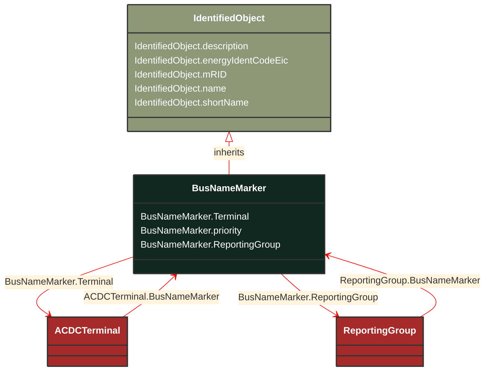

# BusNameMarker

_Used to apply user standard names to TopologicalNodes. Associated with one or more terminals that are normally connected with the bus name.    The associated terminals are normally connected by non-retained switches. For a ring bus station configuration, all BusbarSection terminals in the ring are typically associated.   For a breaker and a half scheme, both BusbarSections would normally be associated.  For a ring bus, all BusbarSections would normally be associated.  For a "straight" busbar configuration, normally only the main terminal at the BusbarSection would be associated._

**URI**: [cim:BusNameMarker](http://iec.ch/TC57/CIM100#BusNameMarker) 
**Type**: Class

## Inheritance
* [IdentifiedObject](/Models/Profiles/CoreEquipment/ConcreteClasses/IdentifiedObject/)
    * **BusNameMarker**

## Attributes
| Name | URI | Cardinality and Range | Description | Inheritance |
| ---  | --- | --- | --- | --- |
| Terminal | [cim:BusNameMarker.Terminal](http://iec.ch/TC57/CIM100#BusNameMarker.Terminal) | No cardinality available ACDCTerminal | The terminals associated with this bus name marker. | direct |
| priority | [cim:BusNameMarker.priority](http://iec.ch/TC57/CIM100#BusNameMarker.priority) | No cardinality available integer | Priority of bus name marker for use as topology bus name.  Use 0 for do not care.  Use 1 for highest priority.  Use 2 as priority is less than 1 and so on. | direct |
| ReportingGroup | [cim:BusNameMarker.ReportingGroup](http://iec.ch/TC57/CIM100#BusNameMarker.ReportingGroup) | No cardinality available ReportingGroup | The reporting group to which this bus name marker belongs. | direct |
| description | [cim:IdentifiedObject.description](http://iec.ch/TC57/CIM100#IdentifiedObject.description) | No cardinality available string | The description is a free human readable text describing or naming the object. It may be non unique and may not correlate to a naming hierarchy. | IdentifiedObject |
| energyIdentCodeEic | [eu:IdentifiedObject.energyIdentCodeEic](http://iec.ch/TC57/CIM100-European#IdentifiedObject.energyIdentCodeEic) | No cardinality available string | The attribute is used for an exchange of the EIC code (Energy identification Code). The length of the string is 16 characters as defined by the EIC code. For details on EIC scheme please refer to ENTSO-E web site. | IdentifiedObject |
| mRID | [cim:IdentifiedObject.mRID](http://iec.ch/TC57/CIM100#IdentifiedObject.mRID) | No cardinality available string | Master resource identifier issued by a model authority. The mRID is unique within an exchange context. Global uniqueness is easily achieved by using a UUID, as specified in RFC 4122, for the mRID. The use of UUID is strongly recommended.
For CIMXML data files in RDF syntax conforming to IEC 61970-552, the mRID is mapped to rdf:ID or rdf:about attributes that identify CIM object elements. | IdentifiedObject |
| name | [cim:IdentifiedObject.name](http://iec.ch/TC57/CIM100#IdentifiedObject.name) | No cardinality available string | The name is any free human readable and possibly non unique text naming the object. | IdentifiedObject |
| shortName | [eu:IdentifiedObject.shortName](http://iec.ch/TC57/CIM100-European#IdentifiedObject.shortName) | No cardinality available string | The attribute is used for an exchange of a human readable short name with length of the string 12 characters maximum. | IdentifiedObject |

### Schema Source
* from schema: [http://iec.ch/TC57/ns/CIM/CoreEquipment-EUPackage_CoreEquipmentProfile](http://iec.ch/TC57/ns/CIM/CoreEquipment-EUPackage_CoreEquipmentProfile)
