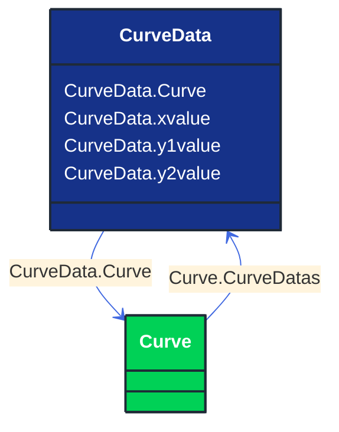

# CurveData

_Multi-purpose data points for defining a curve.  The use of this generic class is discouraged if a more specific class can be used to specify the X and Y axis values along with their specific data types._

**URI**: [cim:CurveData](http://iec.ch/TC57/CIM100#CurveData) 
**Type**: Class

## Inheritance
* **CurveData**

## Attributes
| Name | URI | Cardinality and Range | Description | Inheritance |
| ---  | --- | --- | --- | --- |
| Curve | [cim:CurveData.Curve](http://iec.ch/TC57/CIM100#CurveData.Curve) | No cardinality available Curve | The curve of  this curve data point. | direct |
| xvalue | [cim:CurveData.xvalue](http://iec.ch/TC57/CIM100#CurveData.xvalue) | No cardinality available float | The data value of the X-axis variable,  depending on the X-axis units. | direct |
| y1value | [cim:CurveData.y1value](http://iec.ch/TC57/CIM100#CurveData.y1value) | No cardinality available float | The data value of the  first Y-axis variable, depending on the Y-axis units. | direct |
| y2value | [cim:CurveData.y2value](http://iec.ch/TC57/CIM100#CurveData.y2value) | No cardinality available float | The data value of the second Y-axis variable (if present), depending on the Y-axis units. | direct |

### Schema Source
* from schema: [http://iec.ch/TC57/ns/CIM/CoreEquipment-EUPackage_CoreEquipmentProfile](http://iec.ch/TC57/ns/CIM/CoreEquipment-EUPackage_CoreEquipmentProfile)
