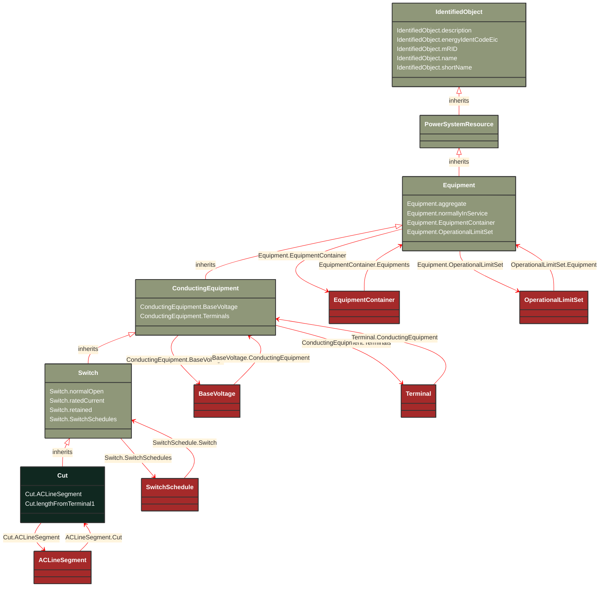

# Cut

_A cut separates a line segment into two parts. The cut appears as a switch inserted between these two parts and connects them together. As the cut is normally open there is no galvanic connection between the two line segment parts. But it is possible to close the cut to get galvanic connection.
The cut terminals are oriented towards the line segment terminals with the same sequence number. Hence the cut terminal with sequence number equal to 1 is oriented to the line segment's terminal with sequence number equal to 1.
The cut terminals also act as connection points for jumpers and other equipment, e.g. a mobile generator. To enable this, connectivity nodes are placed at the cut terminals. Once the connectivity nodes are in place any conducting equipment can be connected at them._

**URI**: [cim:Cut](http://iec.ch/TC57/CIM100#Cut) 
**Type**: Class

## Inheritance
* [IdentifiedObject](/Models/Profiles/CoreEquipment/AbstractClasses/IdentifiedObject/)
    * [PowerSystemResource](/Models/Profiles/CoreEquipment/AbstractClasses/PowerSystemResource/)
        * [Equipment](/Models/Profiles/CoreEquipment/AbstractClasses/Equipment/)
            * [ConductingEquipment](/Models/Profiles/CoreEquipment/AbstractClasses/ConductingEquipment/)
                * [Switch](/Models/Profiles/CoreEquipment/ConcreteClasses/Switch/)
                    * **Cut**

## Attributes
| Name | URI | Cardinality and Range | Description | Inheritance |
| ---  | --- | --- | --- | --- |
| ACLineSegment | [cim:Cut.ACLineSegment](http://iec.ch/TC57/CIM100#Cut.ACLineSegment) | No cardinality available ACLineSegment | The line segment to which the cut is applied. | direct |
| lengthFromTerminal1 | [cim:Cut.lengthFromTerminal1](http://iec.ch/TC57/CIM100#Cut.lengthFromTerminal1) | No cardinality available Length | The length to the place where the cut is located starting from side one of the cut line segment, i.e. the line segment Terminal with sequenceNumber equal to 1. | direct |
| normalOpen | [cim:Switch.normalOpen](http://iec.ch/TC57/CIM100#Switch.normalOpen) | No cardinality available boolean | The attribute is used in cases when no Measurement for the status value is present. If the Switch has a status measurement the Discrete.normalValue is expected to match with the Switch.normalOpen. | Switch |
| ratedCurrent | [cim:Switch.ratedCurrent](http://iec.ch/TC57/CIM100#Switch.ratedCurrent) | No cardinality available CurrentFlow | The maximum continuous current carrying capacity in amps governed by the device material and construction.
The attribute shall be a positive value. | Switch |
| retained | [cim:Switch.retained](http://iec.ch/TC57/CIM100#Switch.retained) | No cardinality available boolean | Branch is retained in the topological solution.  The flow through retained switches will normally be calculated in power flow. | Switch |
| SwitchSchedules | [cim:Switch.SwitchSchedules](http://iec.ch/TC57/CIM100#Switch.SwitchSchedules) | No cardinality available SwitchSchedule | A Switch can be associated with SwitchSchedules. | Switch |
| BaseVoltage | [cim:ConductingEquipment.BaseVoltage](http://iec.ch/TC57/CIM100#ConductingEquipment.BaseVoltage) | No cardinality available BaseVoltage | Base voltage of this conducting equipment.  Use only when there is no voltage level container used and only one base voltage applies.  For example, not used for transformers. | ConductingEquipment |
| Terminals | [cim:ConductingEquipment.Terminals](http://iec.ch/TC57/CIM100#ConductingEquipment.Terminals) | No cardinality available Terminal | Conducting equipment have terminals that may be connected to other conducting equipment terminals via connectivity nodes or topological nodes. | ConductingEquipment |
| aggregate | [cim:Equipment.aggregate](http://iec.ch/TC57/CIM100#Equipment.aggregate) | No cardinality available boolean | The aggregate flag provides an alternative way of representing an aggregated (equivalent) element. It is applicable in cases when the dedicated classes for equivalent equipment do not have all of the attributes necessary to represent the required level of detail.  In case the flag is set to “true” the single instance of equipment represents multiple pieces of equipment that have been modelled together as an aggregate equivalent obtained by a network reduction procedure. Examples would be power transformers or synchronous machines operating in parallel modelled as a single aggregate power transformer or aggregate synchronous machine.  
The attribute is not used for EquivalentBranch, EquivalentShunt and EquivalentInjection. | Equipment |
| normallyInService | [cim:Equipment.normallyInService](http://iec.ch/TC57/CIM100#Equipment.normallyInService) | No cardinality available boolean | Specifies the availability of the equipment under normal operating conditions. True means the equipment is available for topology processing, which determines if the equipment is energized or not. False means that the equipment is treated by network applications as if it is not in the model. | Equipment |
| EquipmentContainer | [cim:Equipment.EquipmentContainer](http://iec.ch/TC57/CIM100#Equipment.EquipmentContainer) | No cardinality available EquipmentContainer | Container of this equipment. | Equipment |
| OperationalLimitSet | [cim:Equipment.OperationalLimitSet](http://iec.ch/TC57/CIM100#Equipment.OperationalLimitSet) | No cardinality available OperationalLimitSet | The operational limit sets associated with this equipment. | Equipment |
| description | [cim:IdentifiedObject.description](http://iec.ch/TC57/CIM100#IdentifiedObject.description) | No cardinality available string | The description is a free human readable text describing or naming the object. It may be non unique and may not correlate to a naming hierarchy. | IdentifiedObject |
| energyIdentCodeEic | [eu:IdentifiedObject.energyIdentCodeEic](http://iec.ch/TC57/CIM100-European#IdentifiedObject.energyIdentCodeEic) | No cardinality available string | The attribute is used for an exchange of the EIC code (Energy identification Code). The length of the string is 16 characters as defined by the EIC code. For details on EIC scheme please refer to ENTSO-E web site. | IdentifiedObject |
| mRID | [cim:IdentifiedObject.mRID](http://iec.ch/TC57/CIM100#IdentifiedObject.mRID) | No cardinality available string | Master resource identifier issued by a model authority. The mRID is unique within an exchange context. Global uniqueness is easily achieved by using a UUID, as specified in RFC 4122, for the mRID. The use of UUID is strongly recommended.
For CIMXML data files in RDF syntax conforming to IEC 61970-552, the mRID is mapped to rdf:ID or rdf:about attributes that identify CIM object elements. | IdentifiedObject |
| name | [cim:IdentifiedObject.name](http://iec.ch/TC57/CIM100#IdentifiedObject.name) | No cardinality available string | The name is any free human readable and possibly non unique text naming the object. | IdentifiedObject |
| shortName | [eu:IdentifiedObject.shortName](http://iec.ch/TC57/CIM100-European#IdentifiedObject.shortName) | No cardinality available string | The attribute is used for an exchange of a human readable short name with length of the string 12 characters maximum. | IdentifiedObject |

### Schema Source
* from schema: [http://iec.ch/TC57/ns/CIM/CoreEquipment-EUPackage_CoreEquipmentProfile](http://iec.ch/TC57/ns/CIM/CoreEquipment-EUPackage_CoreEquipmentProfile)
