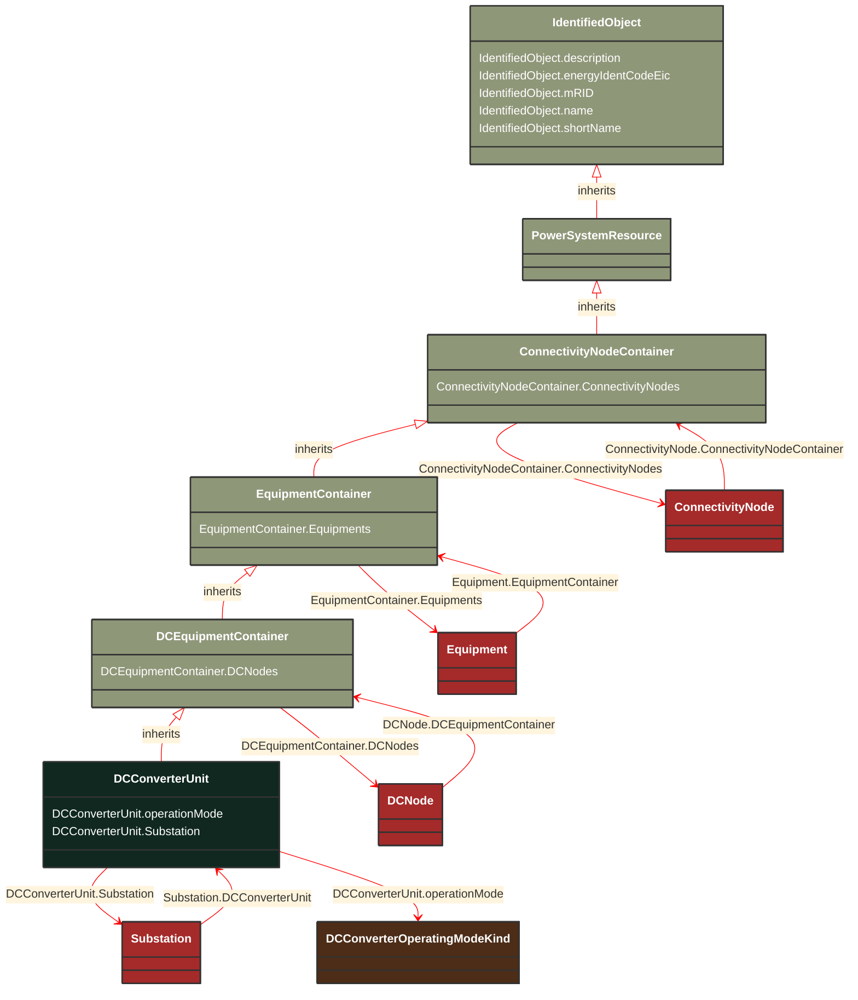

# DCConverterUnit

_Indivisible operative unit comprising all equipment between the point of common coupling on the AC side and the point of common coupling – DC side, essentially one or more converters, together with one or more converter transformers, converter control equipment, essential protective and switching devices and auxiliaries, if any, used for conversion._

**URI**: [cim:DCConverterUnit](http://iec.ch/TC57/CIM100#DCConverterUnit) 
**Type**: Class

## Inheritance
* [IdentifiedObject](/Models/Profiles/CoreEquipment/AbstractClasses/IdentifiedObject/)
    * [PowerSystemResource](/Models/Profiles/CoreEquipment/AbstractClasses/PowerSystemResource/)
        * [ConnectivityNodeContainer](/Models/Profiles/CoreEquipment/AbstractClasses/ConnectivityNodeContainer/)
            * [EquipmentContainer](/Models/Profiles/CoreEquipment/AbstractClasses/EquipmentContainer/)
                * [DCEquipmentContainer](/Models/Profiles/CoreEquipment/AbstractClasses/DCEquipmentContainer/)
                    * **DCConverterUnit**

## Attributes
| Name | URI | Cardinality and Range | Description | Inheritance |
| ---  | --- | --- | --- | --- |
| operationMode | [cim:DCConverterUnit.operationMode](http://iec.ch/TC57/CIM100#DCConverterUnit.operationMode) | No cardinality available DCConverterOperatingModeKind | The operating mode of an HVDC bipole (bipolar, monopolar metallic return, etc). | direct |
| Substation | [cim:DCConverterUnit.Substation](http://iec.ch/TC57/CIM100#DCConverterUnit.Substation) | No cardinality available Substation | The containing substation of the DC converter unit. | direct |
| DCNodes | [cim:DCEquipmentContainer.DCNodes](http://iec.ch/TC57/CIM100#DCEquipmentContainer.DCNodes) | No cardinality available DCNode | The DC nodes contained in the DC equipment container. | DCEquipmentContainer |
| Equipments | [cim:EquipmentContainer.Equipments](http://iec.ch/TC57/CIM100#EquipmentContainer.Equipments) | No cardinality available Equipment | Contained equipment. | EquipmentContainer |
| ConnectivityNodes | [cim:ConnectivityNodeContainer.ConnectivityNodes](http://iec.ch/TC57/CIM100#ConnectivityNodeContainer.ConnectivityNodes) | No cardinality available ConnectivityNode | Connectivity nodes which belong to this connectivity node container. | ConnectivityNodeContainer |
| description | [cim:IdentifiedObject.description](http://iec.ch/TC57/CIM100#IdentifiedObject.description) | No cardinality available string | The description is a free human readable text describing or naming the object. It may be non unique and may not correlate to a naming hierarchy. | IdentifiedObject |
| energyIdentCodeEic | [eu:IdentifiedObject.energyIdentCodeEic](http://iec.ch/TC57/CIM100-European#IdentifiedObject.energyIdentCodeEic) | No cardinality available string | The attribute is used for an exchange of the EIC code (Energy identification Code). The length of the string is 16 characters as defined by the EIC code. For details on EIC scheme please refer to ENTSO-E web site. | IdentifiedObject |
| mRID | [cim:IdentifiedObject.mRID](http://iec.ch/TC57/CIM100#IdentifiedObject.mRID) | No cardinality available string | Master resource identifier issued by a model authority. The mRID is unique within an exchange context. Global uniqueness is easily achieved by using a UUID, as specified in RFC 4122, for the mRID. The use of UUID is strongly recommended.
For CIMXML data files in RDF syntax conforming to IEC 61970-552, the mRID is mapped to rdf:ID or rdf:about attributes that identify CIM object elements. | IdentifiedObject |
| name | [cim:IdentifiedObject.name](http://iec.ch/TC57/CIM100#IdentifiedObject.name) | No cardinality available string | The name is any free human readable and possibly non unique text naming the object. | IdentifiedObject |
| shortName | [eu:IdentifiedObject.shortName](http://iec.ch/TC57/CIM100-European#IdentifiedObject.shortName) | No cardinality available string | The attribute is used for an exchange of a human readable short name with length of the string 12 characters maximum. | IdentifiedObject |

### Schema Source
* from schema: [http://iec.ch/TC57/ns/CIM/CoreEquipment-EUPackage_CoreEquipmentProfile](http://iec.ch/TC57/ns/CIM/CoreEquipment-EUPackage_CoreEquipmentProfile)
