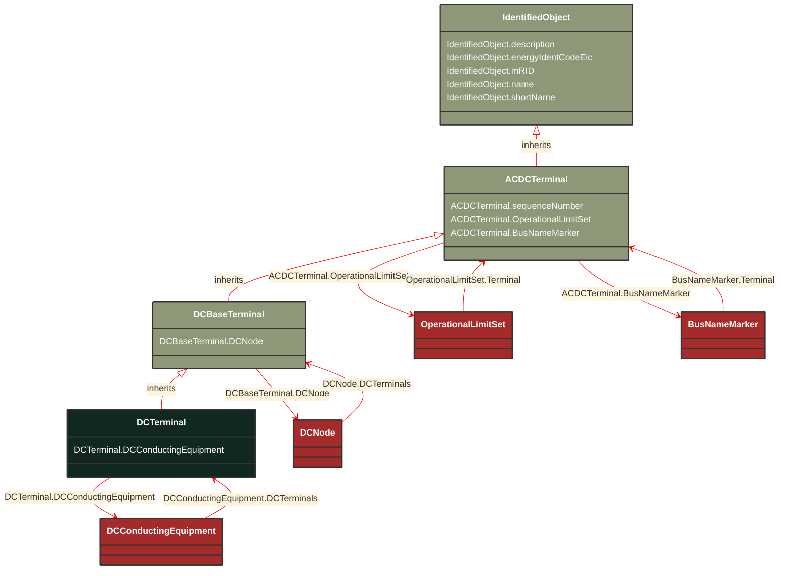

# DCTerminal

_An electrical connection point to generic DC conducting equipment._

**URI**: [cim:DCTerminal](http://iec.ch/TC57/CIM100#DCTerminal) 
**Type**: Class

## Inheritance
* [IdentifiedObject](/Models/Profiles/CoreEquipment/ConcreteClasses/IdentifiedObject/)
    * [ACDCTerminal](/Models/Profiles/CoreEquipment/ConcreteClasses/ACDCTerminal/)
        * [DCBaseTerminal](/Models/Profiles/CoreEquipment/ConcreteClasses/DCBaseTerminal/)
            * **DCTerminal**

## Attributes
| Name | URI | Cardinality and Range | Description | Inheritance |
| ---  | --- | --- | --- | --- |
| DCConductingEquipment | [cim:DCTerminal.DCConductingEquipment](http://iec.ch/TC57/CIM100#DCTerminal.DCConductingEquipment) | No cardinality available DCConductingEquipment | An DC  terminal belong to a DC conducting equipment. | direct |
| DCNode | [cim:DCBaseTerminal.DCNode](http://iec.ch/TC57/CIM100#DCBaseTerminal.DCNode) | No cardinality available DCNode | The DC connectivity node to which this DC base terminal connects with zero impedance. | DCBaseTerminal |
| sequenceNumber | [cim:ACDCTerminal.sequenceNumber](http://iec.ch/TC57/CIM100#ACDCTerminal.sequenceNumber) | No cardinality available integer | The orientation of the terminal connections for a multiple terminal conducting equipment.  The sequence numbering starts with 1 and additional terminals should follow in increasing order.   The first terminal is the "starting point" for a two terminal branch. | ACDCTerminal |
| OperationalLimitSet | [cim:ACDCTerminal.OperationalLimitSet](http://iec.ch/TC57/CIM100#ACDCTerminal.OperationalLimitSet) | No cardinality available OperationalLimitSet | The operational limit sets at the terminal. | ACDCTerminal |
| BusNameMarker | [cim:ACDCTerminal.BusNameMarker](http://iec.ch/TC57/CIM100#ACDCTerminal.BusNameMarker) | No cardinality available BusNameMarker | The bus name marker used to name the bus (topological node). | ACDCTerminal |
| description | [cim:IdentifiedObject.description](http://iec.ch/TC57/CIM100#IdentifiedObject.description) | No cardinality available string | The description is a free human readable text describing or naming the object. It may be non unique and may not correlate to a naming hierarchy. | IdentifiedObject |
| energyIdentCodeEic | [eu:IdentifiedObject.energyIdentCodeEic](http://iec.ch/TC57/CIM100-European#IdentifiedObject.energyIdentCodeEic) | No cardinality available string | The attribute is used for an exchange of the EIC code (Energy identification Code). The length of the string is 16 characters as defined by the EIC code. For details on EIC scheme please refer to ENTSO-E web site. | IdentifiedObject |
| mRID | [cim:IdentifiedObject.mRID](http://iec.ch/TC57/CIM100#IdentifiedObject.mRID) | No cardinality available string | Master resource identifier issued by a model authority. The mRID is unique within an exchange context. Global uniqueness is easily achieved by using a UUID, as specified in RFC 4122, for the mRID. The use of UUID is strongly recommended.
For CIMXML data files in RDF syntax conforming to IEC 61970-552, the mRID is mapped to rdf:ID or rdf:about attributes that identify CIM object elements. | IdentifiedObject |
| name | [cim:IdentifiedObject.name](http://iec.ch/TC57/CIM100#IdentifiedObject.name) | No cardinality available string | The name is any free human readable and possibly non unique text naming the object. | IdentifiedObject |
| shortName | [eu:IdentifiedObject.shortName](http://iec.ch/TC57/CIM100-European#IdentifiedObject.shortName) | No cardinality available string | The attribute is used for an exchange of a human readable short name with length of the string 12 characters maximum. | IdentifiedObject |

### Schema Source
* from schema: [http://iec.ch/TC57/ns/CIM/CoreEquipment-EUPackage_CoreEquipmentProfile](http://iec.ch/TC57/ns/CIM/CoreEquipment-EUPackage_CoreEquipmentProfile)
