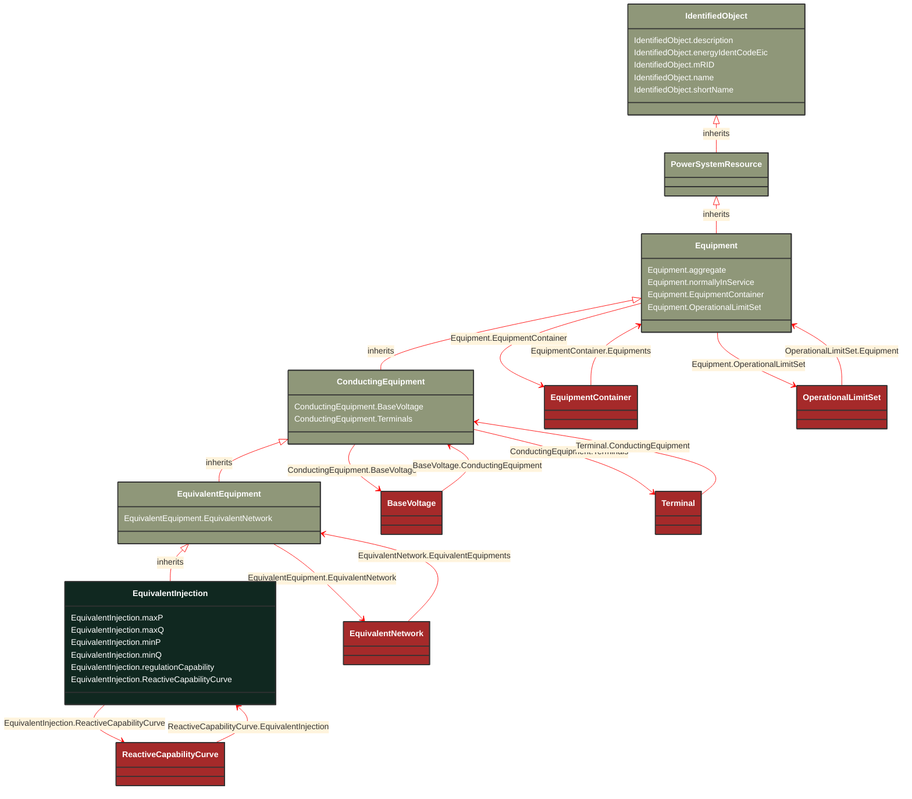

# EquivalentInjection

_This class represents equivalent injections (generation or load).  Voltage regulation is allowed only at the point of connection._

**URI**: [cim:EquivalentInjection](http://iec.ch/TC57/CIM100#EquivalentInjection) 
**Type**: Class

## Inheritance
* [IdentifiedObject](/Models/Profiles/CoreEquipment/AbstractClasses/IdentifiedObject/)
    * [PowerSystemResource](/Models/Profiles/CoreEquipment/AbstractClasses/PowerSystemResource/)
        * [Equipment](/Models/Profiles/CoreEquipment/AbstractClasses/Equipment/)
            * [ConductingEquipment](/Models/Profiles/CoreEquipment/AbstractClasses/ConductingEquipment/)
                * [EquivalentEquipment](/Models/Profiles/CoreEquipment/AbstractClasses/EquivalentEquipment/)
                    * **EquivalentInjection**

## Attributes
| Name | URI | Cardinality and Range | Description | Inheritance |
| ---  | --- | --- | --- | --- |
| maxP | [cim:EquivalentInjection.maxP](http://iec.ch/TC57/CIM100#EquivalentInjection.maxP) | No cardinality available ActivePower | Maximum active power of the injection. | direct |
| maxQ | [cim:EquivalentInjection.maxQ](http://iec.ch/TC57/CIM100#EquivalentInjection.maxQ) | No cardinality available ReactivePower | Maximum reactive power of the injection.  Used for modelling of infeed for load flow exchange. Not used for short circuit modelling.  If maxQ and minQ are not used ReactiveCapabilityCurve can be used. | direct |
| minP | [cim:EquivalentInjection.minP](http://iec.ch/TC57/CIM100#EquivalentInjection.minP) | No cardinality available ActivePower | Minimum active power of the injection. | direct |
| minQ | [cim:EquivalentInjection.minQ](http://iec.ch/TC57/CIM100#EquivalentInjection.minQ) | No cardinality available ReactivePower | Minimum reactive power of the injection.  Used for modelling of infeed for load flow exchange. Not used for short circuit modelling.  If maxQ and minQ are not used ReactiveCapabilityCurve can be used. | direct |
| regulationCapability | [cim:EquivalentInjection.regulationCapability](http://iec.ch/TC57/CIM100#EquivalentInjection.regulationCapability) | No cardinality available boolean | Specifies whether or not the EquivalentInjection has the capability to regulate the local voltage. If true the EquivalentInjection can regulate. If false the EquivalentInjection cannot regulate. ReactiveCapabilityCurve can only be associated with EquivalentInjection  if the flag is true. | direct |
| ReactiveCapabilityCurve | [cim:EquivalentInjection.ReactiveCapabilityCurve](http://iec.ch/TC57/CIM100#EquivalentInjection.ReactiveCapabilityCurve) | No cardinality available ReactiveCapabilityCurve | The reactive capability curve used by this equivalent injection. | direct |
| EquivalentNetwork | [cim:EquivalentEquipment.EquivalentNetwork](http://iec.ch/TC57/CIM100#EquivalentEquipment.EquivalentNetwork) | No cardinality available EquivalentNetwork | The equivalent where the reduced model belongs. | EquivalentEquipment |
| BaseVoltage | [cim:ConductingEquipment.BaseVoltage](http://iec.ch/TC57/CIM100#ConductingEquipment.BaseVoltage) | No cardinality available BaseVoltage | Base voltage of this conducting equipment.  Use only when there is no voltage level container used and only one base voltage applies.  For example, not used for transformers. | ConductingEquipment |
| Terminals | [cim:ConductingEquipment.Terminals](http://iec.ch/TC57/CIM100#ConductingEquipment.Terminals) | No cardinality available Terminal | Conducting equipment have terminals that may be connected to other conducting equipment terminals via connectivity nodes or topological nodes. | ConductingEquipment |
| aggregate | [cim:Equipment.aggregate](http://iec.ch/TC57/CIM100#Equipment.aggregate) | No cardinality available boolean | The aggregate flag provides an alternative way of representing an aggregated (equivalent) element. It is applicable in cases when the dedicated classes for equivalent equipment do not have all of the attributes necessary to represent the required level of detail.  In case the flag is set to “true” the single instance of equipment represents multiple pieces of equipment that have been modelled together as an aggregate equivalent obtained by a network reduction procedure. Examples would be power transformers or synchronous machines operating in parallel modelled as a single aggregate power transformer or aggregate synchronous machine.  
The attribute is not used for EquivalentBranch, EquivalentShunt and EquivalentInjection. | Equipment |
| normallyInService | [cim:Equipment.normallyInService](http://iec.ch/TC57/CIM100#Equipment.normallyInService) | No cardinality available boolean | Specifies the availability of the equipment under normal operating conditions. True means the equipment is available for topology processing, which determines if the equipment is energized or not. False means that the equipment is treated by network applications as if it is not in the model. | Equipment |
| EquipmentContainer | [cim:Equipment.EquipmentContainer](http://iec.ch/TC57/CIM100#Equipment.EquipmentContainer) | No cardinality available EquipmentContainer | Container of this equipment. | Equipment |
| OperationalLimitSet | [cim:Equipment.OperationalLimitSet](http://iec.ch/TC57/CIM100#Equipment.OperationalLimitSet) | No cardinality available OperationalLimitSet | The operational limit sets associated with this equipment. | Equipment |
| description | [cim:IdentifiedObject.description](http://iec.ch/TC57/CIM100#IdentifiedObject.description) | No cardinality available string | The description is a free human readable text describing or naming the object. It may be non unique and may not correlate to a naming hierarchy. | IdentifiedObject |
| energyIdentCodeEic | [eu:IdentifiedObject.energyIdentCodeEic](http://iec.ch/TC57/CIM100-European#IdentifiedObject.energyIdentCodeEic) | No cardinality available string | The attribute is used for an exchange of the EIC code (Energy identification Code). The length of the string is 16 characters as defined by the EIC code. For details on EIC scheme please refer to ENTSO-E web site. | IdentifiedObject |
| mRID | [cim:IdentifiedObject.mRID](http://iec.ch/TC57/CIM100#IdentifiedObject.mRID) | No cardinality available string | Master resource identifier issued by a model authority. The mRID is unique within an exchange context. Global uniqueness is easily achieved by using a UUID, as specified in RFC 4122, for the mRID. The use of UUID is strongly recommended.
For CIMXML data files in RDF syntax conforming to IEC 61970-552, the mRID is mapped to rdf:ID or rdf:about attributes that identify CIM object elements. | IdentifiedObject |
| name | [cim:IdentifiedObject.name](http://iec.ch/TC57/CIM100#IdentifiedObject.name) | No cardinality available string | The name is any free human readable and possibly non unique text naming the object. | IdentifiedObject |
| shortName | [eu:IdentifiedObject.shortName](http://iec.ch/TC57/CIM100-European#IdentifiedObject.shortName) | No cardinality available string | The attribute is used for an exchange of a human readable short name with length of the string 12 characters maximum. | IdentifiedObject |

### Schema Source
* from schema: [http://iec.ch/TC57/ns/CIM/CoreEquipment-EUPackage_CoreEquipmentProfile](http://iec.ch/TC57/ns/CIM/CoreEquipment-EUPackage_CoreEquipmentProfile)
