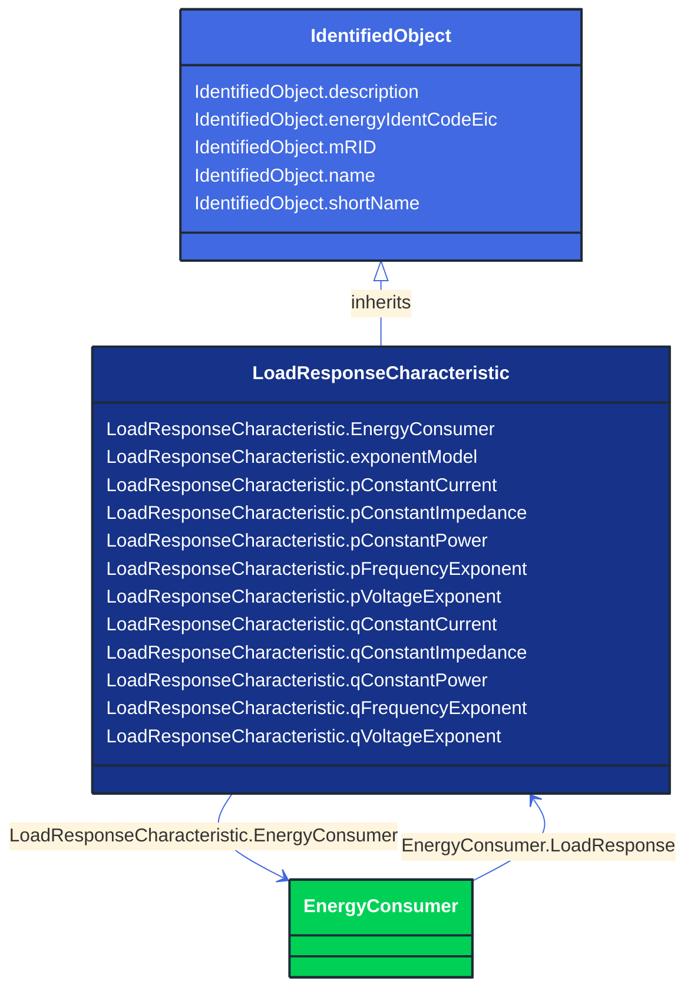

# LoadResponseCharacteristic

_Models the characteristic response of the load demand due to changes in system conditions such as voltage and frequency. It is not related to demand response.
If LoadResponseCharacteristic.exponentModel is True, the exponential voltage or frequency dependent models are specified and used as to calculate active and reactive power components of the load model.
The equations to calculate active and reactive power components of the load model are internal to the power flow calculation, hence they use different quantities depending on the use case of the data exchange. 
The equations for exponential voltage dependent load model injected power are: 
pInjection= Pnominal* (Voltage/cim:BaseVoltage.nominalVoltage) ** cim:LoadResponseCharacteristic.pVoltageExponent
qInjection= Qnominal* (Voltage/cim:BaseVoltage.nominalVoltage) ** cim:LoadResponseCharacteristic.qVoltageExponent
Where: 
1) * means "multiply" and ** is "raised to power of";
2) Pnominal and Qnominal represent the active power and reactive power at nominal voltage as any load described by the voltage exponential model shall be given at nominal voltage.  This means that EnergyConsumer.p and EnergyConsumer.q  are at nominal voltage.
3) After power flow is solved: 
-pInjection and qInjection correspond to SvPowerflow.p and SvPowerflow.q respectively.  
- Voltage corresponds to SvVoltage.v at the TopologicalNode where the load is connected._

**URI**: [cim:LoadResponseCharacteristic](http://iec.ch/TC57/CIM100#LoadResponseCharacteristic) 
**Type**: Class

## Inheritance
* [IdentifiedObject](/Models/Profiles/CoreEquipment/AbstractClasses/IdentifiedObject/)
    * **LoadResponseCharacteristic**

## Attributes
| Name | URI | Cardinality and Range | Description | Inheritance |
| ---  | --- | --- | --- | --- |
| EnergyConsumer | [cim:LoadResponseCharacteristic.EnergyConsumer](http://iec.ch/TC57/CIM100#LoadResponseCharacteristic.EnergyConsumer) | No cardinality available EnergyConsumer | The set of loads that have the response characteristics. | direct |
| exponentModel | [cim:LoadResponseCharacteristic.exponentModel](http://iec.ch/TC57/CIM100#LoadResponseCharacteristic.exponentModel) | No cardinality available boolean | Indicates the exponential voltage dependency model is to be used. If false, the coefficient model is to be used.
The exponential voltage dependency model consist of the attributes:
- pVoltageExponent
- qVoltageExponent
- pFrequencyExponent
- qFrequencyExponent.
The coefficient model consist of the attributes:
- pConstantImpedance
- pConstantCurrent
- pConstantPower
- qConstantImpedance
- qConstantCurrent
- qConstantPower.
The sum of pConstantImpedance, pConstantCurrent and pConstantPower shall equal 1.
The sum of qConstantImpedance, qConstantCurrent and qConstantPower shall equal 1. | direct |
| pConstantCurrent | [cim:LoadResponseCharacteristic.pConstantCurrent](http://iec.ch/TC57/CIM100#LoadResponseCharacteristic.pConstantCurrent) | No cardinality available float | Portion of active power load modelled as constant current. | direct |
| pConstantImpedance | [cim:LoadResponseCharacteristic.pConstantImpedance](http://iec.ch/TC57/CIM100#LoadResponseCharacteristic.pConstantImpedance) | No cardinality available float | Portion of active power load modelled as constant impedance. | direct |
| pConstantPower | [cim:LoadResponseCharacteristic.pConstantPower](http://iec.ch/TC57/CIM100#LoadResponseCharacteristic.pConstantPower) | No cardinality available float | Portion of active power load modelled as constant power. | direct |
| pFrequencyExponent | [cim:LoadResponseCharacteristic.pFrequencyExponent](http://iec.ch/TC57/CIM100#LoadResponseCharacteristic.pFrequencyExponent) | No cardinality available float | Exponent of per unit frequency effecting active power. | direct |
| pVoltageExponent | [cim:LoadResponseCharacteristic.pVoltageExponent](http://iec.ch/TC57/CIM100#LoadResponseCharacteristic.pVoltageExponent) | No cardinality available float | Exponent of per unit voltage effecting real power. | direct |
| qConstantCurrent | [cim:LoadResponseCharacteristic.qConstantCurrent](http://iec.ch/TC57/CIM100#LoadResponseCharacteristic.qConstantCurrent) | No cardinality available float | Portion of reactive power load modelled as constant current. | direct |
| qConstantImpedance | [cim:LoadResponseCharacteristic.qConstantImpedance](http://iec.ch/TC57/CIM100#LoadResponseCharacteristic.qConstantImpedance) | No cardinality available float | Portion of reactive power load modelled as constant impedance. | direct |
| qConstantPower | [cim:LoadResponseCharacteristic.qConstantPower](http://iec.ch/TC57/CIM100#LoadResponseCharacteristic.qConstantPower) | No cardinality available float | Portion of reactive power load modelled as constant power. | direct |
| qFrequencyExponent | [cim:LoadResponseCharacteristic.qFrequencyExponent](http://iec.ch/TC57/CIM100#LoadResponseCharacteristic.qFrequencyExponent) | No cardinality available float | Exponent of per unit frequency effecting reactive power. | direct |
| qVoltageExponent | [cim:LoadResponseCharacteristic.qVoltageExponent](http://iec.ch/TC57/CIM100#LoadResponseCharacteristic.qVoltageExponent) | No cardinality available float | Exponent of per unit voltage effecting reactive power. | direct |
| description | [cim:IdentifiedObject.description](http://iec.ch/TC57/CIM100#IdentifiedObject.description) | No cardinality available string | The description is a free human readable text describing or naming the object. It may be non unique and may not correlate to a naming hierarchy. | IdentifiedObject |
| energyIdentCodeEic | [eu:IdentifiedObject.energyIdentCodeEic](http://iec.ch/TC57/CIM100-European#IdentifiedObject.energyIdentCodeEic) | No cardinality available string | The attribute is used for an exchange of the EIC code (Energy identification Code). The length of the string is 16 characters as defined by the EIC code. For details on EIC scheme please refer to ENTSO-E web site. | IdentifiedObject |
| mRID | [cim:IdentifiedObject.mRID](http://iec.ch/TC57/CIM100#IdentifiedObject.mRID) | No cardinality available string | Master resource identifier issued by a model authority. The mRID is unique within an exchange context. Global uniqueness is easily achieved by using a UUID, as specified in RFC 4122, for the mRID. The use of UUID is strongly recommended.
For CIMXML data files in RDF syntax conforming to IEC 61970-552, the mRID is mapped to rdf:ID or rdf:about attributes that identify CIM object elements. | IdentifiedObject |
| name | [cim:IdentifiedObject.name](http://iec.ch/TC57/CIM100#IdentifiedObject.name) | No cardinality available string | The name is any free human readable and possibly non unique text naming the object. | IdentifiedObject |
| shortName | [eu:IdentifiedObject.shortName](http://iec.ch/TC57/CIM100-European#IdentifiedObject.shortName) | No cardinality available string | The attribute is used for an exchange of a human readable short name with length of the string 12 characters maximum. | IdentifiedObject |

### Schema Source
* from schema: [http://iec.ch/TC57/ns/CIM/CoreEquipment-EUPackage_CoreEquipmentProfile](http://iec.ch/TC57/ns/CIM/CoreEquipment-EUPackage_CoreEquipmentProfile)
