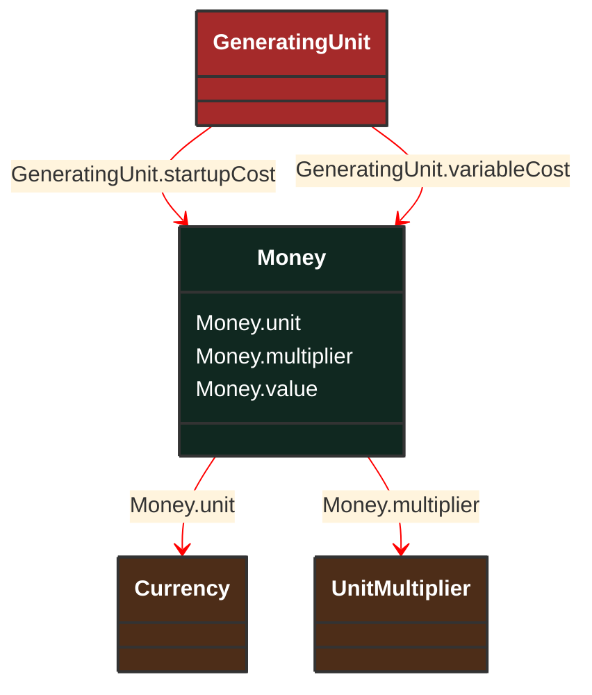

# Money

_Amount of money._

**URI**: [cim:Money](http://iec.ch/TC57/CIM100#Money) 
**Type**: Class

## Inheritance
* **Money**

## Attributes
| Name | URI | Cardinality and Range | Description | Inheritance |
| ---  | --- | --- | --- | --- |
| unit | [cim:Money.unit](http://iec.ch/TC57/CIM100#Money.unit) | No cardinality available Currency | No description available | direct |
| multiplier | [cim:Money.multiplier](http://iec.ch/TC57/CIM100#Money.multiplier) | No cardinality available UnitMultiplier | No description available | direct |
| value | [cim:Money.value](http://iec.ch/TC57/CIM100#Money.value) | No cardinality available double | No description available | direct |

### Schema Source
* from schema: [http://iec.ch/TC57/ns/CIM/CoreEquipment-EUPackage_CoreEquipmentProfile](http://iec.ch/TC57/ns/CIM/CoreEquipment-EUPackage_CoreEquipmentProfile)
