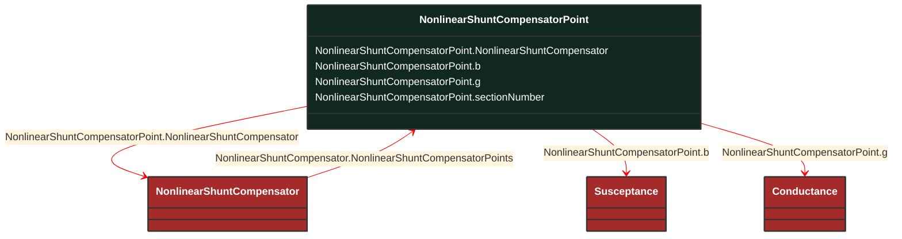

# NonlinearShuntCompensatorPoint

_A non linear shunt compensator bank or section admittance value. The number of NonlinearShuntCompenstorPoint instances associated with a NonlinearShuntCompensator shall be equal to ShuntCompensator.maximumSections. ShuntCompensator.sections shall only be set to one of the NonlinearShuntCompenstorPoint.sectionNumber. There is no interpolation between NonlinearShuntCompenstorPoint-s._

**URI**: [cim:NonlinearShuntCompensatorPoint](http://iec.ch/TC57/CIM100#NonlinearShuntCompensatorPoint) 
**Type**: Class

## Inheritance
* **NonlinearShuntCompensatorPoint**

## Attributes
| Name | URI | Cardinality and Range | Description | Inheritance |
| ---  | --- | --- | --- | --- |
| NonlinearShuntCompensator | [cim:NonlinearShuntCompensatorPoint.NonlinearShuntCompensator](http://iec.ch/TC57/CIM100#NonlinearShuntCompensatorPoint.NonlinearShuntCompensator) | No cardinality available NonlinearShuntCompensator | Non-linear shunt compensator owning this point. | direct |
| b | [cim:NonlinearShuntCompensatorPoint.b](http://iec.ch/TC57/CIM100#NonlinearShuntCompensatorPoint.b) | No cardinality available Susceptance | Positive sequence shunt (charging) susceptance per section. | direct |
| g | [cim:NonlinearShuntCompensatorPoint.g](http://iec.ch/TC57/CIM100#NonlinearShuntCompensatorPoint.g) | No cardinality available Conductance | Positive sequence shunt (charging) conductance per section. | direct |
| sectionNumber | [cim:NonlinearShuntCompensatorPoint.sectionNumber](http://iec.ch/TC57/CIM100#NonlinearShuntCompensatorPoint.sectionNumber) | No cardinality available integer | The number of the section. | direct |

### Schema Source
* from schema: [http://iec.ch/TC57/ns/CIM/CoreEquipment-EUPackage_CoreEquipmentProfile](http://iec.ch/TC57/ns/CIM/CoreEquipment-EUPackage_CoreEquipmentProfile)
