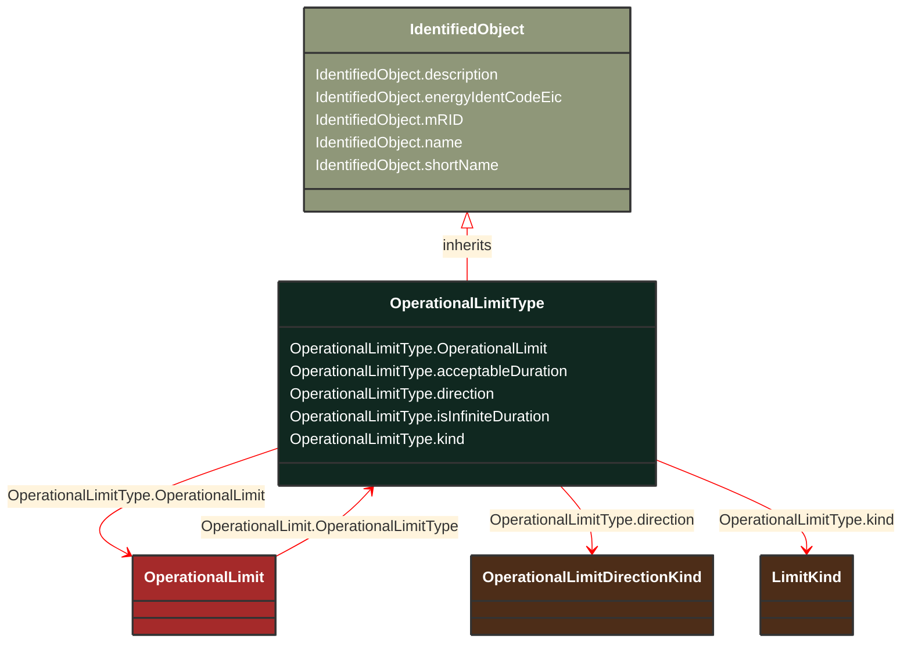

# OperationalLimitType

_The operational meaning of a category of limits._

**URI**: [cim:OperationalLimitType](http://iec.ch/TC57/CIM100#OperationalLimitType) 
**Type**: Class

## Inheritance
* [IdentifiedObject](/Models/Profiles/CoreEquipment/AbstractClasses/IdentifiedObject/)
    * **OperationalLimitType**

## Attributes
| Name | URI | Cardinality and Range | Description | Inheritance |
| ---  | --- | --- | --- | --- |
| OperationalLimit | [cim:OperationalLimitType.OperationalLimit](http://iec.ch/TC57/CIM100#OperationalLimitType.OperationalLimit) | No cardinality available OperationalLimit | The operational limits associated with this type of limit. | direct |
| acceptableDuration | [cim:OperationalLimitType.acceptableDuration](http://iec.ch/TC57/CIM100#OperationalLimitType.acceptableDuration) | No cardinality available Seconds | The nominal acceptable duration of the limit. Limits are commonly expressed in terms of the time limit for which the limit is normally acceptable. The actual acceptable duration of a specific limit may depend on other local factors such as temperature or wind speed. The attribute has meaning only if the flag isInfiniteDuration is set to false, hence it shall not be exchanged when isInfiniteDuration is set to true. | direct |
| direction | [cim:OperationalLimitType.direction](http://iec.ch/TC57/CIM100#OperationalLimitType.direction) | No cardinality available OperationalLimitDirectionKind | The direction of the limit. | direct |
| isInfiniteDuration | [cim:OperationalLimitType.isInfiniteDuration](http://iec.ch/TC57/CIM100#OperationalLimitType.isInfiniteDuration) | No cardinality available boolean | Defines if the operational limit type has infinite duration. If true, the limit has infinite duration. If false, the limit has definite duration which is defined by the attribute acceptableDuration. | direct |
| kind | [eu:OperationalLimitType.kind](http://iec.ch/TC57/CIM100-European#OperationalLimitType.kind) | No cardinality available LimitKind | Types of limits defined in the ENTSO-E Operational Handbook Policy 3. | direct |
| description | [cim:IdentifiedObject.description](http://iec.ch/TC57/CIM100#IdentifiedObject.description) | No cardinality available string | The description is a free human readable text describing or naming the object. It may be non unique and may not correlate to a naming hierarchy. | IdentifiedObject |
| energyIdentCodeEic | [eu:IdentifiedObject.energyIdentCodeEic](http://iec.ch/TC57/CIM100-European#IdentifiedObject.energyIdentCodeEic) | No cardinality available string | The attribute is used for an exchange of the EIC code (Energy identification Code). The length of the string is 16 characters as defined by the EIC code. For details on EIC scheme please refer to ENTSO-E web site. | IdentifiedObject |
| mRID | [cim:IdentifiedObject.mRID](http://iec.ch/TC57/CIM100#IdentifiedObject.mRID) | No cardinality available string | Master resource identifier issued by a model authority. The mRID is unique within an exchange context. Global uniqueness is easily achieved by using a UUID, as specified in RFC 4122, for the mRID. The use of UUID is strongly recommended.
For CIMXML data files in RDF syntax conforming to IEC 61970-552, the mRID is mapped to rdf:ID or rdf:about attributes that identify CIM object elements. | IdentifiedObject |
| name | [cim:IdentifiedObject.name](http://iec.ch/TC57/CIM100#IdentifiedObject.name) | No cardinality available string | The name is any free human readable and possibly non unique text naming the object. | IdentifiedObject |
| shortName | [eu:IdentifiedObject.shortName](http://iec.ch/TC57/CIM100-European#IdentifiedObject.shortName) | No cardinality available string | The attribute is used for an exchange of a human readable short name with length of the string 12 characters maximum. | IdentifiedObject |

### Schema Source
* from schema: [http://iec.ch/TC57/ns/CIM/CoreEquipment-EUPackage_CoreEquipmentProfile](http://iec.ch/TC57/ns/CIM/CoreEquipment-EUPackage_CoreEquipmentProfile)
