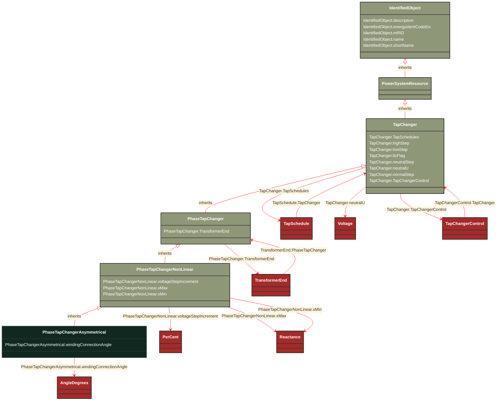

# PhaseTapChangerAsymmetrical

_Describes the tap model for an asymmetrical phase shifting transformer in which the difference voltage vector adds to the in-phase winding. The out-of-phase winding is the transformer end where the tap changer is located.  The angle between the in-phase and out-of-phase windings is named the winding connection angle. The phase shift depends on both the difference voltage magnitude and the winding connection angle._

**URI**: [cim:PhaseTapChangerAsymmetrical](http://iec.ch/TC57/CIM100#PhaseTapChangerAsymmetrical) 
**Type**: Class

## Inheritance
* [IdentifiedObject](/Models/Profiles/CoreEquipment/ConcreteClasses/IdentifiedObject/)
    * [PowerSystemResource](/Models/Profiles/CoreEquipment/ConcreteClasses/PowerSystemResource/)
        * [TapChanger](/Models/Profiles/CoreEquipment/ConcreteClasses/TapChanger/)
            * [PhaseTapChanger](/Models/Profiles/CoreEquipment/ConcreteClasses/PhaseTapChanger/)
                * [PhaseTapChangerNonLinear](/Models/Profiles/CoreEquipment/ConcreteClasses/PhaseTapChangerNonLinear/)
                    * **PhaseTapChangerAsymmetrical**

## Attributes
| Name | URI | Cardinality and Range | Description | Inheritance |
| ---  | --- | --- | --- | --- |
| windingConnectionAngle | [cim:PhaseTapChangerAsymmetrical.windingConnectionAngle](http://iec.ch/TC57/CIM100#PhaseTapChangerAsymmetrical.windingConnectionAngle) | No cardinality available AngleDegrees | The phase angle between the in-phase winding and the out-of -phase winding used for creating phase shift. The out-of-phase winding produces what is known as the difference voltage.  Setting this angle to 90 degrees is not the same as a symmetrical transformer. The attribute can only be multiples of 30 degrees.  The allowed range is -150 degrees to 150 degrees excluding 0. | direct |
| voltageStepIncrement | [cim:PhaseTapChangerNonLinear.voltageStepIncrement](http://iec.ch/TC57/CIM100#PhaseTapChangerNonLinear.voltageStepIncrement) | No cardinality available PerCent | The voltage step increment on the out of phase winding (the PowerTransformerEnd where the TapChanger is located) specified in percent of rated voltage of the PowerTransformerEnd. A positive value means a positive voltage variation from the Terminal at the PowerTransformerEnd, where the TapChanger is located, into the transformer.
When the increment is negative, the voltage decreases when the tap step increases. | PhaseTapChangerNonLinear |
| xMax | [cim:PhaseTapChangerNonLinear.xMax](http://iec.ch/TC57/CIM100#PhaseTapChangerNonLinear.xMax) | No cardinality available Reactance | The reactance depends on the tap position according to a "u" shaped curve. The maximum reactance (xMax) appears at the low and high tap positions. Depending on the “u” curve the attribute can be either higher or lower than PowerTransformerEnd.x. | PhaseTapChangerNonLinear |
| xMin | [cim:PhaseTapChangerNonLinear.xMin](http://iec.ch/TC57/CIM100#PhaseTapChangerNonLinear.xMin) | No cardinality available Reactance | The reactance depend on the tap position according to a "u" shaped curve. The minimum reactance (xMin) appear at the mid tap position.   PowerTransformerEnd.x shall be consistent with PhaseTapChangerLinear.xMin and PhaseTapChangerNonLinear.xMin. In case of inconsistency, PowerTransformerEnd.x shall be used. | PhaseTapChangerNonLinear |
| TransformerEnd | [cim:PhaseTapChanger.TransformerEnd](http://iec.ch/TC57/CIM100#PhaseTapChanger.TransformerEnd) | No cardinality available TransformerEnd | Transformer end to which this phase tap changer belongs. | PhaseTapChanger |
| TapSchedules | [cim:TapChanger.TapSchedules](http://iec.ch/TC57/CIM100#TapChanger.TapSchedules) | No cardinality available TapSchedule | A TapChanger can have TapSchedules. | TapChanger |
| highStep | [cim:TapChanger.highStep](http://iec.ch/TC57/CIM100#TapChanger.highStep) | No cardinality available integer | Highest possible tap step position, advance from neutral.
The attribute shall be greater than lowStep. | TapChanger |
| lowStep | [cim:TapChanger.lowStep](http://iec.ch/TC57/CIM100#TapChanger.lowStep) | No cardinality available integer | Lowest possible tap step position, retard from neutral. | TapChanger |
| ltcFlag | [cim:TapChanger.ltcFlag](http://iec.ch/TC57/CIM100#TapChanger.ltcFlag) | No cardinality available boolean | Specifies whether or not a TapChanger has load tap changing capabilities. | TapChanger |
| neutralStep | [cim:TapChanger.neutralStep](http://iec.ch/TC57/CIM100#TapChanger.neutralStep) | No cardinality available integer | The neutral tap step position for this winding.
The attribute shall be equal to or greater than lowStep and equal or less than highStep.
It is the step position where the voltage is neutralU when the other terminals of the transformer are at the ratedU.  If there are other tap changers on the transformer those taps are kept constant at their neutralStep. | TapChanger |
| neutralU | [cim:TapChanger.neutralU](http://iec.ch/TC57/CIM100#TapChanger.neutralU) | No cardinality available Voltage | Voltage at which the winding operates at the neutral tap setting. It is the voltage at the terminal of the PowerTransformerEnd associated with the tap changer when all tap changers on the transformer are at their neutralStep position.  Normally neutralU of the tap changer is the same as ratedU of the PowerTransformerEnd, but it can differ in special cases such as when the tapping mechanism is separate from the winding more common on lower voltage transformers.
This attribute is not relevant for PhaseTapChangerAsymmetrical, PhaseTapChangerSymmetrical and PhaseTapChangerLinear. | TapChanger |
| normalStep | [cim:TapChanger.normalStep](http://iec.ch/TC57/CIM100#TapChanger.normalStep) | No cardinality available integer | The tap step position used in "normal" network operation for this winding. For a "Fixed" tap changer indicates the current physical tap setting.
The attribute shall be equal to or greater than lowStep and equal to or less than highStep. | TapChanger |
| TapChangerControl | [cim:TapChanger.TapChangerControl](http://iec.ch/TC57/CIM100#TapChanger.TapChangerControl) | No cardinality available TapChangerControl | The regulating control scheme in which this tap changer participates. | TapChanger |
| description | [cim:IdentifiedObject.description](http://iec.ch/TC57/CIM100#IdentifiedObject.description) | No cardinality available string | The description is a free human readable text describing or naming the object. It may be non unique and may not correlate to a naming hierarchy. | IdentifiedObject |
| energyIdentCodeEic | [eu:IdentifiedObject.energyIdentCodeEic](http://iec.ch/TC57/CIM100-European#IdentifiedObject.energyIdentCodeEic) | No cardinality available string | The attribute is used for an exchange of the EIC code (Energy identification Code). The length of the string is 16 characters as defined by the EIC code. For details on EIC scheme please refer to ENTSO-E web site. | IdentifiedObject |
| mRID | [cim:IdentifiedObject.mRID](http://iec.ch/TC57/CIM100#IdentifiedObject.mRID) | No cardinality available string | Master resource identifier issued by a model authority. The mRID is unique within an exchange context. Global uniqueness is easily achieved by using a UUID, as specified in RFC 4122, for the mRID. The use of UUID is strongly recommended.
For CIMXML data files in RDF syntax conforming to IEC 61970-552, the mRID is mapped to rdf:ID or rdf:about attributes that identify CIM object elements. | IdentifiedObject |
| name | [cim:IdentifiedObject.name](http://iec.ch/TC57/CIM100#IdentifiedObject.name) | No cardinality available string | The name is any free human readable and possibly non unique text naming the object. | IdentifiedObject |
| shortName | [eu:IdentifiedObject.shortName](http://iec.ch/TC57/CIM100-European#IdentifiedObject.shortName) | No cardinality available string | The attribute is used for an exchange of a human readable short name with length of the string 12 characters maximum. | IdentifiedObject |

### Schema Source
* from schema: [http://iec.ch/TC57/ns/CIM/CoreEquipment-EUPackage_CoreEquipmentProfile](http://iec.ch/TC57/ns/CIM/CoreEquipment-EUPackage_CoreEquipmentProfile)
