# PowerTransformerEnd

_A PowerTransformerEnd is associated with each Terminal of a PowerTransformer.
The impedance values r, r0, x, and x0 of a PowerTransformerEnd represents a star equivalent as follows.
1) for a two Terminal PowerTransformer the high voltage (TransformerEnd.endNumber=1) PowerTransformerEnd has non zero values on r, r0, x, and x0 while the low voltage (TransformerEnd.endNumber=2) PowerTransformerEnd has zero values for r, r0, x, and x0.  Parameters are always provided, even if the PowerTransformerEnds have the same rated voltage.  In this case, the parameters are provided at the PowerTransformerEnd which has TransformerEnd.endNumber equal to 1.
2) for a three Terminal PowerTransformer the three PowerTransformerEnds represent a star equivalent with each leg in the star represented by r, r0, x, and x0 values.
3) For a three Terminal transformer each PowerTransformerEnd shall have g, g0, b and b0 values corresponding to the no load losses distributed on the three PowerTransformerEnds. The total no load loss shunt impedances may also be placed at one of the PowerTransformerEnds, preferably the end numbered 1, having the shunt values on end 1.  This is the preferred way.
4) for a PowerTransformer with more than three Terminals the PowerTransformerEnd impedance values cannot be used. Instead use the TransformerMeshImpedance or split the transformer into multiple PowerTransformers.
Each PowerTransformerEnd must be contained by a PowerTransformer. Because a PowerTransformerEnd (or any other object) can not be contained by more than one parent, a PowerTransformerEnd can not have an association to an EquipmentContainer (Substation, VoltageLevel, etc)._

**URI**: [cim:PowerTransformerEnd](http://iec.ch/TC57/CIM100#PowerTransformerEnd) 
**Type**: Class

```mermaid
%%{init: {'theme':'base','themeVariables': {'lineColor': '#FF0000'}}}%%
classDiagram
    class PowerTransformerEnd
    click PowerTransformerEnd href "/Models/Profiles/CoreEquipment/ConcreteClasses/PowerTransformerEnd/"
    style PowerTransformerEnd fill:#102820,stroke:#333,stroke-width:2px,rx:10,ry:10,color:white
     
        TransformerEnd <|-- PowerTransformerEnd : inherits
            click TransformerEnd href "/Models/Profiles/CoreEquipment/ConcreteClasses/TransformerEnd/"
            style TransformerEnd fill:#8F9779,stroke:#333,stroke-width:2px,rx:10,ry:10,color:white
     
        IdentifiedObject <|-- TransformerEnd : inherits
            click IdentifiedObject href "/Models/Profiles/CoreEquipment/ConcreteClasses/IdentifiedObject/"
            style IdentifiedObject fill:#8F9779,stroke:#333,stroke-width:2px,rx:10,ry:10,color:white

        PowerTransformerEnd --> PowerTransformer : PowerTransformerEnd.PowerTransformer

        PowerTransformer
            click PowerTransformer href "/Models/Profiles/CoreEquipment/ConcreteClasses/PowerTransformer/"
            style PowerTransformer fill:#A52A2A,stroke:#333,stroke-width:2px,rx:10,ry:10,color:white
        PowerTransformerEnd --> Susceptance : PowerTransformerEnd.b

        Susceptance
            click Susceptance href "/Models/Profiles/CoreEquipment/ConcreteClasses/Susceptance/"
            style Susceptance fill:#A52A2A,stroke:#333,stroke-width:2px,rx:10,ry:10,color:white
        PowerTransformerEnd --> ApparentPower : PowerTransformerEnd.ratedS

        ApparentPower
            click ApparentPower href "/Models/Profiles/CoreEquipment/ConcreteClasses/ApparentPower/"
            style ApparentPower fill:#A52A2A,stroke:#333,stroke-width:2px,rx:10,ry:10,color:white
        PowerTransformerEnd --> Conductance : PowerTransformerEnd.g

        Conductance
            click Conductance href "/Models/Profiles/CoreEquipment/ConcreteClasses/Conductance/"
            style Conductance fill:#A52A2A,stroke:#333,stroke-width:2px,rx:10,ry:10,color:white
        PowerTransformerEnd --> Voltage : PowerTransformerEnd.ratedU

        Voltage
            click Voltage href "/Models/Profiles/CoreEquipment/ConcreteClasses/Voltage/"
            style Voltage fill:#A52A2A,stroke:#333,stroke-width:2px,rx:10,ry:10,color:white
        PowerTransformerEnd --> Resistance : PowerTransformerEnd.r

        Resistance
            click Resistance href "/Models/Profiles/CoreEquipment/ConcreteClasses/Resistance/"
            style Resistance fill:#A52A2A,stroke:#333,stroke-width:2px,rx:10,ry:10,color:white
        PowerTransformerEnd --> Reactance : PowerTransformerEnd.x

        Reactance
            click Reactance href "/Models/Profiles/CoreEquipment/ConcreteClasses/Reactance/"
            style Reactance fill:#A52A2A,stroke:#333,stroke-width:2px,rx:10,ry:10,color:white
        TransformerEnd --> BaseVoltage : TransformerEnd.BaseVoltage

        BaseVoltage
            click BaseVoltage href "/Models/Profiles/CoreEquipment/ConcreteClasses/BaseVoltage/"
            style BaseVoltage fill:#A52A2A,stroke:#333,stroke-width:2px,rx:10,ry:10,color:white
        TransformerEnd --> PhaseTapChanger : TransformerEnd.PhaseTapChanger

        PhaseTapChanger
            click PhaseTapChanger href "/Models/Profiles/CoreEquipment/ConcreteClasses/PhaseTapChanger/"
            style PhaseTapChanger fill:#A52A2A,stroke:#333,stroke-width:2px,rx:10,ry:10,color:white
        TransformerEnd --> RatioTapChanger : TransformerEnd.RatioTapChanger

        RatioTapChanger
            click RatioTapChanger href "/Models/Profiles/CoreEquipment/ConcreteClasses/RatioTapChanger/"
            style RatioTapChanger fill:#A52A2A,stroke:#333,stroke-width:2px,rx:10,ry:10,color:white
        TransformerEnd --> Terminal : TransformerEnd.Terminal

        Terminal
            click Terminal href "/Models/Profiles/CoreEquipment/ConcreteClasses/Terminal/"
            style Terminal fill:#A52A2A,stroke:#333,stroke-width:2px,rx:10,ry:10,color:white

        BaseVoltage --> TransformerEnd : BaseVoltage.TransformerEnds

        BaseVoltage
            click BaseVoltage href "/Models/Profiles/CoreEquipment/ConcreteClasses/BaseVoltage/"
            style BaseVoltage fill:#A52A2A,stroke:#333,stroke-width:2px,rx:10,ry:10,color:white

        PhaseTapChanger --> TransformerEnd : PhaseTapChanger.TransformerEnd

        PhaseTapChanger
            click PhaseTapChanger href "/Models/Profiles/CoreEquipment/ConcreteClasses/PhaseTapChanger/"
            style PhaseTapChanger fill:#A52A2A,stroke:#333,stroke-width:2px,rx:10,ry:10,color:white

        PowerTransformer --> PowerTransformerEnd : PowerTransformer.PowerTransformerEnd

        PowerTransformer
            click PowerTransformer href "/Models/Profiles/CoreEquipment/ConcreteClasses/PowerTransformer/"
            style PowerTransformer fill:#A52A2A,stroke:#333,stroke-width:2px,rx:10,ry:10,color:white

        RatioTapChanger --> TransformerEnd : RatioTapChanger.TransformerEnd

        RatioTapChanger
            click RatioTapChanger href "/Models/Profiles/CoreEquipment/ConcreteClasses/RatioTapChanger/"
            style RatioTapChanger fill:#A52A2A,stroke:#333,stroke-width:2px,rx:10,ry:10,color:white

        Terminal --> TransformerEnd : Terminal.TransformerEnd

        Terminal
            click Terminal href "/Models/Profiles/CoreEquipment/ConcreteClasses/Terminal/"
            style Terminal fill:#A52A2A,stroke:#333,stroke-width:2px,rx:10,ry:10,color:white

        PowerTransformerEnd --> WindingConnection : PowerTransformerEnd.connectionKind

        WindingConnection
            click WindingConnection href "/Models/Profiles/CoreEquipment/Enumerations/WindingConnection/"
            style WindingConnection fill:#4D2D18,stroke:#333,stroke-width:2px,rx:10,ry:10,color:white

        PowerTransformerEnd : PowerTransformerEnd.PowerTransformer
        PowerTransformerEnd : PowerTransformerEnd.b
        PowerTransformerEnd : PowerTransformerEnd.connectionKind
        PowerTransformerEnd : PowerTransformerEnd.ratedS
        PowerTransformerEnd : PowerTransformerEnd.g
        PowerTransformerEnd : PowerTransformerEnd.ratedU
        PowerTransformerEnd : PowerTransformerEnd.r
        PowerTransformerEnd : PowerTransformerEnd.x
        TransformerEnd : TransformerEnd.BaseVoltage
        TransformerEnd : TransformerEnd.PhaseTapChanger
        TransformerEnd : TransformerEnd.RatioTapChanger
        TransformerEnd : TransformerEnd.Terminal
        TransformerEnd : TransformerEnd.endNumber
        IdentifiedObject : IdentifiedObject.description
        IdentifiedObject : IdentifiedObject.energyIdentCodeEic
        IdentifiedObject : IdentifiedObject.mRID
        IdentifiedObject : IdentifiedObject.name
        IdentifiedObject : IdentifiedObject.shortName
```

## Inheritance
* [IdentifiedObject](/Models/Profiles/CoreEquipment/ConcreteClasses/IdentifiedObject/)
    * [TransformerEnd](/Models/Profiles/CoreEquipment/ConcreteClasses/TransformerEnd/)
        * **PowerTransformerEnd**

## Attributes
| Name | URI | Cardinality and Range | Description | Inheritance |
| ---  | --- | --- | --- | --- |
| PowerTransformer | [cim:PowerTransformerEnd.PowerTransformer](http://iec.ch/TC57/CIM100#PowerTransformerEnd.PowerTransformer) | No cardinality available PowerTransformer | The power transformer of this power transformer end. | direct |
| b | [cim:PowerTransformerEnd.b](http://iec.ch/TC57/CIM100#PowerTransformerEnd.b) | No cardinality available Susceptance | Magnetizing branch susceptance (B mag).  The value can be positive or negative. | direct |
| connectionKind | [cim:PowerTransformerEnd.connectionKind](http://iec.ch/TC57/CIM100#PowerTransformerEnd.connectionKind) | No cardinality available WindingConnection | Kind of connection. | direct |
| ratedS | [cim:PowerTransformerEnd.ratedS](http://iec.ch/TC57/CIM100#PowerTransformerEnd.ratedS) | No cardinality available ApparentPower | Normal apparent power rating.
The attribute shall be a positive value. For a two-winding transformer the values for the high and low voltage sides shall be identical. | direct |
| g | [cim:PowerTransformerEnd.g](http://iec.ch/TC57/CIM100#PowerTransformerEnd.g) | No cardinality available Conductance | Magnetizing branch conductance. | direct |
| ratedU | [cim:PowerTransformerEnd.ratedU](http://iec.ch/TC57/CIM100#PowerTransformerEnd.ratedU) | No cardinality available Voltage | Rated voltage: phase-phase for three-phase windings, and either phase-phase or phase-neutral for single-phase windings.
A high voltage side, as given by TransformerEnd.endNumber, shall have a ratedU that is greater than or equal to ratedU for the lower voltage sides.
The attribute shall be a positive value. | direct |
| r | [cim:PowerTransformerEnd.r](http://iec.ch/TC57/CIM100#PowerTransformerEnd.r) | No cardinality available Resistance | Resistance (star-model) of the transformer end.
The attribute shall be equal to or greater than zero for non-equivalent transformers. | direct |
| x | [cim:PowerTransformerEnd.x](http://iec.ch/TC57/CIM100#PowerTransformerEnd.x) | No cardinality available Reactance | Positive sequence series reactance (star-model) of the transformer end. | direct |
| BaseVoltage | [cim:TransformerEnd.BaseVoltage](http://iec.ch/TC57/CIM100#TransformerEnd.BaseVoltage) | No cardinality available BaseVoltage | Base voltage of the transformer end.  This is essential for PU calculation. | TransformerEnd |
| PhaseTapChanger | [cim:TransformerEnd.PhaseTapChanger](http://iec.ch/TC57/CIM100#TransformerEnd.PhaseTapChanger) | No cardinality available PhaseTapChanger | Phase tap changer associated with this transformer end. | TransformerEnd |
| RatioTapChanger | [cim:TransformerEnd.RatioTapChanger](http://iec.ch/TC57/CIM100#TransformerEnd.RatioTapChanger) | No cardinality available RatioTapChanger | Ratio tap changer associated with this transformer end. | TransformerEnd |
| Terminal | [cim:TransformerEnd.Terminal](http://iec.ch/TC57/CIM100#TransformerEnd.Terminal) | No cardinality available Terminal | Terminal of the power transformer to which this transformer end belongs. | TransformerEnd |
| endNumber | [cim:TransformerEnd.endNumber](http://iec.ch/TC57/CIM100#TransformerEnd.endNumber) | No cardinality available integer | Number for this transformer end, corresponding to the end's order in the power transformer vector group or phase angle clock number.  Highest voltage winding should be 1.  Each end within a power transformer should have a unique subsequent end number.   Note the transformer end number need not match the terminal sequence number. | TransformerEnd |
| description | [cim:IdentifiedObject.description](http://iec.ch/TC57/CIM100#IdentifiedObject.description) | No cardinality available string | The description is a free human readable text describing or naming the object. It may be non unique and may not correlate to a naming hierarchy. | IdentifiedObject |
| energyIdentCodeEic | [eu:IdentifiedObject.energyIdentCodeEic](http://iec.ch/TC57/CIM100-European#IdentifiedObject.energyIdentCodeEic) | No cardinality available string | The attribute is used for an exchange of the EIC code (Energy identification Code). The length of the string is 16 characters as defined by the EIC code. For details on EIC scheme please refer to ENTSO-E web site. | IdentifiedObject |
| mRID | [cim:IdentifiedObject.mRID](http://iec.ch/TC57/CIM100#IdentifiedObject.mRID) | No cardinality available string | Master resource identifier issued by a model authority. The mRID is unique within an exchange context. Global uniqueness is easily achieved by using a UUID, as specified in RFC 4122, for the mRID. The use of UUID is strongly recommended.
For CIMXML data files in RDF syntax conforming to IEC 61970-552, the mRID is mapped to rdf:ID or rdf:about attributes that identify CIM object elements. | IdentifiedObject |
| name | [cim:IdentifiedObject.name](http://iec.ch/TC57/CIM100#IdentifiedObject.name) | No cardinality available string | The name is any free human readable and possibly non unique text naming the object. | IdentifiedObject |
| shortName | [eu:IdentifiedObject.shortName](http://iec.ch/TC57/CIM100-European#IdentifiedObject.shortName) | No cardinality available string | The attribute is used for an exchange of a human readable short name with length of the string 12 characters maximum. | IdentifiedObject |

### Schema Source
* from schema: [http://iec.ch/TC57/ns/CIM/CoreEquipment-EUPackage_CoreEquipmentProfile](http://iec.ch/TC57/ns/CIM/CoreEquipment-EUPackage_CoreEquipmentProfile)
