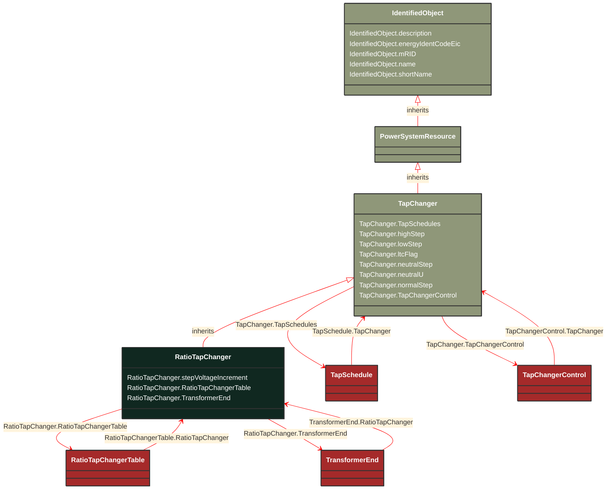

# RatioTapChanger

_A tap changer that changes the voltage ratio impacting the voltage magnitude but not the phase angle across the transformer.

Angle sign convention (general): Positive value indicates a positive phase shift from the winding where the tap is located to the other winding (for a two-winding transformer)._

**URI**: [cim:RatioTapChanger](http://iec.ch/TC57/CIM100#RatioTapChanger) 
**Type**: Class

## Inheritance
* [IdentifiedObject](/Models/Profiles/CoreEquipment/AbstractClasses/IdentifiedObject/)
    * [PowerSystemResource](/Models/Profiles/CoreEquipment/AbstractClasses/PowerSystemResource/)
        * [TapChanger](/Models/Profiles/CoreEquipment/AbstractClasses/TapChanger/)
            * **RatioTapChanger**

## Attributes
| Name | URI | Cardinality and Range | Description | Inheritance |
| ---  | --- | --- | --- | --- |
| stepVoltageIncrement | [cim:RatioTapChanger.stepVoltageIncrement](http://iec.ch/TC57/CIM100#RatioTapChanger.stepVoltageIncrement) | No cardinality available PerCent | Tap step increment, in per cent of rated voltage of the power transformer end, per step position.
When the increment is negative, the voltage decreases when the tap step increases. | direct |
| RatioTapChangerTable | [cim:RatioTapChanger.RatioTapChangerTable](http://iec.ch/TC57/CIM100#RatioTapChanger.RatioTapChangerTable) | No cardinality available RatioTapChangerTable | The tap ratio table for this ratio  tap changer. | direct |
| TransformerEnd | [cim:RatioTapChanger.TransformerEnd](http://iec.ch/TC57/CIM100#RatioTapChanger.TransformerEnd) | No cardinality available TransformerEnd | Transformer end to which this ratio tap changer belongs. | direct |
| TapSchedules | [cim:TapChanger.TapSchedules](http://iec.ch/TC57/CIM100#TapChanger.TapSchedules) | No cardinality available TapSchedule | A TapChanger can have TapSchedules. | TapChanger |
| highStep | [cim:TapChanger.highStep](http://iec.ch/TC57/CIM100#TapChanger.highStep) | No cardinality available integer | Highest possible tap step position, advance from neutral.
The attribute shall be greater than lowStep. | TapChanger |
| lowStep | [cim:TapChanger.lowStep](http://iec.ch/TC57/CIM100#TapChanger.lowStep) | No cardinality available integer | Lowest possible tap step position, retard from neutral. | TapChanger |
| ltcFlag | [cim:TapChanger.ltcFlag](http://iec.ch/TC57/CIM100#TapChanger.ltcFlag) | No cardinality available boolean | Specifies whether or not a TapChanger has load tap changing capabilities. | TapChanger |
| neutralStep | [cim:TapChanger.neutralStep](http://iec.ch/TC57/CIM100#TapChanger.neutralStep) | No cardinality available integer | The neutral tap step position for this winding.
The attribute shall be equal to or greater than lowStep and equal or less than highStep.
It is the step position where the voltage is neutralU when the other terminals of the transformer are at the ratedU.  If there are other tap changers on the transformer those taps are kept constant at their neutralStep. | TapChanger |
| neutralU | [cim:TapChanger.neutralU](http://iec.ch/TC57/CIM100#TapChanger.neutralU) | No cardinality available Voltage | Voltage at which the winding operates at the neutral tap setting. It is the voltage at the terminal of the PowerTransformerEnd associated with the tap changer when all tap changers on the transformer are at their neutralStep position.  Normally neutralU of the tap changer is the same as ratedU of the PowerTransformerEnd, but it can differ in special cases such as when the tapping mechanism is separate from the winding more common on lower voltage transformers.
This attribute is not relevant for PhaseTapChangerAsymmetrical, PhaseTapChangerSymmetrical and PhaseTapChangerLinear. | TapChanger |
| normalStep | [cim:TapChanger.normalStep](http://iec.ch/TC57/CIM100#TapChanger.normalStep) | No cardinality available integer | The tap step position used in "normal" network operation for this winding. For a "Fixed" tap changer indicates the current physical tap setting.
The attribute shall be equal to or greater than lowStep and equal to or less than highStep. | TapChanger |
| TapChangerControl | [cim:TapChanger.TapChangerControl](http://iec.ch/TC57/CIM100#TapChanger.TapChangerControl) | No cardinality available TapChangerControl | The regulating control scheme in which this tap changer participates. | TapChanger |
| description | [cim:IdentifiedObject.description](http://iec.ch/TC57/CIM100#IdentifiedObject.description) | No cardinality available string | The description is a free human readable text describing or naming the object. It may be non unique and may not correlate to a naming hierarchy. | IdentifiedObject |
| energyIdentCodeEic | [eu:IdentifiedObject.energyIdentCodeEic](http://iec.ch/TC57/CIM100-European#IdentifiedObject.energyIdentCodeEic) | No cardinality available string | The attribute is used for an exchange of the EIC code (Energy identification Code). The length of the string is 16 characters as defined by the EIC code. For details on EIC scheme please refer to ENTSO-E web site. | IdentifiedObject |
| mRID | [cim:IdentifiedObject.mRID](http://iec.ch/TC57/CIM100#IdentifiedObject.mRID) | No cardinality available string | Master resource identifier issued by a model authority. The mRID is unique within an exchange context. Global uniqueness is easily achieved by using a UUID, as specified in RFC 4122, for the mRID. The use of UUID is strongly recommended.
For CIMXML data files in RDF syntax conforming to IEC 61970-552, the mRID is mapped to rdf:ID or rdf:about attributes that identify CIM object elements. | IdentifiedObject |
| name | [cim:IdentifiedObject.name](http://iec.ch/TC57/CIM100#IdentifiedObject.name) | No cardinality available string | The name is any free human readable and possibly non unique text naming the object. | IdentifiedObject |
| shortName | [eu:IdentifiedObject.shortName](http://iec.ch/TC57/CIM100-European#IdentifiedObject.shortName) | No cardinality available string | The attribute is used for an exchange of a human readable short name with length of the string 12 characters maximum. | IdentifiedObject |

### Schema Source
* from schema: [http://iec.ch/TC57/ns/CIM/CoreEquipment-EUPackage_CoreEquipmentProfile](http://iec.ch/TC57/ns/CIM/CoreEquipment-EUPackage_CoreEquipmentProfile)
