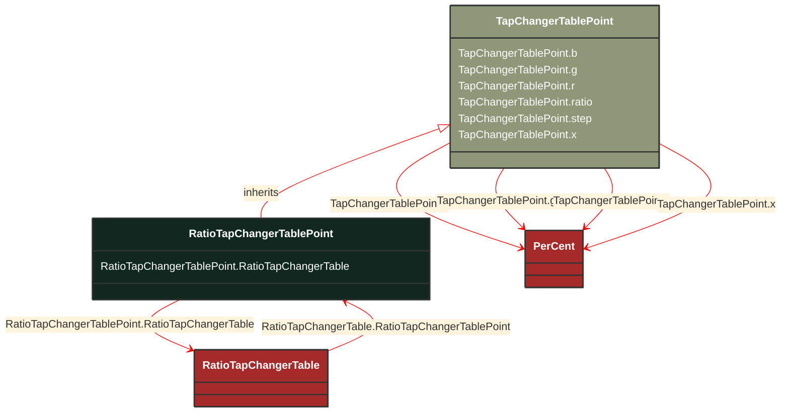

# RatioTapChangerTablePoint

_Describes each tap step in the ratio tap changer tabular curve._

**URI**: [cim:RatioTapChangerTablePoint](http://iec.ch/TC57/CIM100#RatioTapChangerTablePoint) 
**Type**: Class

## Inheritance
* [TapChangerTablePoint](/Models/Profiles/CoreEquipment/ConcreteClasses/TapChangerTablePoint/)
    * **RatioTapChangerTablePoint**

## Attributes
| Name | URI | Cardinality and Range | Description | Inheritance |
| ---  | --- | --- | --- | --- |
| RatioTapChangerTable | [cim:RatioTapChangerTablePoint.RatioTapChangerTable](http://iec.ch/TC57/CIM100#RatioTapChangerTablePoint.RatioTapChangerTable) | No cardinality available RatioTapChangerTable | Table of this point. | direct |
| b | [cim:TapChangerTablePoint.b](http://iec.ch/TC57/CIM100#TapChangerTablePoint.b) | No cardinality available PerCent | The magnetizing branch susceptance deviation as a percentage of nominal value. The actual susceptance is calculated as follows:
calculated magnetizing susceptance = b(nominal) * (1 + b(from this class)/100).   The b(nominal) is defined as the static magnetizing susceptance on the associated power transformer end or ends.  This model assumes the star impedance (pi model) form. | TapChangerTablePoint |
| g | [cim:TapChangerTablePoint.g](http://iec.ch/TC57/CIM100#TapChangerTablePoint.g) | No cardinality available PerCent | The magnetizing branch conductance deviation as a percentage of nominal value. The actual conductance is calculated as follows:
calculated magnetizing conductance = g(nominal) * (1 + g(from this class)/100).   The g(nominal) is defined as the static magnetizing conductance on the associated power transformer end or ends.  This model assumes the star impedance (pi model) form. | TapChangerTablePoint |
| r | [cim:TapChangerTablePoint.r](http://iec.ch/TC57/CIM100#TapChangerTablePoint.r) | No cardinality available PerCent | The resistance deviation as a percentage of nominal value. The actual reactance is calculated as follows:
calculated resistance = r(nominal) * (1 + r(from this class)/100).   The r(nominal) is defined as the static resistance on the associated power transformer end or ends.  This model assumes the star impedance (pi model) form. | TapChangerTablePoint |
| ratio | [cim:TapChangerTablePoint.ratio](http://iec.ch/TC57/CIM100#TapChangerTablePoint.ratio) | No cardinality available float | The voltage at the tap step divided by rated voltage of the transformer end having the tap changer. Hence this is a value close to one.
For example, if the ratio at step 1 is 1.01, and the rated voltage of the transformer end is 110kV, then the voltage obtained by setting the tap changer to step 1 to is 111.1kV. | TapChangerTablePoint |
| step | [cim:TapChangerTablePoint.step](http://iec.ch/TC57/CIM100#TapChangerTablePoint.step) | No cardinality available integer | The tap step. | TapChangerTablePoint |
| x | [cim:TapChangerTablePoint.x](http://iec.ch/TC57/CIM100#TapChangerTablePoint.x) | No cardinality available PerCent | The series reactance deviation as a percentage of nominal value. The actual reactance is calculated as follows:
calculated reactance = x(nominal) * (1 + x(from this class)/100).   The x(nominal) is defined as the static series reactance on the associated power transformer end or ends.  This model assumes the star impedance (pi model) form. | TapChangerTablePoint |

### Schema Source
* from schema: [http://iec.ch/TC57/ns/CIM/CoreEquipment-EUPackage_CoreEquipmentProfile](http://iec.ch/TC57/ns/CIM/CoreEquipment-EUPackage_CoreEquipmentProfile)
