# Reactance

_Reactance (imaginary part of impedance), at rated frequency._

**URI**: [cim:Reactance](http://iec.ch/TC57/CIM100#Reactance) 
**Type**: Class

```mermaid
%%{init: {'theme':'base','themeVariables': {'lineColor': '#FF0000'}}}%%
classDiagram
    class Reactance
    click Reactance href "/Models/Profiles/CoreEquipment/ConcreteClasses/Reactance/"
    style Reactance fill:#102820,stroke:#333,stroke-width:2px,rx:10,ry:10,color:white


        ACLineSegment --> Reactance : ACLineSegment.x

        ACLineSegment
            click ACLineSegment href "/Models/Profiles/CoreEquipment/ConcreteClasses/ACLineSegment/"
            style ACLineSegment fill:#A52A2A,stroke:#333,stroke-width:2px,rx:10,ry:10,color:white

        EquivalentBranch --> Reactance : EquivalentBranch.x

        EquivalentBranch
            click EquivalentBranch href "/Models/Profiles/CoreEquipment/ConcreteClasses/EquivalentBranch/"
            style EquivalentBranch fill:#A52A2A,stroke:#333,stroke-width:2px,rx:10,ry:10,color:white

        EquivalentBranch --> Reactance : EquivalentBranch.x21

        EquivalentBranch
            click EquivalentBranch href "/Models/Profiles/CoreEquipment/ConcreteClasses/EquivalentBranch/"
            style EquivalentBranch fill:#A52A2A,stroke:#333,stroke-width:2px,rx:10,ry:10,color:white

        PhaseTapChangerLinear --> Reactance : PhaseTapChangerLinear.xMax

        PhaseTapChangerLinear
            click PhaseTapChangerLinear href "/Models/Profiles/CoreEquipment/ConcreteClasses/PhaseTapChangerLinear/"
            style PhaseTapChangerLinear fill:#A52A2A,stroke:#333,stroke-width:2px,rx:10,ry:10,color:white

        PhaseTapChangerLinear --> Reactance : PhaseTapChangerLinear.xMin

        PhaseTapChangerLinear
            click PhaseTapChangerLinear href "/Models/Profiles/CoreEquipment/ConcreteClasses/PhaseTapChangerLinear/"
            style PhaseTapChangerLinear fill:#A52A2A,stroke:#333,stroke-width:2px,rx:10,ry:10,color:white

        PhaseTapChangerNonLinear --> Reactance : PhaseTapChangerNonLinear.xMax

        PhaseTapChangerNonLinear
            click PhaseTapChangerNonLinear href "/Models/Profiles/CoreEquipment/ConcreteClasses/PhaseTapChangerNonLinear/"
            style PhaseTapChangerNonLinear fill:#A52A2A,stroke:#333,stroke-width:2px,rx:10,ry:10,color:white

        PhaseTapChangerNonLinear --> Reactance : PhaseTapChangerNonLinear.xMin

        PhaseTapChangerNonLinear
            click PhaseTapChangerNonLinear href "/Models/Profiles/CoreEquipment/ConcreteClasses/PhaseTapChangerNonLinear/"
            style PhaseTapChangerNonLinear fill:#A52A2A,stroke:#333,stroke-width:2px,rx:10,ry:10,color:white

        PowerTransformerEnd --> Reactance : PowerTransformerEnd.x

        PowerTransformerEnd
            click PowerTransformerEnd href "/Models/Profiles/CoreEquipment/ConcreteClasses/PowerTransformerEnd/"
            style PowerTransformerEnd fill:#A52A2A,stroke:#333,stroke-width:2px,rx:10,ry:10,color:white

        SeriesCompensator --> Reactance : SeriesCompensator.x

        SeriesCompensator
            click SeriesCompensator href "/Models/Profiles/CoreEquipment/ConcreteClasses/SeriesCompensator/"
            style SeriesCompensator fill:#A52A2A,stroke:#333,stroke-width:2px,rx:10,ry:10,color:white

        StaticVarCompensator --> Reactance : StaticVarCompensator.capacitiveRating

        StaticVarCompensator
            click StaticVarCompensator href "/Models/Profiles/CoreEquipment/ConcreteClasses/StaticVarCompensator/"
            style StaticVarCompensator fill:#A52A2A,stroke:#333,stroke-width:2px,rx:10,ry:10,color:white

        StaticVarCompensator --> Reactance : StaticVarCompensator.inductiveRating

        StaticVarCompensator
            click StaticVarCompensator href "/Models/Profiles/CoreEquipment/ConcreteClasses/StaticVarCompensator/"
            style StaticVarCompensator fill:#A52A2A,stroke:#333,stroke-width:2px,rx:10,ry:10,color:white

        Reactance --> UnitSymbol : Reactance.unit

        UnitSymbol
            click UnitSymbol href "/Models/Profiles/CoreEquipment/Enumerations/UnitSymbol/"
            style UnitSymbol fill:#4D2D18,stroke:#333,stroke-width:2px,rx:10,ry:10,color:white
        Reactance --> UnitMultiplier : Reactance.multiplier

        UnitMultiplier
            click UnitMultiplier href "/Models/Profiles/CoreEquipment/Enumerations/UnitMultiplier/"
            style UnitMultiplier fill:#4D2D18,stroke:#333,stroke-width:2px,rx:10,ry:10,color:white

        Reactance : Reactance.value
        Reactance : Reactance.unit
        Reactance : Reactance.multiplier
```

## Inheritance
* **Reactance**

## Attributes
| Name | URI | Cardinality and Range | Description | Inheritance |
| ---  | --- | --- | --- | --- |
| value | [cim:Reactance.value](http://iec.ch/TC57/CIM100#Reactance.value) | No cardinality available float | No description available | direct |
| unit | [cim:Reactance.unit](http://iec.ch/TC57/CIM100#Reactance.unit) | No cardinality available UnitSymbol | No description available | direct |
| multiplier | [cim:Reactance.multiplier](http://iec.ch/TC57/CIM100#Reactance.multiplier) | No cardinality available UnitMultiplier | No description available | direct |

### Schema Source
* from schema: [http://iec.ch/TC57/ns/CIM/CoreEquipment-EUPackage_CoreEquipmentProfile](http://iec.ch/TC57/ns/CIM/CoreEquipment-EUPackage_CoreEquipmentProfile)
