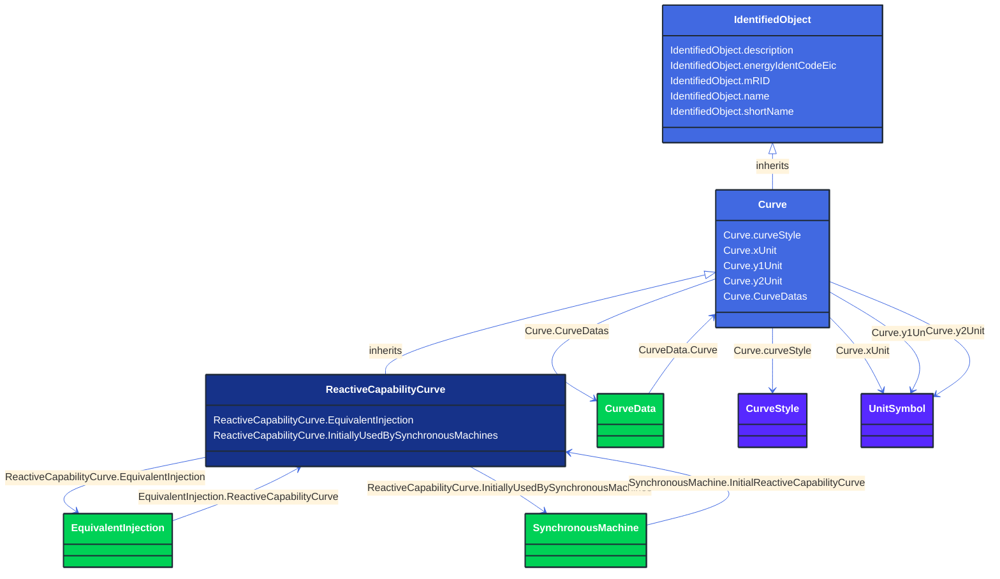

# ReactiveCapabilityCurve

_Reactive power rating envelope versus the synchronous machine's active power, in both the generating and motoring modes. For each active power value there is a corresponding high and low reactive power limit  value. Typically there will be a separate curve for each coolant condition, such as hydrogen pressure.  The Y1 axis values represent reactive minimum and the Y2 axis values represent reactive maximum._

**URI**: [cim:ReactiveCapabilityCurve](http://iec.ch/TC57/CIM100#ReactiveCapabilityCurve) 
**Type**: Class

## Inheritance
* [IdentifiedObject](/Models/Profiles/CoreEquipment/AbstractClasses/IdentifiedObject/)
    * [Curve](/Models/Profiles/CoreEquipment/AbstractClasses/Curve/)
        * **ReactiveCapabilityCurve**

## Attributes
| Name | URI | Cardinality and Range | Description | Inheritance |
| ---  | --- | --- | --- | --- |
| EquivalentInjection | [cim:ReactiveCapabilityCurve.EquivalentInjection](http://iec.ch/TC57/CIM100#ReactiveCapabilityCurve.EquivalentInjection) | No cardinality available EquivalentInjection | The equivalent injection using this reactive capability curve. | direct |
| InitiallyUsedBySynchronousMachines | [cim:ReactiveCapabilityCurve.InitiallyUsedBySynchronousMachines](http://iec.ch/TC57/CIM100#ReactiveCapabilityCurve.InitiallyUsedBySynchronousMachines) | No cardinality available SynchronousMachine | Synchronous machines using this curve as default. | direct |
| curveStyle | [cim:Curve.curveStyle](http://iec.ch/TC57/CIM100#Curve.curveStyle) | No cardinality available CurveStyle | The style or shape of the curve. | Curve |
| xUnit | [cim:Curve.xUnit](http://iec.ch/TC57/CIM100#Curve.xUnit) | No cardinality available UnitSymbol | The X-axis units of measure. | Curve |
| y1Unit | [cim:Curve.y1Unit](http://iec.ch/TC57/CIM100#Curve.y1Unit) | No cardinality available UnitSymbol | The Y1-axis units of measure. | Curve |
| y2Unit | [cim:Curve.y2Unit](http://iec.ch/TC57/CIM100#Curve.y2Unit) | No cardinality available UnitSymbol | The Y2-axis units of measure. | Curve |
| CurveDatas | [cim:Curve.CurveDatas](http://iec.ch/TC57/CIM100#Curve.CurveDatas) | No cardinality available CurveData | The point data values that define this curve. | Curve |
| description | [cim:IdentifiedObject.description](http://iec.ch/TC57/CIM100#IdentifiedObject.description) | No cardinality available string | The description is a free human readable text describing or naming the object. It may be non unique and may not correlate to a naming hierarchy. | IdentifiedObject |
| energyIdentCodeEic | [eu:IdentifiedObject.energyIdentCodeEic](http://iec.ch/TC57/CIM100-European#IdentifiedObject.energyIdentCodeEic) | No cardinality available string | The attribute is used for an exchange of the EIC code (Energy identification Code). The length of the string is 16 characters as defined by the EIC code. For details on EIC scheme please refer to ENTSO-E web site. | IdentifiedObject |
| mRID | [cim:IdentifiedObject.mRID](http://iec.ch/TC57/CIM100#IdentifiedObject.mRID) | No cardinality available string | Master resource identifier issued by a model authority. The mRID is unique within an exchange context. Global uniqueness is easily achieved by using a UUID, as specified in RFC 4122, for the mRID. The use of UUID is strongly recommended.
For CIMXML data files in RDF syntax conforming to IEC 61970-552, the mRID is mapped to rdf:ID or rdf:about attributes that identify CIM object elements. | IdentifiedObject |
| name | [cim:IdentifiedObject.name](http://iec.ch/TC57/CIM100#IdentifiedObject.name) | No cardinality available string | The name is any free human readable and possibly non unique text naming the object. | IdentifiedObject |
| shortName | [eu:IdentifiedObject.shortName](http://iec.ch/TC57/CIM100-European#IdentifiedObject.shortName) | No cardinality available string | The attribute is used for an exchange of a human readable short name with length of the string 12 characters maximum. | IdentifiedObject |

### Schema Source
* from schema: [http://iec.ch/TC57/ns/CIM/CoreEquipment-EUPackage_CoreEquipmentProfile](http://iec.ch/TC57/ns/CIM/CoreEquipment-EUPackage_CoreEquipmentProfile)
