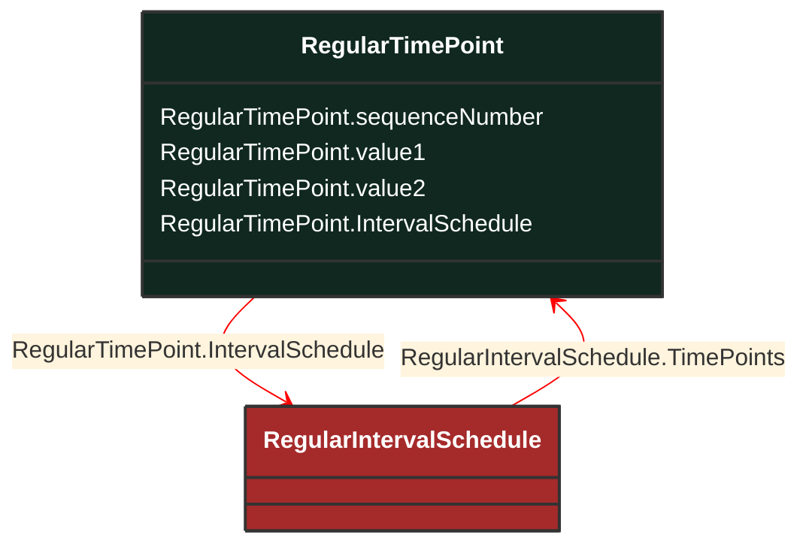

# RegularTimePoint

_Time point for a schedule where the time between the consecutive points is constant._

**URI**: [cim:RegularTimePoint](http://iec.ch/TC57/CIM100#RegularTimePoint) 
**Type**: Class

## Inheritance
* **RegularTimePoint**

## Attributes
| Name | URI | Cardinality and Range | Description | Inheritance |
| ---  | --- | --- | --- | --- |
| sequenceNumber | [cim:RegularTimePoint.sequenceNumber](http://iec.ch/TC57/CIM100#RegularTimePoint.sequenceNumber) | No cardinality available integer | The position of the regular time point in the sequence. Note that time points don't have to be sequential, i.e. time points may be omitted. The actual time for a RegularTimePoint is computed by multiplying the associated regular interval schedule's time step with the regular time point sequence number and adding the associated schedules start time. To specify values for the start time, use sequence number 0.  The sequence number cannot be negative. | direct |
| value1 | [cim:RegularTimePoint.value1](http://iec.ch/TC57/CIM100#RegularTimePoint.value1) | No cardinality available float | The first value at the time. The meaning of the value is defined by the derived type of the associated schedule. | direct |
| value2 | [cim:RegularTimePoint.value2](http://iec.ch/TC57/CIM100#RegularTimePoint.value2) | No cardinality available float | The second value at the time. The meaning of the value is defined by the derived type of the associated schedule. | direct |
| IntervalSchedule | [cim:RegularTimePoint.IntervalSchedule](http://iec.ch/TC57/CIM100#RegularTimePoint.IntervalSchedule) | No cardinality available RegularIntervalSchedule | Regular interval schedule containing this time point. | direct |

### Schema Source
* from schema: [http://iec.ch/TC57/ns/CIM/CoreEquipment-EUPackage_CoreEquipmentProfile](http://iec.ch/TC57/ns/CIM/CoreEquipment-EUPackage_CoreEquipmentProfile)
