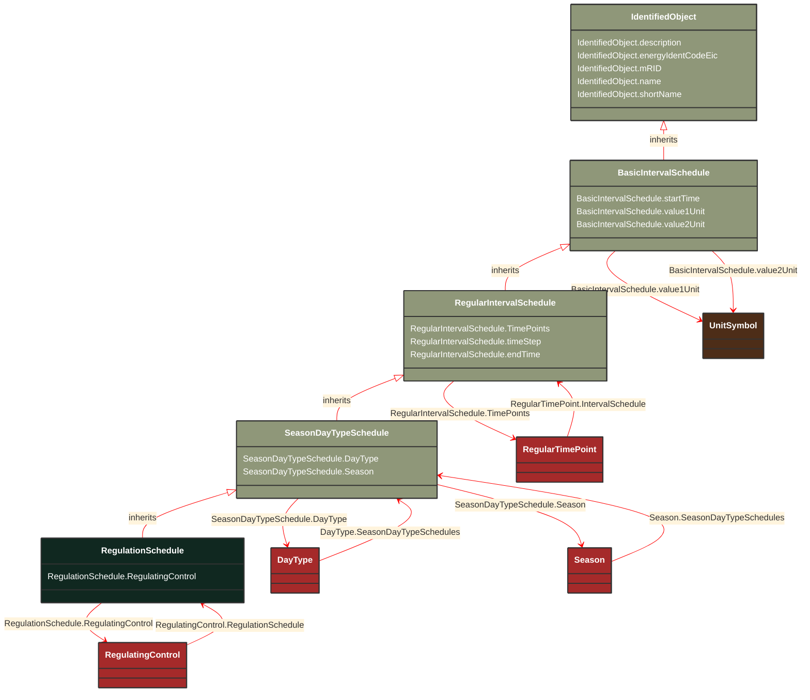

# RegulationSchedule

_A pre-established pattern over time for a controlled variable, e.g., busbar voltage._

**URI**: [cim:RegulationSchedule](http://iec.ch/TC57/CIM100#RegulationSchedule) 
**Type**: Class

## Inheritance
* [IdentifiedObject](/Models/Profiles/CoreEquipment/AbstractClasses/IdentifiedObject/)
    * [BasicIntervalSchedule](/Models/Profiles/CoreEquipment/AbstractClasses/BasicIntervalSchedule/)
        * [RegularIntervalSchedule](/Models/Profiles/CoreEquipment/AbstractClasses/RegularIntervalSchedule/)
            * [SeasonDayTypeSchedule](/Models/Profiles/CoreEquipment/AbstractClasses/SeasonDayTypeSchedule/)
                * **RegulationSchedule**

## Attributes
| Name | URI | Cardinality and Range | Description | Inheritance |
| ---  | --- | --- | --- | --- |
| RegulatingControl | [cim:RegulationSchedule.RegulatingControl](http://iec.ch/TC57/CIM100#RegulationSchedule.RegulatingControl) | No cardinality available RegulatingControl | Regulating controls that have this schedule. | direct |
| DayType | [cim:SeasonDayTypeSchedule.DayType](http://iec.ch/TC57/CIM100#SeasonDayTypeSchedule.DayType) | No cardinality available DayType | DayType for the Schedule. | SeasonDayTypeSchedule |
| Season | [cim:SeasonDayTypeSchedule.Season](http://iec.ch/TC57/CIM100#SeasonDayTypeSchedule.Season) | No cardinality available Season | Season for the Schedule. | SeasonDayTypeSchedule |
| TimePoints | [cim:RegularIntervalSchedule.TimePoints](http://iec.ch/TC57/CIM100#RegularIntervalSchedule.TimePoints) | No cardinality available RegularTimePoint | The regular interval time point data values that define this schedule. | RegularIntervalSchedule |
| timeStep | [cim:RegularIntervalSchedule.timeStep](http://iec.ch/TC57/CIM100#RegularIntervalSchedule.timeStep) | No cardinality available Seconds | The time between each pair of subsequent regular time points in sequence order. | RegularIntervalSchedule |
| endTime | [cim:RegularIntervalSchedule.endTime](http://iec.ch/TC57/CIM100#RegularIntervalSchedule.endTime) | No cardinality available date | The time for the last time point.  The value can be a time of day, not a specific date. | RegularIntervalSchedule |
| startTime | [cim:BasicIntervalSchedule.startTime](http://iec.ch/TC57/CIM100#BasicIntervalSchedule.startTime) | No cardinality available date | The time for the first time point.  The value can be a time of day, not a specific date. | BasicIntervalSchedule |
| value1Unit | [cim:BasicIntervalSchedule.value1Unit](http://iec.ch/TC57/CIM100#BasicIntervalSchedule.value1Unit) | No cardinality available UnitSymbol | Value1 units of measure. | BasicIntervalSchedule |
| value2Unit | [cim:BasicIntervalSchedule.value2Unit](http://iec.ch/TC57/CIM100#BasicIntervalSchedule.value2Unit) | No cardinality available UnitSymbol | Value2 units of measure. | BasicIntervalSchedule |
| description | [cim:IdentifiedObject.description](http://iec.ch/TC57/CIM100#IdentifiedObject.description) | No cardinality available string | The description is a free human readable text describing or naming the object. It may be non unique and may not correlate to a naming hierarchy. | IdentifiedObject |
| energyIdentCodeEic | [eu:IdentifiedObject.energyIdentCodeEic](http://iec.ch/TC57/CIM100-European#IdentifiedObject.energyIdentCodeEic) | No cardinality available string | The attribute is used for an exchange of the EIC code (Energy identification Code). The length of the string is 16 characters as defined by the EIC code. For details on EIC scheme please refer to ENTSO-E web site. | IdentifiedObject |
| mRID | [cim:IdentifiedObject.mRID](http://iec.ch/TC57/CIM100#IdentifiedObject.mRID) | No cardinality available string | Master resource identifier issued by a model authority. The mRID is unique within an exchange context. Global uniqueness is easily achieved by using a UUID, as specified in RFC 4122, for the mRID. The use of UUID is strongly recommended.
For CIMXML data files in RDF syntax conforming to IEC 61970-552, the mRID is mapped to rdf:ID or rdf:about attributes that identify CIM object elements. | IdentifiedObject |
| name | [cim:IdentifiedObject.name](http://iec.ch/TC57/CIM100#IdentifiedObject.name) | No cardinality available string | The name is any free human readable and possibly non unique text naming the object. | IdentifiedObject |
| shortName | [eu:IdentifiedObject.shortName](http://iec.ch/TC57/CIM100-European#IdentifiedObject.shortName) | No cardinality available string | The attribute is used for an exchange of a human readable short name with length of the string 12 characters maximum. | IdentifiedObject |

### Schema Source
* from schema: [http://iec.ch/TC57/ns/CIM/CoreEquipment-EUPackage_CoreEquipmentProfile](http://iec.ch/TC57/ns/CIM/CoreEquipment-EUPackage_CoreEquipmentProfile)
