# Resistance

_Resistance (real part of impedance)._

**URI**: [cim:Resistance](http://iec.ch/TC57/CIM100#Resistance) 
**Type**: Class

```mermaid
%%{init: {'theme':'base','themeVariables': {'lineColor': '#FF0000'}}}%%
classDiagram
    class Resistance
    click Resistance href "/Models/Profiles/CoreEquipment/ConcreteClasses/Resistance/"
    style Resistance fill:#102820,stroke:#333,stroke-width:2px,rx:10,ry:10,color:white


        ACDCConverter --> Resistance : ACDCConverter.resistiveLoss

        ACDCConverter
            click ACDCConverter href "/Models/Profiles/CoreEquipment/ConcreteClasses/ACDCConverter/"
            style ACDCConverter fill:#A52A2A,stroke:#333,stroke-width:2px,rx:10,ry:10,color:white

        ACLineSegment --> Resistance : ACLineSegment.r

        ACLineSegment
            click ACLineSegment href "/Models/Profiles/CoreEquipment/ConcreteClasses/ACLineSegment/"
            style ACLineSegment fill:#A52A2A,stroke:#333,stroke-width:2px,rx:10,ry:10,color:white

        DCGround --> Resistance : DCGround.r

        DCGround
            click DCGround href "/Models/Profiles/CoreEquipment/ConcreteClasses/DCGround/"
            style DCGround fill:#A52A2A,stroke:#333,stroke-width:2px,rx:10,ry:10,color:white

        DCLineSegment --> Resistance : DCLineSegment.resistance

        DCLineSegment
            click DCLineSegment href "/Models/Profiles/CoreEquipment/ConcreteClasses/DCLineSegment/"
            style DCLineSegment fill:#A52A2A,stroke:#333,stroke-width:2px,rx:10,ry:10,color:white

        DCSeriesDevice --> Resistance : DCSeriesDevice.resistance

        DCSeriesDevice
            click DCSeriesDevice href "/Models/Profiles/CoreEquipment/ConcreteClasses/DCSeriesDevice/"
            style DCSeriesDevice fill:#A52A2A,stroke:#333,stroke-width:2px,rx:10,ry:10,color:white

        DCShunt --> Resistance : DCShunt.resistance

        DCShunt
            click DCShunt href "/Models/Profiles/CoreEquipment/ConcreteClasses/DCShunt/"
            style DCShunt fill:#A52A2A,stroke:#333,stroke-width:2px,rx:10,ry:10,color:white

        EquivalentBranch --> Resistance : EquivalentBranch.r

        EquivalentBranch
            click EquivalentBranch href "/Models/Profiles/CoreEquipment/ConcreteClasses/EquivalentBranch/"
            style EquivalentBranch fill:#A52A2A,stroke:#333,stroke-width:2px,rx:10,ry:10,color:white

        EquivalentBranch --> Resistance : EquivalentBranch.r21

        EquivalentBranch
            click EquivalentBranch href "/Models/Profiles/CoreEquipment/ConcreteClasses/EquivalentBranch/"
            style EquivalentBranch fill:#A52A2A,stroke:#333,stroke-width:2px,rx:10,ry:10,color:white

        PowerTransformerEnd --> Resistance : PowerTransformerEnd.r

        PowerTransformerEnd
            click PowerTransformerEnd href "/Models/Profiles/CoreEquipment/ConcreteClasses/PowerTransformerEnd/"
            style PowerTransformerEnd fill:#A52A2A,stroke:#333,stroke-width:2px,rx:10,ry:10,color:white

        SeriesCompensator --> Resistance : SeriesCompensator.r

        SeriesCompensator
            click SeriesCompensator href "/Models/Profiles/CoreEquipment/ConcreteClasses/SeriesCompensator/"
            style SeriesCompensator fill:#A52A2A,stroke:#333,stroke-width:2px,rx:10,ry:10,color:white

        Resistance --> UnitSymbol : Resistance.unit

        UnitSymbol
            click UnitSymbol href "/Models/Profiles/CoreEquipment/Enumerations/UnitSymbol/"
            style UnitSymbol fill:#4D2D18,stroke:#333,stroke-width:2px,rx:10,ry:10,color:white
        Resistance --> UnitMultiplier : Resistance.multiplier

        UnitMultiplier
            click UnitMultiplier href "/Models/Profiles/CoreEquipment/Enumerations/UnitMultiplier/"
            style UnitMultiplier fill:#4D2D18,stroke:#333,stroke-width:2px,rx:10,ry:10,color:white

        Resistance : Resistance.value
        Resistance : Resistance.unit
        Resistance : Resistance.multiplier
```

## Inheritance
* **Resistance**

## Attributes
| Name | URI | Cardinality and Range | Description | Inheritance |
| ---  | --- | --- | --- | --- |
| value | [cim:Resistance.value](http://iec.ch/TC57/CIM100#Resistance.value) | No cardinality available float | No description available | direct |
| unit | [cim:Resistance.unit](http://iec.ch/TC57/CIM100#Resistance.unit) | No cardinality available UnitSymbol | No description available | direct |
| multiplier | [cim:Resistance.multiplier](http://iec.ch/TC57/CIM100#Resistance.multiplier) | No cardinality available UnitMultiplier | No description available | direct |

### Schema Source
* from schema: [http://iec.ch/TC57/ns/CIM/CoreEquipment-EUPackage_CoreEquipmentProfile](http://iec.ch/TC57/ns/CIM/CoreEquipment-EUPackage_CoreEquipmentProfile)
