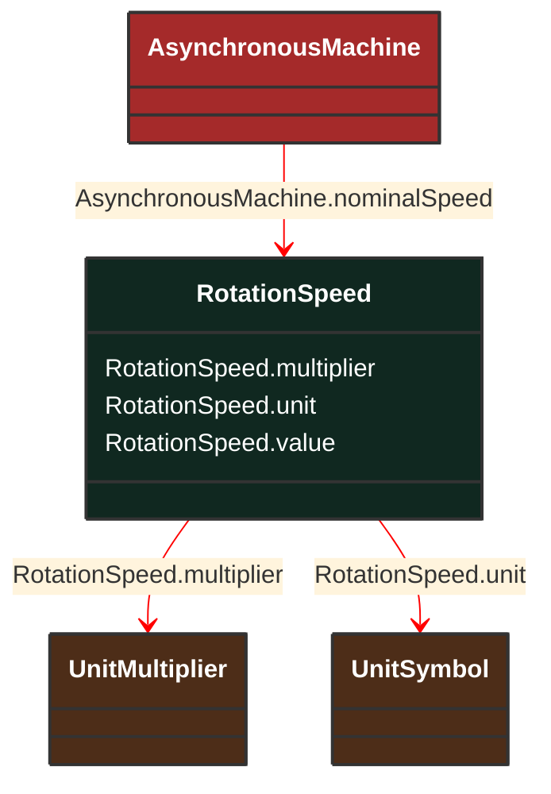

# RotationSpeed

_Number of revolutions per second._

**URI**: [cim:RotationSpeed](http://iec.ch/TC57/CIM100#RotationSpeed) 
**Type**: Class

## Inheritance
* **RotationSpeed**

## Attributes
| Name | URI | Cardinality and Range | Description | Inheritance |
| ---  | --- | --- | --- | --- |
| multiplier | [cim:RotationSpeed.multiplier](http://iec.ch/TC57/CIM100#RotationSpeed.multiplier) | No cardinality available UnitMultiplier | No description available | direct |
| unit | [cim:RotationSpeed.unit](http://iec.ch/TC57/CIM100#RotationSpeed.unit) | No cardinality available UnitSymbol | No description available | direct |
| value | [cim:RotationSpeed.value](http://iec.ch/TC57/CIM100#RotationSpeed.value) | No cardinality available float | No description available | direct |

### Schema Source
* from schema: [http://iec.ch/TC57/ns/CIM/CoreEquipment-EUPackage_CoreEquipmentProfile](http://iec.ch/TC57/ns/CIM/CoreEquipment-EUPackage_CoreEquipmentProfile)
