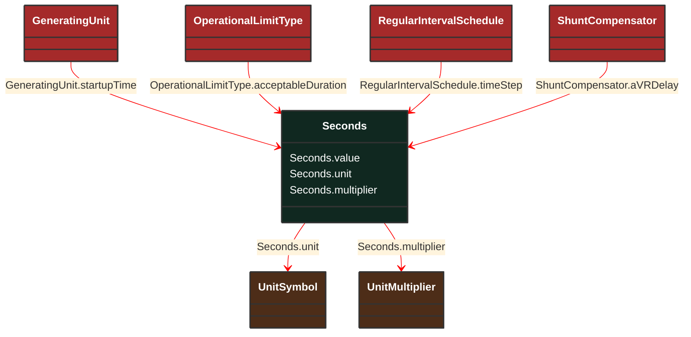

# Seconds

_Time, in seconds._

**URI**: [cim:Seconds](http://iec.ch/TC57/CIM100#Seconds) 
**Type**: Class

## Inheritance
* **Seconds**

## Attributes
| Name | URI | Cardinality and Range | Description | Inheritance |
| ---  | --- | --- | --- | --- |
| value | [cim:Seconds.value](http://iec.ch/TC57/CIM100#Seconds.value) | No cardinality available float | Time, in seconds | direct |
| unit | [cim:Seconds.unit](http://iec.ch/TC57/CIM100#Seconds.unit) | No cardinality available UnitSymbol | No description available | direct |
| multiplier | [cim:Seconds.multiplier](http://iec.ch/TC57/CIM100#Seconds.multiplier) | No cardinality available UnitMultiplier | No description available | direct |

### Schema Source
* from schema: [http://iec.ch/TC57/ns/CIM/CoreEquipment-EUPackage_CoreEquipmentProfile](http://iec.ch/TC57/ns/CIM/CoreEquipment-EUPackage_CoreEquipmentProfile)
