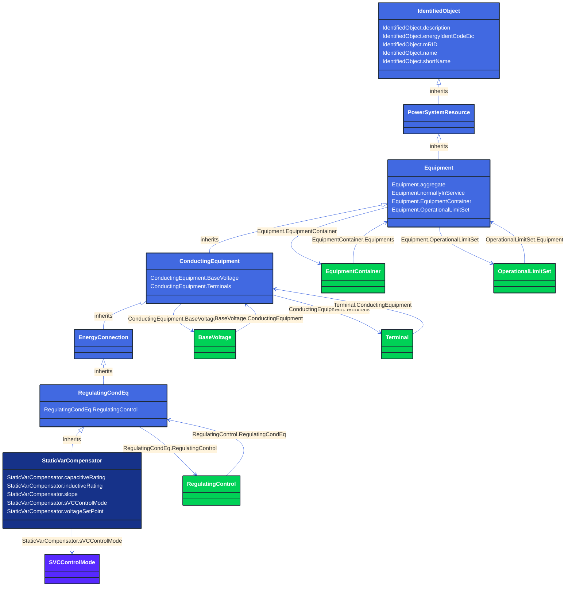

# StaticVarCompensator

_A facility for providing variable and controllable shunt reactive power. The SVC typically consists of a stepdown transformer, filter, thyristor-controlled reactor, and thyristor-switched capacitor arms.

The SVC may operate in fixed MVar output mode or in voltage control mode. When in voltage control mode, the output of the SVC will be proportional to the deviation of voltage at the controlled bus from the voltage setpoint.  The SVC characteristic slope defines the proportion.  If the voltage at the controlled bus is equal to the voltage setpoint, the SVC MVar output is zero._

**URI**: [cim:StaticVarCompensator](http://iec.ch/TC57/CIM100#StaticVarCompensator) 
**Type**: Class

## Inheritance
* [IdentifiedObject](/Models/Profiles/CoreEquipment/AbstractClasses/IdentifiedObject/)
    * [PowerSystemResource](/Models/Profiles/CoreEquipment/AbstractClasses/PowerSystemResource/)
        * [Equipment](/Models/Profiles/CoreEquipment/AbstractClasses/Equipment/)
            * [ConductingEquipment](/Models/Profiles/CoreEquipment/AbstractClasses/ConductingEquipment/)
                * [EnergyConnection](/Models/Profiles/CoreEquipment/AbstractClasses/EnergyConnection/)
                    * [RegulatingCondEq](/Models/Profiles/CoreEquipment/AbstractClasses/RegulatingCondEq/)
                        * **StaticVarCompensator**

## Attributes
| Name | URI | Cardinality and Range | Description | Inheritance |
| ---  | --- | --- | --- | --- |
| capacitiveRating | [cim:StaticVarCompensator.capacitiveRating](http://iec.ch/TC57/CIM100#StaticVarCompensator.capacitiveRating) | No cardinality available Reactance | Capacitive reactance at maximum capacitive reactive power.  Shall always be positive. | direct |
| inductiveRating | [cim:StaticVarCompensator.inductiveRating](http://iec.ch/TC57/CIM100#StaticVarCompensator.inductiveRating) | No cardinality available Reactance | Inductive reactance at maximum inductive reactive power.  Shall always be negative. | direct |
| slope | [cim:StaticVarCompensator.slope](http://iec.ch/TC57/CIM100#StaticVarCompensator.slope) | No cardinality available VoltagePerReactivePower | The characteristics slope of an SVC defines how the reactive power output changes in proportion to the difference between the regulated bus voltage and the voltage setpoint.
The attribute shall be a positive value or zero. | direct |
| sVCControlMode | [cim:StaticVarCompensator.sVCControlMode](http://iec.ch/TC57/CIM100#StaticVarCompensator.sVCControlMode) | No cardinality available SVCControlMode | SVC control mode. | direct |
| voltageSetPoint | [cim:StaticVarCompensator.voltageSetPoint](http://iec.ch/TC57/CIM100#StaticVarCompensator.voltageSetPoint) | No cardinality available Voltage | The reactive power output of the SVC is proportional to the difference between the voltage at the regulated bus and the voltage setpoint.  When the regulated bus voltage is equal to the voltage setpoint, the reactive power output is zero. | direct |
| RegulatingControl | [cim:RegulatingCondEq.RegulatingControl](http://iec.ch/TC57/CIM100#RegulatingCondEq.RegulatingControl) | No cardinality available RegulatingControl | The regulating control scheme in which this equipment participates. | RegulatingCondEq |
| BaseVoltage | [cim:ConductingEquipment.BaseVoltage](http://iec.ch/TC57/CIM100#ConductingEquipment.BaseVoltage) | No cardinality available BaseVoltage | Base voltage of this conducting equipment.  Use only when there is no voltage level container used and only one base voltage applies.  For example, not used for transformers. | ConductingEquipment |
| Terminals | [cim:ConductingEquipment.Terminals](http://iec.ch/TC57/CIM100#ConductingEquipment.Terminals) | No cardinality available Terminal | Conducting equipment have terminals that may be connected to other conducting equipment terminals via connectivity nodes or topological nodes. | ConductingEquipment |
| aggregate | [cim:Equipment.aggregate](http://iec.ch/TC57/CIM100#Equipment.aggregate) | No cardinality available boolean | The aggregate flag provides an alternative way of representing an aggregated (equivalent) element. It is applicable in cases when the dedicated classes for equivalent equipment do not have all of the attributes necessary to represent the required level of detail.  In case the flag is set to “true” the single instance of equipment represents multiple pieces of equipment that have been modelled together as an aggregate equivalent obtained by a network reduction procedure. Examples would be power transformers or synchronous machines operating in parallel modelled as a single aggregate power transformer or aggregate synchronous machine.  
The attribute is not used for EquivalentBranch, EquivalentShunt and EquivalentInjection. | Equipment |
| normallyInService | [cim:Equipment.normallyInService](http://iec.ch/TC57/CIM100#Equipment.normallyInService) | No cardinality available boolean | Specifies the availability of the equipment under normal operating conditions. True means the equipment is available for topology processing, which determines if the equipment is energized or not. False means that the equipment is treated by network applications as if it is not in the model. | Equipment |
| EquipmentContainer | [cim:Equipment.EquipmentContainer](http://iec.ch/TC57/CIM100#Equipment.EquipmentContainer) | No cardinality available EquipmentContainer | Container of this equipment. | Equipment |
| OperationalLimitSet | [cim:Equipment.OperationalLimitSet](http://iec.ch/TC57/CIM100#Equipment.OperationalLimitSet) | No cardinality available OperationalLimitSet | The operational limit sets associated with this equipment. | Equipment |
| description | [cim:IdentifiedObject.description](http://iec.ch/TC57/CIM100#IdentifiedObject.description) | No cardinality available string | The description is a free human readable text describing or naming the object. It may be non unique and may not correlate to a naming hierarchy. | IdentifiedObject |
| energyIdentCodeEic | [eu:IdentifiedObject.energyIdentCodeEic](http://iec.ch/TC57/CIM100-European#IdentifiedObject.energyIdentCodeEic) | No cardinality available string | The attribute is used for an exchange of the EIC code (Energy identification Code). The length of the string is 16 characters as defined by the EIC code. For details on EIC scheme please refer to ENTSO-E web site. | IdentifiedObject |
| mRID | [cim:IdentifiedObject.mRID](http://iec.ch/TC57/CIM100#IdentifiedObject.mRID) | No cardinality available string | Master resource identifier issued by a model authority. The mRID is unique within an exchange context. Global uniqueness is easily achieved by using a UUID, as specified in RFC 4122, for the mRID. The use of UUID is strongly recommended.
For CIMXML data files in RDF syntax conforming to IEC 61970-552, the mRID is mapped to rdf:ID or rdf:about attributes that identify CIM object elements. | IdentifiedObject |
| name | [cim:IdentifiedObject.name](http://iec.ch/TC57/CIM100#IdentifiedObject.name) | No cardinality available string | The name is any free human readable and possibly non unique text naming the object. | IdentifiedObject |
| shortName | [eu:IdentifiedObject.shortName](http://iec.ch/TC57/CIM100-European#IdentifiedObject.shortName) | No cardinality available string | The attribute is used for an exchange of a human readable short name with length of the string 12 characters maximum. | IdentifiedObject |

### Schema Source
* from schema: [http://iec.ch/TC57/ns/CIM/CoreEquipment-EUPackage_CoreEquipmentProfile](http://iec.ch/TC57/ns/CIM/CoreEquipment-EUPackage_CoreEquipmentProfile)
