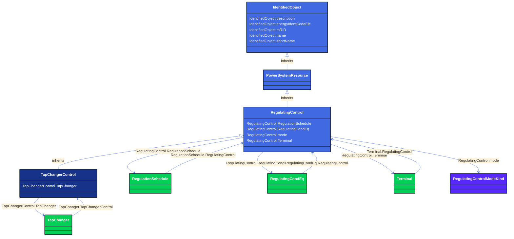

# TapChangerControl

_Describes behaviour specific to tap changers, e.g. how the voltage at the end of a line varies with the load level and compensation of the voltage drop by tap adjustment._

**URI**: [cim:TapChangerControl](http://iec.ch/TC57/CIM100#TapChangerControl) 
**Type**: Class

## Inheritance
* [IdentifiedObject](/Models/Profiles/CoreEquipment/AbstractClasses/IdentifiedObject/)
    * [PowerSystemResource](/Models/Profiles/CoreEquipment/AbstractClasses/PowerSystemResource/)
        * [RegulatingControl](/Models/Profiles/CoreEquipment/ConcreteClasses/RegulatingControl/)
            * **TapChangerControl**

## Attributes
| Name | URI | Cardinality and Range | Description | Inheritance |
| ---  | --- | --- | --- | --- |
| TapChanger | [cim:TapChangerControl.TapChanger](http://iec.ch/TC57/CIM100#TapChangerControl.TapChanger) | No cardinality available TapChanger | The tap changers that participates in this regulating tap control scheme. | direct |
| RegulationSchedule | [cim:RegulatingControl.RegulationSchedule](http://iec.ch/TC57/CIM100#RegulatingControl.RegulationSchedule) | No cardinality available RegulationSchedule | Schedule for this regulating control. | RegulatingControl |
| RegulatingCondEq | [cim:RegulatingControl.RegulatingCondEq](http://iec.ch/TC57/CIM100#RegulatingControl.RegulatingCondEq) | No cardinality available RegulatingCondEq | The equipment that participates in this regulating control scheme. | RegulatingControl |
| mode | [cim:RegulatingControl.mode](http://iec.ch/TC57/CIM100#RegulatingControl.mode) | No cardinality available RegulatingControlModeKind | The regulating control mode presently available.  This specification allows for determining the kind of regulation without need for obtaining the units from a schedule. | RegulatingControl |
| Terminal | [cim:RegulatingControl.Terminal](http://iec.ch/TC57/CIM100#RegulatingControl.Terminal) | No cardinality available Terminal | The terminal associated with this regulating control.  The terminal is associated instead of a node, since the terminal could connect into either a topological node or a connectivity node.  Sometimes it is useful to model regulation at a terminal of a bus bar object. | RegulatingControl |
| description | [cim:IdentifiedObject.description](http://iec.ch/TC57/CIM100#IdentifiedObject.description) | No cardinality available string | The description is a free human readable text describing or naming the object. It may be non unique and may not correlate to a naming hierarchy. | IdentifiedObject |
| energyIdentCodeEic | [eu:IdentifiedObject.energyIdentCodeEic](http://iec.ch/TC57/CIM100-European#IdentifiedObject.energyIdentCodeEic) | No cardinality available string | The attribute is used for an exchange of the EIC code (Energy identification Code). The length of the string is 16 characters as defined by the EIC code. For details on EIC scheme please refer to ENTSO-E web site. | IdentifiedObject |
| mRID | [cim:IdentifiedObject.mRID](http://iec.ch/TC57/CIM100#IdentifiedObject.mRID) | No cardinality available string | Master resource identifier issued by a model authority. The mRID is unique within an exchange context. Global uniqueness is easily achieved by using a UUID, as specified in RFC 4122, for the mRID. The use of UUID is strongly recommended.
For CIMXML data files in RDF syntax conforming to IEC 61970-552, the mRID is mapped to rdf:ID or rdf:about attributes that identify CIM object elements. | IdentifiedObject |
| name | [cim:IdentifiedObject.name](http://iec.ch/TC57/CIM100#IdentifiedObject.name) | No cardinality available string | The name is any free human readable and possibly non unique text naming the object. | IdentifiedObject |
| shortName | [eu:IdentifiedObject.shortName](http://iec.ch/TC57/CIM100-European#IdentifiedObject.shortName) | No cardinality available string | The attribute is used for an exchange of a human readable short name with length of the string 12 characters maximum. | IdentifiedObject |

### Schema Source
* from schema: [http://iec.ch/TC57/ns/CIM/CoreEquipment-EUPackage_CoreEquipmentProfile](http://iec.ch/TC57/ns/CIM/CoreEquipment-EUPackage_CoreEquipmentProfile)
