# Terminal

_An AC electrical connection point to a piece of conducting equipment. Terminals are connected at physical connection points called connectivity nodes._

**URI**: [cim:Terminal](http://iec.ch/TC57/CIM100#Terminal) 
**Type**: Class

```mermaid
%%{init: {'theme':'base','themeVariables': {'lineColor': '#FF0000'}}}%%
classDiagram
    class Terminal
    click Terminal href "/Models/Profiles/CoreEquipment/ConcreteClasses/Terminal/"
    style Terminal fill:#102820,stroke:#333,stroke-width:2px,rx:10,ry:10,color:white
     
        ACDCTerminal <|-- Terminal : inherits
            click ACDCTerminal href "/Models/Profiles/CoreEquipment/AbstractClasses/ACDCTerminal/"
            style ACDCTerminal fill:#8F9779,stroke:#333,stroke-width:2px,rx:10,ry:10,color:white
     
        IdentifiedObject <|-- ACDCTerminal : inherits
            click IdentifiedObject href "/Models/Profiles/CoreEquipment/AbstractClasses/IdentifiedObject/"
            style IdentifiedObject fill:#8F9779,stroke:#333,stroke-width:2px,rx:10,ry:10,color:white

        Terminal --> ACDCConverter : Terminal.ConverterDCSides

        ACDCConverter
            click ACDCConverter href "/Models/Profiles/CoreEquipment/AbstractClasses/ACDCConverter/"
            style ACDCConverter fill:#A52A2A,stroke:#333,stroke-width:2px,rx:10,ry:10,color:white
        Terminal --> AuxiliaryEquipment : Terminal.AuxiliaryEquipment

        AuxiliaryEquipment
            click AuxiliaryEquipment href "/Models/Profiles/CoreEquipment/AbstractClasses/AuxiliaryEquipment/"
            style AuxiliaryEquipment fill:#A52A2A,stroke:#333,stroke-width:2px,rx:10,ry:10,color:white
        Terminal --> ConductingEquipment : Terminal.ConductingEquipment

        ConductingEquipment
            click ConductingEquipment href "/Models/Profiles/CoreEquipment/AbstractClasses/ConductingEquipment/"
            style ConductingEquipment fill:#A52A2A,stroke:#333,stroke-width:2px,rx:10,ry:10,color:white
        Terminal --> ConnectivityNode : Terminal.ConnectivityNode

        ConnectivityNode
            click ConnectivityNode href "/Models/Profiles/CoreEquipment/AbstractClasses/ConnectivityNode/"
            style ConnectivityNode fill:#A52A2A,stroke:#333,stroke-width:2px,rx:10,ry:10,color:white
        Terminal --> RegulatingControl : Terminal.RegulatingControl

        RegulatingControl
            click RegulatingControl href "/Models/Profiles/CoreEquipment/ConcreteClasses/RegulatingControl/"
            style RegulatingControl fill:#A52A2A,stroke:#333,stroke-width:2px,rx:10,ry:10,color:white
        Terminal --> TransformerEnd : Terminal.TransformerEnd

        TransformerEnd
            click TransformerEnd href "/Models/Profiles/CoreEquipment/AbstractClasses/TransformerEnd/"
            style TransformerEnd fill:#A52A2A,stroke:#333,stroke-width:2px,rx:10,ry:10,color:white
        Terminal --> TieFlow : Terminal.TieFlow

        TieFlow
            click TieFlow href "/Models/Profiles/CoreEquipment/ConcreteClasses/TieFlow/"
            style TieFlow fill:#A52A2A,stroke:#333,stroke-width:2px,rx:10,ry:10,color:white
        ACDCTerminal --> OperationalLimitSet : ACDCTerminal.OperationalLimitSet

        OperationalLimitSet
            click OperationalLimitSet href "/Models/Profiles/CoreEquipment/ConcreteClasses/OperationalLimitSet/"
            style OperationalLimitSet fill:#A52A2A,stroke:#333,stroke-width:2px,rx:10,ry:10,color:white
        ACDCTerminal --> BusNameMarker : ACDCTerminal.BusNameMarker

        BusNameMarker
            click BusNameMarker href "/Models/Profiles/CoreEquipment/ConcreteClasses/BusNameMarker/"
            style BusNameMarker fill:#A52A2A,stroke:#333,stroke-width:2px,rx:10,ry:10,color:white

        ACDCConverter --> Terminal : ACDCConverter.PccTerminal

        ACDCConverter
            click ACDCConverter href "/Models/Profiles/CoreEquipment/AbstractClasses/ACDCConverter/"
            style ACDCConverter fill:#A52A2A,stroke:#333,stroke-width:2px,rx:10,ry:10,color:white

        AuxiliaryEquipment --> Terminal : AuxiliaryEquipment.Terminal

        AuxiliaryEquipment
            click AuxiliaryEquipment href "/Models/Profiles/CoreEquipment/AbstractClasses/AuxiliaryEquipment/"
            style AuxiliaryEquipment fill:#A52A2A,stroke:#333,stroke-width:2px,rx:10,ry:10,color:white

        BusNameMarker --> ACDCTerminal : BusNameMarker.Terminal

        BusNameMarker
            click BusNameMarker href "/Models/Profiles/CoreEquipment/ConcreteClasses/BusNameMarker/"
            style BusNameMarker fill:#A52A2A,stroke:#333,stroke-width:2px,rx:10,ry:10,color:white

        ConductingEquipment --> Terminal : ConductingEquipment.Terminals

        ConductingEquipment
            click ConductingEquipment href "/Models/Profiles/CoreEquipment/AbstractClasses/ConductingEquipment/"
            style ConductingEquipment fill:#A52A2A,stroke:#333,stroke-width:2px,rx:10,ry:10,color:white

        ConnectivityNode --> Terminal : ConnectivityNode.Terminals

        ConnectivityNode
            click ConnectivityNode href "/Models/Profiles/CoreEquipment/AbstractClasses/ConnectivityNode/"
            style ConnectivityNode fill:#A52A2A,stroke:#333,stroke-width:2px,rx:10,ry:10,color:white

        OperationalLimitSet --> ACDCTerminal : OperationalLimitSet.Terminal

        OperationalLimitSet
            click OperationalLimitSet href "/Models/Profiles/CoreEquipment/ConcreteClasses/OperationalLimitSet/"
            style OperationalLimitSet fill:#A52A2A,stroke:#333,stroke-width:2px,rx:10,ry:10,color:white

        RegulatingControl --> Terminal : RegulatingControl.Terminal

        RegulatingControl
            click RegulatingControl href "/Models/Profiles/CoreEquipment/ConcreteClasses/RegulatingControl/"
            style RegulatingControl fill:#A52A2A,stroke:#333,stroke-width:2px,rx:10,ry:10,color:white

        TieFlow --> Terminal : TieFlow.Terminal

        TieFlow
            click TieFlow href "/Models/Profiles/CoreEquipment/ConcreteClasses/TieFlow/"
            style TieFlow fill:#A52A2A,stroke:#333,stroke-width:2px,rx:10,ry:10,color:white

        TransformerEnd --> Terminal : TransformerEnd.Terminal

        TransformerEnd
            click TransformerEnd href "/Models/Profiles/CoreEquipment/AbstractClasses/TransformerEnd/"
            style TransformerEnd fill:#A52A2A,stroke:#333,stroke-width:2px,rx:10,ry:10,color:white

        Terminal --> PhaseCode : Terminal.phases

        PhaseCode
            click PhaseCode href "/Models/Profiles/CoreEquipment/Enumerations/PhaseCode/"
            style PhaseCode fill:#4D2D18,stroke:#333,stroke-width:2px,rx:10,ry:10,color:white

        Terminal : Terminal.ConverterDCSides
        Terminal : Terminal.AuxiliaryEquipment
        Terminal : Terminal.ConductingEquipment
        Terminal : Terminal.ConnectivityNode
        Terminal : Terminal.RegulatingControl
        Terminal : Terminal.phases
        Terminal : Terminal.TransformerEnd
        Terminal : Terminal.TieFlow
        ACDCTerminal : ACDCTerminal.sequenceNumber
        ACDCTerminal : ACDCTerminal.OperationalLimitSet
        ACDCTerminal : ACDCTerminal.BusNameMarker
        IdentifiedObject : IdentifiedObject.description
        IdentifiedObject : IdentifiedObject.energyIdentCodeEic
        IdentifiedObject : IdentifiedObject.mRID
        IdentifiedObject : IdentifiedObject.name
        IdentifiedObject : IdentifiedObject.shortName
```

## Inheritance
* [IdentifiedObject](/Models/Profiles/CoreEquipment/AbstractClasses/IdentifiedObject/)
    * [ACDCTerminal](/Models/Profiles/CoreEquipment/AbstractClasses/ACDCTerminal/)
        * **Terminal**

## Attributes
| Name | URI | Cardinality and Range | Description | Inheritance |
| ---  | --- | --- | --- | --- |
| ConverterDCSides | [cim:Terminal.ConverterDCSides](http://iec.ch/TC57/CIM100#Terminal.ConverterDCSides) | No cardinality available ACDCConverter | All converters' DC sides linked to this point of common coupling terminal. | direct |
| AuxiliaryEquipment | [cim:Terminal.AuxiliaryEquipment](http://iec.ch/TC57/CIM100#Terminal.AuxiliaryEquipment) | No cardinality available AuxiliaryEquipment | The auxiliary equipment connected to the terminal. | direct |
| ConductingEquipment | [cim:Terminal.ConductingEquipment](http://iec.ch/TC57/CIM100#Terminal.ConductingEquipment) | No cardinality available ConductingEquipment | The conducting equipment of the terminal.  Conducting equipment have  terminals that may be connected to other conducting equipment terminals via connectivity nodes or topological nodes. | direct |
| ConnectivityNode | [cim:Terminal.ConnectivityNode](http://iec.ch/TC57/CIM100#Terminal.ConnectivityNode) | No cardinality available ConnectivityNode | The connectivity node to which this terminal connects with zero impedance. | direct |
| RegulatingControl | [cim:Terminal.RegulatingControl](http://iec.ch/TC57/CIM100#Terminal.RegulatingControl) | No cardinality available RegulatingControl | The controls regulating this terminal. | direct |
| phases | [cim:Terminal.phases](http://iec.ch/TC57/CIM100#Terminal.phases) | No cardinality available PhaseCode | Represents the normal network phasing condition. If the attribute is missing, three phases (ABC) shall be assumed, except for terminals of grounding classes (specializations of EarthFaultCompensator, GroundDisconnector, and Ground) which will be assumed to be N. Therefore, phase code ABCN is explicitly declared when needed, e.g. for star point grounding equipment.
The phase code on terminals connecting same ConnectivityNode or same TopologicalNode as well as for equipment between two terminals shall be consistent. | direct |
| TransformerEnd | [cim:Terminal.TransformerEnd](http://iec.ch/TC57/CIM100#Terminal.TransformerEnd) | No cardinality available TransformerEnd | All transformer ends connected at this terminal. | direct |
| TieFlow | [cim:Terminal.TieFlow](http://iec.ch/TC57/CIM100#Terminal.TieFlow) | No cardinality available TieFlow | The control area tie flows to which this terminal associates. | direct |
| sequenceNumber | [cim:ACDCTerminal.sequenceNumber](http://iec.ch/TC57/CIM100#ACDCTerminal.sequenceNumber) | No cardinality available integer | The orientation of the terminal connections for a multiple terminal conducting equipment.  The sequence numbering starts with 1 and additional terminals should follow in increasing order.   The first terminal is the "starting point" for a two terminal branch. | ACDCTerminal |
| OperationalLimitSet | [cim:ACDCTerminal.OperationalLimitSet](http://iec.ch/TC57/CIM100#ACDCTerminal.OperationalLimitSet) | No cardinality available OperationalLimitSet | The operational limit sets at the terminal. | ACDCTerminal |
| BusNameMarker | [cim:ACDCTerminal.BusNameMarker](http://iec.ch/TC57/CIM100#ACDCTerminal.BusNameMarker) | No cardinality available BusNameMarker | The bus name marker used to name the bus (topological node). | ACDCTerminal |
| description | [cim:IdentifiedObject.description](http://iec.ch/TC57/CIM100#IdentifiedObject.description) | No cardinality available string | The description is a free human readable text describing or naming the object. It may be non unique and may not correlate to a naming hierarchy. | IdentifiedObject |
| energyIdentCodeEic | [eu:IdentifiedObject.energyIdentCodeEic](http://iec.ch/TC57/CIM100-European#IdentifiedObject.energyIdentCodeEic) | No cardinality available string | The attribute is used for an exchange of the EIC code (Energy identification Code). The length of the string is 16 characters as defined by the EIC code. For details on EIC scheme please refer to ENTSO-E web site. | IdentifiedObject |
| mRID | [cim:IdentifiedObject.mRID](http://iec.ch/TC57/CIM100#IdentifiedObject.mRID) | No cardinality available string | Master resource identifier issued by a model authority. The mRID is unique within an exchange context. Global uniqueness is easily achieved by using a UUID, as specified in RFC 4122, for the mRID. The use of UUID is strongly recommended.
For CIMXML data files in RDF syntax conforming to IEC 61970-552, the mRID is mapped to rdf:ID or rdf:about attributes that identify CIM object elements. | IdentifiedObject |
| name | [cim:IdentifiedObject.name](http://iec.ch/TC57/CIM100#IdentifiedObject.name) | No cardinality available string | The name is any free human readable and possibly non unique text naming the object. | IdentifiedObject |
| shortName | [eu:IdentifiedObject.shortName](http://iec.ch/TC57/CIM100-European#IdentifiedObject.shortName) | No cardinality available string | The attribute is used for an exchange of a human readable short name with length of the string 12 characters maximum. | IdentifiedObject |

### Schema Source
* from schema: [http://iec.ch/TC57/ns/CIM/CoreEquipment-EUPackage_CoreEquipmentProfile](http://iec.ch/TC57/ns/CIM/CoreEquipment-EUPackage_CoreEquipmentProfile)
