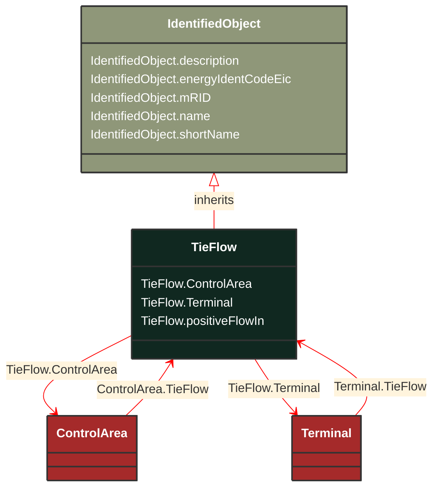

# TieFlow

_Defines the structure (in terms of location and direction) of the net interchange constraint for a control area. This constraint may be used by either AGC or power flow._

**URI**: [cim:TieFlow](http://iec.ch/TC57/CIM100#TieFlow) 
**Type**: Class

## Inheritance
* [IdentifiedObject](/Models/Profiles/CoreEquipment/AbstractClasses/IdentifiedObject/)
    * **TieFlow**

## Attributes
| Name | URI | Cardinality and Range | Description | Inheritance |
| ---  | --- | --- | --- | --- |
| ControlArea | [cim:TieFlow.ControlArea](http://iec.ch/TC57/CIM100#TieFlow.ControlArea) | No cardinality available ControlArea | The control area of the tie flows. | direct |
| Terminal | [cim:TieFlow.Terminal](http://iec.ch/TC57/CIM100#TieFlow.Terminal) | No cardinality available Terminal | The terminal to which this tie flow belongs. | direct |
| positiveFlowIn | [cim:TieFlow.positiveFlowIn](http://iec.ch/TC57/CIM100#TieFlow.positiveFlowIn) | No cardinality available boolean | Specifies the sign of the tie flow associated with a control area. True if positive flow into the terminal (load convention) is also positive flow into the control area.  See the description of ControlArea for further explanation of how TieFlow.positiveFlowIn is used. | direct |
| description | [cim:IdentifiedObject.description](http://iec.ch/TC57/CIM100#IdentifiedObject.description) | No cardinality available string | The description is a free human readable text describing or naming the object. It may be non unique and may not correlate to a naming hierarchy. | IdentifiedObject |
| energyIdentCodeEic | [eu:IdentifiedObject.energyIdentCodeEic](http://iec.ch/TC57/CIM100-European#IdentifiedObject.energyIdentCodeEic) | No cardinality available string | The attribute is used for an exchange of the EIC code (Energy identification Code). The length of the string is 16 characters as defined by the EIC code. For details on EIC scheme please refer to ENTSO-E web site. | IdentifiedObject |
| mRID | [cim:IdentifiedObject.mRID](http://iec.ch/TC57/CIM100#IdentifiedObject.mRID) | No cardinality available string | Master resource identifier issued by a model authority. The mRID is unique within an exchange context. Global uniqueness is easily achieved by using a UUID, as specified in RFC 4122, for the mRID. The use of UUID is strongly recommended.
For CIMXML data files in RDF syntax conforming to IEC 61970-552, the mRID is mapped to rdf:ID or rdf:about attributes that identify CIM object elements. | IdentifiedObject |
| name | [cim:IdentifiedObject.name](http://iec.ch/TC57/CIM100#IdentifiedObject.name) | No cardinality available string | The name is any free human readable and possibly non unique text naming the object. | IdentifiedObject |
| shortName | [eu:IdentifiedObject.shortName](http://iec.ch/TC57/CIM100-European#IdentifiedObject.shortName) | No cardinality available string | The attribute is used for an exchange of a human readable short name with length of the string 12 characters maximum. | IdentifiedObject |

### Schema Source
* from schema: [http://iec.ch/TC57/ns/CIM/CoreEquipment-EUPackage_CoreEquipmentProfile](http://iec.ch/TC57/ns/CIM/CoreEquipment-EUPackage_CoreEquipmentProfile)
