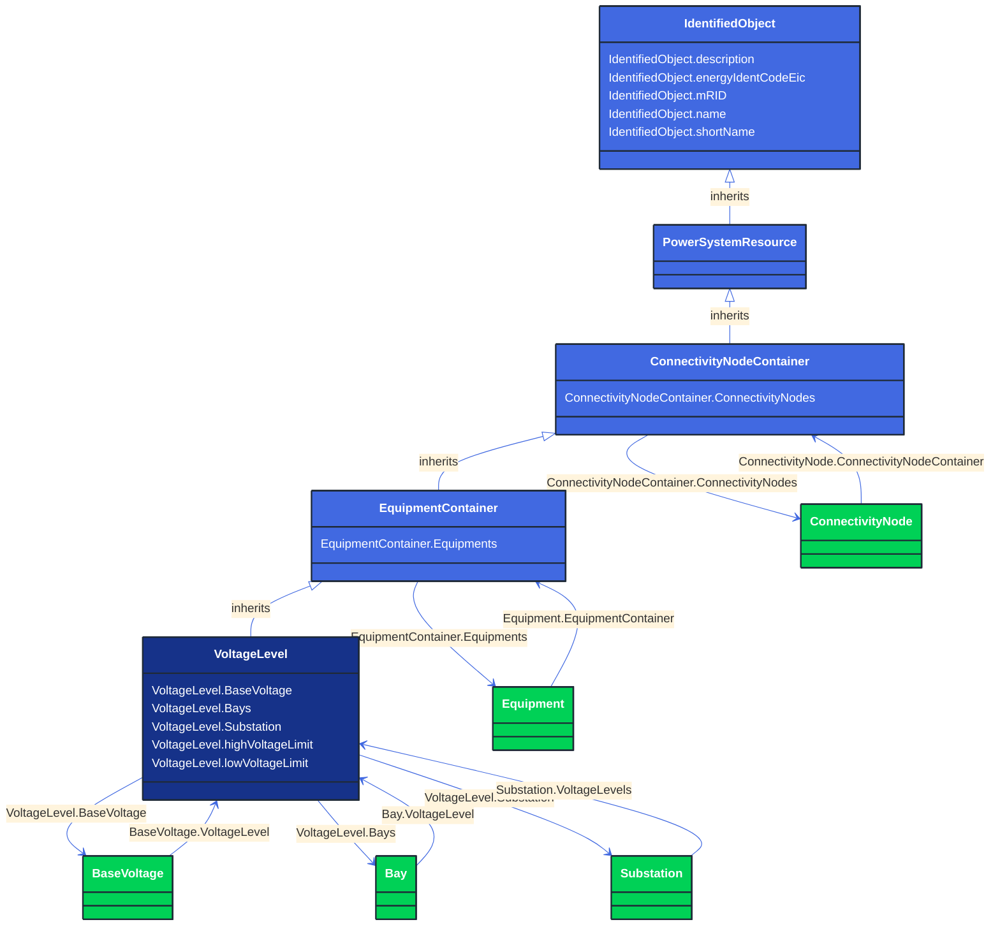

# VoltageLevel

_A collection of equipment at one common system voltage forming a switchgear. The equipment typically consists of breakers, busbars, instrumentation, control, regulation and protection devices as well as assemblies of all these._

**URI**: [cim:VoltageLevel](http://iec.ch/TC57/CIM100#VoltageLevel) 
**Type**: Class

## Inheritance
* [IdentifiedObject](/Models/Profiles/CoreEquipment/AbstractClasses/IdentifiedObject/)
    * [PowerSystemResource](/Models/Profiles/CoreEquipment/AbstractClasses/PowerSystemResource/)
        * [ConnectivityNodeContainer](/Models/Profiles/CoreEquipment/AbstractClasses/ConnectivityNodeContainer/)
            * [EquipmentContainer](/Models/Profiles/CoreEquipment/AbstractClasses/EquipmentContainer/)
                * **VoltageLevel**

## Attributes
| Name | URI | Cardinality and Range | Description | Inheritance |
| ---  | --- | --- | --- | --- |
| BaseVoltage | [cim:VoltageLevel.BaseVoltage](http://iec.ch/TC57/CIM100#VoltageLevel.BaseVoltage) | No cardinality available BaseVoltage | The base voltage used for all equipment within the voltage level. | direct |
| Bays | [cim:VoltageLevel.Bays](http://iec.ch/TC57/CIM100#VoltageLevel.Bays) | No cardinality available Bay | The bays within this voltage level. | direct |
| Substation | [cim:VoltageLevel.Substation](http://iec.ch/TC57/CIM100#VoltageLevel.Substation) | No cardinality available Substation | The substation of the voltage level. | direct |
| highVoltageLimit | [cim:VoltageLevel.highVoltageLimit](http://iec.ch/TC57/CIM100#VoltageLevel.highVoltageLimit) | No cardinality available Voltage | The bus bar's high voltage limit.
The limit applies to all equipment and nodes contained in a given VoltageLevel. It is not required that it is exchanged in pair with lowVoltageLimit. It is preferable to use operational VoltageLimit, which prevails, if present. | direct |
| lowVoltageLimit | [cim:VoltageLevel.lowVoltageLimit](http://iec.ch/TC57/CIM100#VoltageLevel.lowVoltageLimit) | No cardinality available Voltage | The bus bar's low voltage limit.
The limit applies to all equipment and nodes contained in a given VoltageLevel. It is not required that it is exchanged in pair with highVoltageLimit. It is preferable to use operational VoltageLimit, which prevails, if present. | direct |
| Equipments | [cim:EquipmentContainer.Equipments](http://iec.ch/TC57/CIM100#EquipmentContainer.Equipments) | No cardinality available Equipment | Contained equipment. | EquipmentContainer |
| ConnectivityNodes | [cim:ConnectivityNodeContainer.ConnectivityNodes](http://iec.ch/TC57/CIM100#ConnectivityNodeContainer.ConnectivityNodes) | No cardinality available ConnectivityNode | Connectivity nodes which belong to this connectivity node container. | ConnectivityNodeContainer |
| description | [cim:IdentifiedObject.description](http://iec.ch/TC57/CIM100#IdentifiedObject.description) | No cardinality available string | The description is a free human readable text describing or naming the object. It may be non unique and may not correlate to a naming hierarchy. | IdentifiedObject |
| energyIdentCodeEic | [eu:IdentifiedObject.energyIdentCodeEic](http://iec.ch/TC57/CIM100-European#IdentifiedObject.energyIdentCodeEic) | No cardinality available string | The attribute is used for an exchange of the EIC code (Energy identification Code). The length of the string is 16 characters as defined by the EIC code. For details on EIC scheme please refer to ENTSO-E web site. | IdentifiedObject |
| mRID | [cim:IdentifiedObject.mRID](http://iec.ch/TC57/CIM100#IdentifiedObject.mRID) | No cardinality available string | Master resource identifier issued by a model authority. The mRID is unique within an exchange context. Global uniqueness is easily achieved by using a UUID, as specified in RFC 4122, for the mRID. The use of UUID is strongly recommended.
For CIMXML data files in RDF syntax conforming to IEC 61970-552, the mRID is mapped to rdf:ID or rdf:about attributes that identify CIM object elements. | IdentifiedObject |
| name | [cim:IdentifiedObject.name](http://iec.ch/TC57/CIM100#IdentifiedObject.name) | No cardinality available string | The name is any free human readable and possibly non unique text naming the object. | IdentifiedObject |
| shortName | [eu:IdentifiedObject.shortName](http://iec.ch/TC57/CIM100-European#IdentifiedObject.shortName) | No cardinality available string | The attribute is used for an exchange of a human readable short name with length of the string 12 characters maximum. | IdentifiedObject |

### Schema Source
* from schema: [http://iec.ch/TC57/ns/CIM/CoreEquipment-EUPackage_CoreEquipmentProfile](http://iec.ch/TC57/ns/CIM/CoreEquipment-EUPackage_CoreEquipmentProfile)
