# WindGeneratingUnit

_A wind driven generating unit, connected to the grid by means of a rotating machine.  May be used to represent a single turbine or an aggregation._

**URI**: [cim:WindGeneratingUnit](http://iec.ch/TC57/CIM100#WindGeneratingUnit) 
**Type**: Class

```mermaid
%%{init: {'theme':'base','themeVariables': {'lineColor': '#4169E1'}}}%%
classDiagram
    class WindGeneratingUnit
    click WindGeneratingUnit href "/Models/Profiles/CoreEquipment/ConcreteClasses/WindGeneratingUnit/"
    style WindGeneratingUnit fill:#163289,stroke:#1F2A37,stroke-width:2px,rx:10,ry:10,color:white
     
        GeneratingUnit <|-- WindGeneratingUnit : inherits
            click GeneratingUnit href "/Models/Profiles/CoreEquipment/AbstractClasses/GeneratingUnit/"
            style GeneratingUnit fill:#4169E1,stroke:#1F2A37,stroke-width:2px,rx:10,ry:10,color:white
     
        Equipment <|-- GeneratingUnit : inherits
            click Equipment href "/Models/Profiles/CoreEquipment/AbstractClasses/Equipment/"
            style Equipment fill:#4169E1,stroke:#1F2A37,stroke-width:2px,rx:10,ry:10,color:white
     
        PowerSystemResource <|-- Equipment : inherits
            click PowerSystemResource href "/Models/Profiles/CoreEquipment/AbstractClasses/PowerSystemResource/"
            style PowerSystemResource fill:#4169E1,stroke:#1F2A37,stroke-width:2px,rx:10,ry:10,color:white
     
        IdentifiedObject <|-- PowerSystemResource : inherits
            click IdentifiedObject href "/Models/Profiles/CoreEquipment/AbstractClasses/IdentifiedObject/"
            style IdentifiedObject fill:#4169E1,stroke:#1F2A37,stroke-width:2px,rx:10,ry:10,color:white

        WindGeneratingUnit --> WindPowerPlant : WindGeneratingUnit.WindPowerPlant

        WindPowerPlant
            click WindPowerPlant href "/Models/Profiles/CoreEquipment/ConcreteClasses/WindPowerPlant/"
            style WindPowerPlant fill:#00D156,stroke:#1F2A37,stroke-width:2px,rx:10,ry:10,color:white
        GeneratingUnit --> ControlAreaGeneratingUnit : GeneratingUnit.ControlAreaGeneratingUnit

        ControlAreaGeneratingUnit
            click ControlAreaGeneratingUnit href "/Models/Profiles/CoreEquipment/ConcreteClasses/ControlAreaGeneratingUnit/"
            style ControlAreaGeneratingUnit fill:#00D156,stroke:#1F2A37,stroke-width:2px,rx:10,ry:10,color:white
        GeneratingUnit --> GrossToNetActivePowerCurve : GeneratingUnit.GrossToNetActivePowerCurves

        GrossToNetActivePowerCurve
            click GrossToNetActivePowerCurve href "/Models/Profiles/CoreEquipment/ConcreteClasses/GrossToNetActivePowerCurve/"
            style GrossToNetActivePowerCurve fill:#00D156,stroke:#1F2A37,stroke-width:2px,rx:10,ry:10,color:white
        GeneratingUnit --> RotatingMachine : GeneratingUnit.RotatingMachine

        RotatingMachine
            click RotatingMachine href "/Models/Profiles/CoreEquipment/AbstractClasses/RotatingMachine/"
            style RotatingMachine fill:#00D156,stroke:#1F2A37,stroke-width:2px,rx:10,ry:10,color:white
        Equipment --> EquipmentContainer : Equipment.EquipmentContainer

        EquipmentContainer
            click EquipmentContainer href "/Models/Profiles/CoreEquipment/AbstractClasses/EquipmentContainer/"
            style EquipmentContainer fill:#00D156,stroke:#1F2A37,stroke-width:2px,rx:10,ry:10,color:white
        Equipment --> OperationalLimitSet : Equipment.OperationalLimitSet

        OperationalLimitSet
            click OperationalLimitSet href "/Models/Profiles/CoreEquipment/ConcreteClasses/OperationalLimitSet/"
            style OperationalLimitSet fill:#00D156,stroke:#1F2A37,stroke-width:2px,rx:10,ry:10,color:white

        ControlAreaGeneratingUnit --> GeneratingUnit : ControlAreaGeneratingUnit.GeneratingUnit

        ControlAreaGeneratingUnit
            click ControlAreaGeneratingUnit href "/Models/Profiles/CoreEquipment/ConcreteClasses/ControlAreaGeneratingUnit/"
            style ControlAreaGeneratingUnit fill:#00D156,stroke:#1F2A37,stroke-width:2px,rx:10,ry:10,color:white

        EquipmentContainer --> Equipment : EquipmentContainer.Equipments

        EquipmentContainer
            click EquipmentContainer href "/Models/Profiles/CoreEquipment/AbstractClasses/EquipmentContainer/"
            style EquipmentContainer fill:#00D156,stroke:#1F2A37,stroke-width:2px,rx:10,ry:10,color:white

        GrossToNetActivePowerCurve --> GeneratingUnit : GrossToNetActivePowerCurve.GeneratingUnit

        GrossToNetActivePowerCurve
            click GrossToNetActivePowerCurve href "/Models/Profiles/CoreEquipment/ConcreteClasses/GrossToNetActivePowerCurve/"
            style GrossToNetActivePowerCurve fill:#00D156,stroke:#1F2A37,stroke-width:2px,rx:10,ry:10,color:white

        OperationalLimitSet --> Equipment : OperationalLimitSet.Equipment

        OperationalLimitSet
            click OperationalLimitSet href "/Models/Profiles/CoreEquipment/ConcreteClasses/OperationalLimitSet/"
            style OperationalLimitSet fill:#00D156,stroke:#1F2A37,stroke-width:2px,rx:10,ry:10,color:white

        RotatingMachine --> GeneratingUnit : RotatingMachine.GeneratingUnit

        RotatingMachine
            click RotatingMachine href "/Models/Profiles/CoreEquipment/AbstractClasses/RotatingMachine/"
            style RotatingMachine fill:#00D156,stroke:#1F2A37,stroke-width:2px,rx:10,ry:10,color:white

        WindPowerPlant --> WindGeneratingUnit : WindPowerPlant.WindGeneratingUnits

        WindPowerPlant
            click WindPowerPlant href "/Models/Profiles/CoreEquipment/ConcreteClasses/WindPowerPlant/"
            style WindPowerPlant fill:#00D156,stroke:#1F2A37,stroke-width:2px,rx:10,ry:10,color:white

        WindGeneratingUnit --> WindGenUnitKind : WindGeneratingUnit.windGenUnitType

        WindGenUnitKind
            click WindGenUnitKind href "/Models/Profiles/CoreEquipment/Enumerations/WindGenUnitKind/"
            style WindGenUnitKind fill:#5729FF,stroke:#1F2A37,stroke-width:2px,rx:10,ry:10,color:white
        GeneratingUnit --> GeneratorControlSource : GeneratingUnit.genControlSource

        GeneratorControlSource
            click GeneratorControlSource href "/Models/Profiles/CoreEquipment/Enumerations/GeneratorControlSource/"
            style GeneratorControlSource fill:#5729FF,stroke:#1F2A37,stroke-width:2px,rx:10,ry:10,color:white

        WindGeneratingUnit : WindGeneratingUnit.windGenUnitType
        WindGeneratingUnit : WindGeneratingUnit.WindPowerPlant
        GeneratingUnit : GeneratingUnit.ControlAreaGeneratingUnit
        GeneratingUnit : GeneratingUnit.genControlSource
        GeneratingUnit : GeneratingUnit.governorSCD
        GeneratingUnit : GeneratingUnit.longPF
        GeneratingUnit : GeneratingUnit.maximumAllowableSpinningReserve
        GeneratingUnit : GeneratingUnit.maxOperatingP
        GeneratingUnit : GeneratingUnit.minOperatingP
        GeneratingUnit : GeneratingUnit.nominalP
        GeneratingUnit : GeneratingUnit.ratedGrossMaxP
        GeneratingUnit : GeneratingUnit.ratedGrossMinP
        GeneratingUnit : GeneratingUnit.ratedNetMaxP
        GeneratingUnit : GeneratingUnit.shortPF
        GeneratingUnit : GeneratingUnit.startupCost
        GeneratingUnit : GeneratingUnit.variableCost
        GeneratingUnit : GeneratingUnit.startupTime
        GeneratingUnit : GeneratingUnit.totalEfficiency
        GeneratingUnit : GeneratingUnit.GrossToNetActivePowerCurves
        GeneratingUnit : GeneratingUnit.RotatingMachine
        Equipment : Equipment.aggregate
        Equipment : Equipment.normallyInService
        Equipment : Equipment.EquipmentContainer
        Equipment : Equipment.OperationalLimitSet
        IdentifiedObject : IdentifiedObject.description
        IdentifiedObject : IdentifiedObject.energyIdentCodeEic
        IdentifiedObject : IdentifiedObject.mRID
        IdentifiedObject : IdentifiedObject.name
        IdentifiedObject : IdentifiedObject.shortName
```

## Inheritance
* [IdentifiedObject](/Models/Profiles/CoreEquipment/AbstractClasses/IdentifiedObject/)
    * [PowerSystemResource](/Models/Profiles/CoreEquipment/AbstractClasses/PowerSystemResource/)
        * [Equipment](/Models/Profiles/CoreEquipment/AbstractClasses/Equipment/)
            * [GeneratingUnit](/Models/Profiles/CoreEquipment/AbstractClasses/GeneratingUnit/)
                * **WindGeneratingUnit**

## Attributes
| Name | URI | Cardinality and Range | Description | Inheritance |
| ---  | --- | --- | --- | --- |
| windGenUnitType | [cim:WindGeneratingUnit.windGenUnitType](http://iec.ch/TC57/CIM100#WindGeneratingUnit.windGenUnitType) | No cardinality available WindGenUnitKind | The kind of wind generating unit. | direct |
| WindPowerPlant | [eu:WindGeneratingUnit.WindPowerPlant](http://iec.ch/TC57/CIM100-European#WindGeneratingUnit.WindPowerPlant) | No cardinality available WindPowerPlant | A wind power plant may have wind generating units. | direct |
| ControlAreaGeneratingUnit | [cim:GeneratingUnit.ControlAreaGeneratingUnit](http://iec.ch/TC57/CIM100#GeneratingUnit.ControlAreaGeneratingUnit) | No cardinality available ControlAreaGeneratingUnit | ControlArea specifications for this generating unit. | GeneratingUnit |
| genControlSource | [cim:GeneratingUnit.genControlSource](http://iec.ch/TC57/CIM100#GeneratingUnit.genControlSource) | No cardinality available GeneratorControlSource | The source of controls for a generating unit.  Defines the control status of the generating unit. | GeneratingUnit |
| governorSCD | [cim:GeneratingUnit.governorSCD](http://iec.ch/TC57/CIM100#GeneratingUnit.governorSCD) | No cardinality available PerCent | Governor Speed Changer Droop.   This is the change in generator power output divided by the change in frequency normalized by the nominal power of the generator and the nominal frequency and expressed in percent and negated. A positive value of speed change droop provides additional generator output upon a drop in frequency. | GeneratingUnit |
| longPF | [cim:GeneratingUnit.longPF](http://iec.ch/TC57/CIM100#GeneratingUnit.longPF) | No cardinality available float | Generating unit long term economic participation factor. | GeneratingUnit |
| maximumAllowableSpinningReserve | [cim:GeneratingUnit.maximumAllowableSpinningReserve](http://iec.ch/TC57/CIM100#GeneratingUnit.maximumAllowableSpinningReserve) | No cardinality available ActivePower | Maximum allowable spinning reserve. Spinning reserve will never be considered greater than this value regardless of the current operating point. | GeneratingUnit |
| maxOperatingP | [cim:GeneratingUnit.maxOperatingP](http://iec.ch/TC57/CIM100#GeneratingUnit.maxOperatingP) | No cardinality available ActivePower | This is the maximum operating active power limit the dispatcher can enter for this unit. | GeneratingUnit |
| minOperatingP | [cim:GeneratingUnit.minOperatingP](http://iec.ch/TC57/CIM100#GeneratingUnit.minOperatingP) | No cardinality available ActivePower | This is the minimum operating active power limit the dispatcher can enter for this unit. | GeneratingUnit |
| nominalP | [cim:GeneratingUnit.nominalP](http://iec.ch/TC57/CIM100#GeneratingUnit.nominalP) | No cardinality available ActivePower | The nominal power of the generating unit.  Used to give precise meaning to percentage based attributes such as the governor speed change droop (governorSCD attribute).
The attribute shall be a positive value equal to or less than RotatingMachine.ratedS. | GeneratingUnit |
| ratedGrossMaxP | [cim:GeneratingUnit.ratedGrossMaxP](http://iec.ch/TC57/CIM100#GeneratingUnit.ratedGrossMaxP) | No cardinality available ActivePower | The unit's gross rated maximum capacity (book value).
The attribute shall be a positive value. | GeneratingUnit |
| ratedGrossMinP | [cim:GeneratingUnit.ratedGrossMinP](http://iec.ch/TC57/CIM100#GeneratingUnit.ratedGrossMinP) | No cardinality available ActivePower | The gross rated minimum generation level which the unit can safely operate at while delivering power to the transmission grid.
The attribute shall be a positive value. | GeneratingUnit |
| ratedNetMaxP | [cim:GeneratingUnit.ratedNetMaxP](http://iec.ch/TC57/CIM100#GeneratingUnit.ratedNetMaxP) | No cardinality available ActivePower | The net rated maximum capacity determined by subtracting the auxiliary power used to operate the internal plant machinery from the rated gross maximum capacity.
The attribute shall be a positive value. | GeneratingUnit |
| shortPF | [cim:GeneratingUnit.shortPF](http://iec.ch/TC57/CIM100#GeneratingUnit.shortPF) | No cardinality available float | Generating unit short term economic participation factor. | GeneratingUnit |
| startupCost | [cim:GeneratingUnit.startupCost](http://iec.ch/TC57/CIM100#GeneratingUnit.startupCost) | No cardinality available Money | The initial startup cost incurred for each start of the GeneratingUnit. | GeneratingUnit |
| variableCost | [cim:GeneratingUnit.variableCost](http://iec.ch/TC57/CIM100#GeneratingUnit.variableCost) | No cardinality available Money | The variable cost component of production per unit of ActivePower. | GeneratingUnit |
| startupTime | [cim:GeneratingUnit.startupTime](http://iec.ch/TC57/CIM100#GeneratingUnit.startupTime) | No cardinality available Seconds | Time it takes to get the unit on-line, from the time that the prime mover mechanical power is applied. | GeneratingUnit |
| totalEfficiency | [cim:GeneratingUnit.totalEfficiency](http://iec.ch/TC57/CIM100#GeneratingUnit.totalEfficiency) | No cardinality available PerCent | The efficiency of the unit in converting the fuel into electrical energy. | GeneratingUnit |
| GrossToNetActivePowerCurves | [cim:GeneratingUnit.GrossToNetActivePowerCurves](http://iec.ch/TC57/CIM100#GeneratingUnit.GrossToNetActivePowerCurves) | No cardinality available GrossToNetActivePowerCurve | A generating unit may have a gross active power to net active power curve, describing the losses and auxiliary power requirements of the unit. | GeneratingUnit |
| RotatingMachine | [cim:GeneratingUnit.RotatingMachine](http://iec.ch/TC57/CIM100#GeneratingUnit.RotatingMachine) | No cardinality available RotatingMachine | A synchronous machine may operate as a generator and as such becomes a member of a generating unit. | GeneratingUnit |
| aggregate | [cim:Equipment.aggregate](http://iec.ch/TC57/CIM100#Equipment.aggregate) | No cardinality available boolean | The aggregate flag provides an alternative way of representing an aggregated (equivalent) element. It is applicable in cases when the dedicated classes for equivalent equipment do not have all of the attributes necessary to represent the required level of detail.  In case the flag is set to “true” the single instance of equipment represents multiple pieces of equipment that have been modelled together as an aggregate equivalent obtained by a network reduction procedure. Examples would be power transformers or synchronous machines operating in parallel modelled as a single aggregate power transformer or aggregate synchronous machine.  
The attribute is not used for EquivalentBranch, EquivalentShunt and EquivalentInjection. | Equipment |
| normallyInService | [cim:Equipment.normallyInService](http://iec.ch/TC57/CIM100#Equipment.normallyInService) | No cardinality available boolean | Specifies the availability of the equipment under normal operating conditions. True means the equipment is available for topology processing, which determines if the equipment is energized or not. False means that the equipment is treated by network applications as if it is not in the model. | Equipment |
| EquipmentContainer | [cim:Equipment.EquipmentContainer](http://iec.ch/TC57/CIM100#Equipment.EquipmentContainer) | No cardinality available EquipmentContainer | Container of this equipment. | Equipment |
| OperationalLimitSet | [cim:Equipment.OperationalLimitSet](http://iec.ch/TC57/CIM100#Equipment.OperationalLimitSet) | No cardinality available OperationalLimitSet | The operational limit sets associated with this equipment. | Equipment |
| description | [cim:IdentifiedObject.description](http://iec.ch/TC57/CIM100#IdentifiedObject.description) | No cardinality available string | The description is a free human readable text describing or naming the object. It may be non unique and may not correlate to a naming hierarchy. | IdentifiedObject |
| energyIdentCodeEic | [eu:IdentifiedObject.energyIdentCodeEic](http://iec.ch/TC57/CIM100-European#IdentifiedObject.energyIdentCodeEic) | No cardinality available string | The attribute is used for an exchange of the EIC code (Energy identification Code). The length of the string is 16 characters as defined by the EIC code. For details on EIC scheme please refer to ENTSO-E web site. | IdentifiedObject |
| mRID | [cim:IdentifiedObject.mRID](http://iec.ch/TC57/CIM100#IdentifiedObject.mRID) | No cardinality available string | Master resource identifier issued by a model authority. The mRID is unique within an exchange context. Global uniqueness is easily achieved by using a UUID, as specified in RFC 4122, for the mRID. The use of UUID is strongly recommended.
For CIMXML data files in RDF syntax conforming to IEC 61970-552, the mRID is mapped to rdf:ID or rdf:about attributes that identify CIM object elements. | IdentifiedObject |
| name | [cim:IdentifiedObject.name](http://iec.ch/TC57/CIM100#IdentifiedObject.name) | No cardinality available string | The name is any free human readable and possibly non unique text naming the object. | IdentifiedObject |
| shortName | [eu:IdentifiedObject.shortName](http://iec.ch/TC57/CIM100-European#IdentifiedObject.shortName) | No cardinality available string | The attribute is used for an exchange of a human readable short name with length of the string 12 characters maximum. | IdentifiedObject |

### Schema Source
* from schema: [http://iec.ch/TC57/ns/CIM/CoreEquipment-EUPackage_CoreEquipmentProfile](http://iec.ch/TC57/ns/CIM/CoreEquipment-EUPackage_CoreEquipmentProfile)
