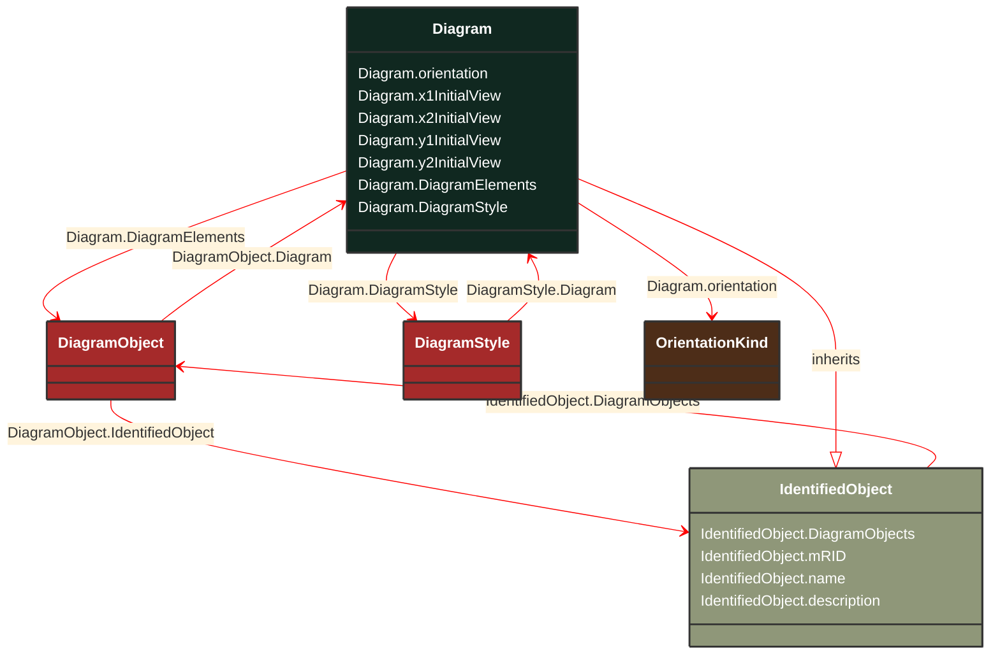

# Diagram

_The diagram being exchanged. The coordinate system is a standard Cartesian coordinate system and the orientation attribute defines the orientation. The initial view related attributes can be used to specify an initial view with the x,y coordinates of the diagonal points._

**URI**: [cim:Diagram](http://iec.ch/TC57/CIM100#Diagram) 
**Type**: Class

## Inheritance
* [IdentifiedObject](/Models/Profiles/DiagramLayout/AbstractClasses/IdentifiedObject/)
    * **Diagram**

## Attributes
| Name | URI | Cardinality and Range | Description | Inheritance |
| ---  | --- | --- | --- | --- |
| orientation | [cim:Diagram.orientation](http://iec.ch/TC57/CIM100#Diagram.orientation) | No cardinality available OrientationKind | Coordinate system orientation of the diagram. A positive orientation gives standard “right-hand” orientation, with negative orientation indicating a “left-hand” orientation. For 2D diagrams, a positive orientation will result in X values increasing from left to right and Y values increasing from bottom to top. A negative orientation gives the “left-hand” orientation (favoured by computer graphics displays) with X values increasing from left to right and Y values increasing from top to bottom. | direct |
| x1InitialView | [cim:Diagram.x1InitialView](http://iec.ch/TC57/CIM100#Diagram.x1InitialView) | No cardinality available float | X coordinate of the first corner of the initial view. | direct |
| x2InitialView | [cim:Diagram.x2InitialView](http://iec.ch/TC57/CIM100#Diagram.x2InitialView) | No cardinality available float | X coordinate of the second corner of the initial view. | direct |
| y1InitialView | [cim:Diagram.y1InitialView](http://iec.ch/TC57/CIM100#Diagram.y1InitialView) | No cardinality available float | Y coordinate of the first corner of the initial view. | direct |
| y2InitialView | [cim:Diagram.y2InitialView](http://iec.ch/TC57/CIM100#Diagram.y2InitialView) | No cardinality available float | Y coordinate of the second corner of the initial view. | direct |
| DiagramElements | [cim:Diagram.DiagramElements](http://iec.ch/TC57/CIM100#Diagram.DiagramElements) | No cardinality available DiagramObject | A diagram is made up of multiple diagram objects. | direct |
| DiagramStyle | [cim:Diagram.DiagramStyle](http://iec.ch/TC57/CIM100#Diagram.DiagramStyle) | No cardinality available DiagramStyle | A Diagram may have a DiagramStyle. | direct |
| DiagramObjects | [cim:IdentifiedObject.DiagramObjects](http://iec.ch/TC57/CIM100#IdentifiedObject.DiagramObjects) | No cardinality available DiagramObject | The diagram objects that are associated with the domain object. | IdentifiedObject |
| mRID | [cim:IdentifiedObject.mRID](http://iec.ch/TC57/CIM100#IdentifiedObject.mRID) | No cardinality available string | Master resource identifier issued by a model authority. The mRID is unique within an exchange context. Global uniqueness is easily achieved by using a UUID, as specified in RFC 4122, for the mRID. The use of UUID is strongly recommended.
For CIMXML data files in RDF syntax conforming to IEC 61970-552, the mRID is mapped to rdf:ID or rdf:about attributes that identify CIM object elements. | IdentifiedObject |
| name | [cim:IdentifiedObject.name](http://iec.ch/TC57/CIM100#IdentifiedObject.name) | No cardinality available string | The name is any free human readable and possibly non unique text naming the object. | IdentifiedObject |
| description | [cim:IdentifiedObject.description](http://iec.ch/TC57/CIM100#IdentifiedObject.description) | No cardinality available string | The description is a free human readable text describing or naming the object. It may be non unique and may not correlate to a naming hierarchy. | IdentifiedObject |

### Schema Source
* from schema: [http://iec.ch/TC57/ns/CIM/DiagramLayout-EUPackage_DiagramLayoutProfile](http://iec.ch/TC57/ns/CIM/DiagramLayout-EUPackage_DiagramLayoutProfile)
